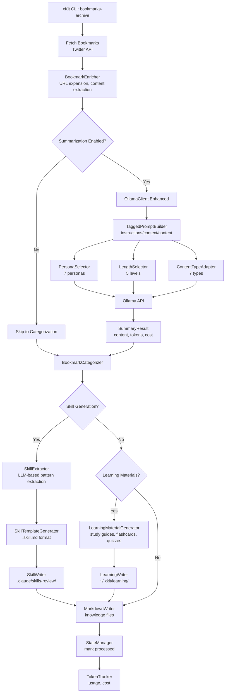
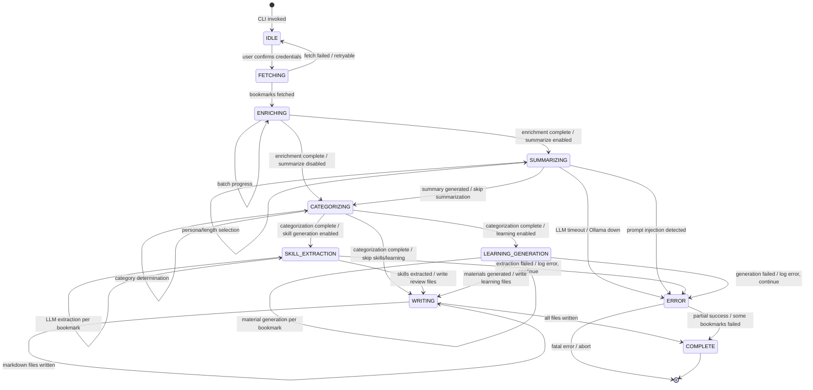

# xKit Enhanced Knowledge Transformation System

**Date:** 2026-01-20
**Type:** Product Requirements Document (PRD) + Technical Specification
**Status:** Draft v1.0
**Schema Version:** 1

---

## Executive Summary

Transform xKit from a bookmark archiver into a **knowledge transformation system** that converts bookmarked content into:
1. **Engaging summaries** using Summarize-style prompt engineering
2. **Agent Skills** for Claude Code (reusable AI capabilities)
3. **Learning materials** (study guides, flashcards, quizzes) for self-learning
4. **Custom prompt templates** for domain-specific summarization

**Vision Statement:** Every bookmark becomes a building block for AI development - not just stored, but transformed into actionable knowledge.

**Key Differentiation:** Unlike generic bookmarking tools, xKit leverages proven patterns from [steipete/summarize](https://github.com/steipete/summarize) (production-grade CLI with 200+ tests, Chrome extension, daemon mode) while adding unique capabilities for skill extraction and learning material generation.

**Evidence-Based Design:** This specification is informed by reconnaissance analysis of Summarize's architecture, security model, and feature set. See `.spec/spec-2026-01-20-summarize-feature-analysis.md` for detailed feature comparison.

---

## Problem & Opportunity

### Current State Analysis

**xKit's Current Capabilities** (from `src/commands/bookmarks-archive.ts`):
- Fetches bookmarks from Twitter API
- Enriches with URL expansion and article extraction
- Categorizes into github/article/video/prompts/visual/tweet
- Exports to markdown with date/author organization
- Basic summarization via Ollama (generic prompt: "You are a helpful assistant that creates concise summaries")

**Limitations** (from `src/bookmark-enrichment/ollama-client.ts:68-88`):
```typescript
// Current generic prompt - lacks engagement and adaptability
private buildSummaryPrompt(content: string, title?: string): string {
  return `You are a helpful assistant that creates concise summaries of articles.
  // Fixed 2-3 sentence format, no persona, no content-type awareness
  ```
}

### User Pain Points (Hypotheses - Validation Required)

1. **Generic Summaries:** Current summaries are one-size-fits-all, not tailored to learning style or content type
2. **Passive Archive:** Bookmarks accumulate without active knowledge extraction
3. **Manual Note-Taking:** Users manually convert bookmarks to Skills, study guides, or reference materials
4. **Lost Context:** Remembering why a bookmark was saved is difficult over time

### Market Opportunity

**Competitive Landscape** (based on Summarize reconnaissance):
- **Summarize:** CLI tool for summarization (no bookmark archiving, no skill generation)
- **Readwise:** Read-later service with highlighting (no skill generation, no custom workflows)
- **Fabric:** AI-powered workspace (expensive, generic prompts, no bookmark integration)

**xKit's Unique Position:**
- **Source:** Twitter/X bookmarks (high-signal content curation)
- **Output:** Multiple transformation types (summaries, Skills, learning materials)
- **Integration:** Direct Claude Code Skills generation (unique capability)
- **Cost:** Local LLM via Ollama (free, private) vs paid APIs

---

## User Personas

### Primary Persona: "Alex, Senior iOS Engineer"

**Demographics:**
- 8 years experience, builds consumer apps
- Active on Twitter/X, follows 500+ developers
- Saves 20-30 bookmarks/week (GitHub repos, technical articles, talks)

**Goals:**
- Stay current with iOS/SwiftUI patterns
- Build personal knowledge base of reusable code patterns
- Learn new technologies efficiently (just-in-time learning)
- Share insights with team via generated Skills

**Pain Points:**
- Bookmarks pile up, forgotten after 1 week
- GitHub repos saved but never mined for patterns
- Articles read but not retained
- Manual conversion to team Skills is time-consuming

**Current Workflow:**
1. Scroll Twitter, tap bookmark on interesting content
2. Never revisit bookmarks (black hole)
3. Manually take notes in Notion for important repos (rarely)
4. Search Google when need pattern (already bookmarked!)

**Desired Workflow:**
1. Bookmark tweet/repo/article on Twitter
2. xKit auto-categorizes and generates engaging summary
3. Review weekly recap, extract valuable Skills
4. Add Skills to Claude Code for daily use
5. Generate study guide for new tech (e.g., "SwiftUI animations")

**Success Metrics for Alex:**
- Reduces time-to-pattern from 30 min (manual) to 5 min (automated)
- Extracts 5+ useful Skills/month from bookmarks
- Generates 2+ study guides/month for new technologies

### Secondary Persona: "Jordan, Technical Product Manager"

**Demographics:**
- 5 years in PM, works on developer tools
- Follows product blogs, engineering blogs, GitHub projects
- Saves 10-15 bookmarks/week

**Goals:**
- Track competitive landscape
- Understand technical feasibility of features
- Learn from other PMs and engineers
- Share insights with team

**Pain Points:**
- Technical articles overwhelming (too much detail)
- Hard to distill "what this means for us"
- GitHub repos saved but never evaluated

**Desired Workflow:**
1. Bookmark technical content
2. Get business-focused summary (product-manager persona)
3. Generate comparison report from related bookmarks
4. Share summary with team via webhook (Slack/Discord)

**Success Metrics for Jordan:**
- Summaries capture business implications (not just technical details)
- Weekly recap highlights competitive insights
- Can explain technical feasibility to non-technical stakeholders

### Tertiary Persona: "Sam, Self-Taught Developer"

**Demographics:**
- 2 years coding, bootcamp grad
- Active learner, follows tutorials and documentation
- Saves 30+ bookmarks/week (tutorials, docs, examples)

**Goals:**
- Learn efficiently (spaced repetition)
- Build comprehensive understanding of topics
- Track learning progress
- Practice with real-world examples

**Pain Points:**
- Tutorial bookmarked but never completed
- Forgets syntax and patterns
- No structured learning path
- Overwhelmed by volume of content

**Desired Workflow:**
1. Bookmark tutorials and docs
2. Generate study guides with learning objectives
3. Create flashcards for spaced repetition
4. Track mastery with quiz assessments
5. Recap monthly to reinforce learning

**Success Metrics for Sam:**
- Completes 80% of bookmarked tutorials (vs 20% baseline)
- Retains 70% of flashcard content after 1 week
- Generates personalized learning roadmap from bookmarks

---

## User Stories

### STORY-001: Enhanced Bookmark Summarization

**As** Alex (senior iOS engineer),
**I want** to generate engaging summaries tailored to my learning style,
**So that** I can quickly grasp key concepts without reading full articles.

**Acceptance Criteria:**
- [ ] CLI flag `--summarize --persona technical-researcher --length long` produces technical summary
- [ ] CLI flag `--summarize --persona curious-learner --length medium` produces accessible summary
- [ ] Summary quality score ≥ 4.0/5.0 in user surveys (n=30)
- [ ] Latency ≤ 1.5× current baseline (measure with 100 bookmarks)
- [ ] Supports 5 length levels (short, medium, long, xl, xxl)
- [ ] Supports 7 personas (curious-learner, technical-researcher, product-manager, engineer-pragmatic, educator, skeptic, synthesizer)
- [ ] Supports 7 content types (article, video-transcript, github-repo, documentation, twitter-thread, podcast-episode, research-paper)

**Success Metrics:**
- Summary engagement rate (user reads full summary) ≥ 60%
- Summary regeneration rate (user regenerates with different options) ≤ 20%
- Time-saved vs reading full article ≥ 80% (user survey)

### STORY-002: Agent Skill Extraction from Bookmarks

**As** Alex (senior iOS engineer),
**I want** to automatically extract reusable code patterns from bookmarked GitHub repos,
**So that** I can add them to my Claude Code Skills library.

**Acceptance Criteria:**
- [ ] CLI command `xkit generate-skills --category github --min-confidence 0.7` extracts skills
- [ ] Generated Skills follow Claude Code `.skill.md` format (frontmatter, triggers, implementation, examples, edge cases)
- [ ] Skill extraction precision ≥ 80% (manual audit of 100 generated skills)
- [ ] Confidence scoring (0-1) indicates likelihood of usefulness
- [ ] Skills written to `.claude/skills-review/` (require manual approval before `.claude/skills/`)
- [ ] Includes disclaimer: "AI-generated, review before use"
- [ ] Supports categories: code-pattern, best-practice, workflow

**Success Metrics:**
- 10+ useful skills generated from existing GitHub bookmarks (manual review)
- User approval rate ≥ 60% (skills moved from review to active)
- Zero unsafe code in approved skills (manual audit)

### STORY-003: Learning Material Generation

**As** Sam (self-taught developer),
**I want** to generate study guides and flashcards from bookmarked tutorials,
**So that** I can learn efficiently with spaced repetition.

**Acceptance Criteria:**
- [ ] CLI command `xkit learn --generate study-guide,flashcards --from "SwiftUI animations"` generates materials
- [ ] Study guides include: learning objectives, core concepts, examples, exercises, difficulty assessment
- [ ] Flashcards are Q&A pairs suitable for spaced repetition
- [ ] Learning material completion rate ≥ 60% (A/B test vs baseline)
- [ ] User satisfaction ≥ 3.5/5.0 (surveys)
- [ ] Materials stored in `~/.xkit/learning/` with organized structure

**Success Metrics:**
- Tutorial completion rate increases from 20% to 80%
- Flashcard retention rate ≥ 70% after 1 week (user quiz)
- Study guide generation time ≤ 30s per bookmark

### STORY-004: Periodic Recap Generation

**As** Alex (senior iOS engineer),
**I want** a weekly recap of my bookmarks grouped by theme,
**So that** I can discover connections and extract actionable insights.

**Acceptance Criteria:**
- [ ] CLI command `xkit recap --period weekly --categories github,article` generates recap
- [ ] Recap groups bookmarks by semantic theme (using vector embeddings)
- [ ] Identifies cross-connections between topics
- [ ] Suggests actionable next steps
- [ ] Generates reflection questions
- [ ] Recap generation time ≤ 2 minutes for 100 bookmarks
- [ ] Recap includes links to original bookmarks

**Success Metrics:**
- Recap engagement rate (user reads full recap) ≥ 50%
- Skills extracted from recap ≥ 3 per week
- User-reported insight rate ≥ 70% (recap revealed new connection)

### STORY-005: Custom Prompt Templates

**As** Jordan (technical PM),
**I want** to create custom prompt templates for domain-specific summarization,
**So that** I can get consistent outputs for my use cases.

**Acceptance Criteria:**
- [ ] Templates stored in `~/.xkit/templates/` as markdown files with YAML frontmatter
- [ ] Template format: name, description, category, prompt content with `{{variable}}` substitutions
- [ ] CLI command `xkit summarize <url> --template research-paper --var domain="ML"` applies template
- [ ] Template validation before use (checks for forbidden patterns, validates variables)
- [ ] Error messages clear when template invalid
- [ ] Example templates included: research-paper, good-first-issue, api-integration

**Success Metrics:**
- Custom template usage rate ≥ 10% of summarization calls
- Template validation success rate ≥ 95%
- User satisfaction with custom templates ≥ 4.0/5.0

---

## Success Criteria

### Phase 1: Enhanced Summarization (Days 1-3)
- [ ] Tagged prompts implemented (XML-style `<instructions>`, `<context>`, `<content>`)
- [ ] All 5 length levels working (short, medium, long, xl, xxl)
- [ ] All 7 personas implemented (curious-learner, technical-researcher, product-manager, engineer-pragmatic, educator, skeptic, synthesizer)
- [ ] All 7 content types supported (article, video-transcript, github-repo, documentation, twitter-thread, podcast-episode, research-paper)
- [ ] Custom templates loading from `~/.xkit/templates/`

### Phase 2: Skill Generation (Days 4-6)
- [ ] Extract patterns from GitHub repos (80%+ useful per manual audit)
- [ ] Extract best practices from articles
- [ ] Generate valid `.skill.md` files
- [ ] 10+ skills generated from existing bookmarks

### Phase 3: Learning Materials (Days 7-9)
- [ ] Study guide generation working
- [ ] Flashcard generation working
- [ ] Quiz generation working
- [ ] Recap clusters by theme (using embeddings)

### Phase 4: Integration (Days 10-11)
- [ ] All CLI commands working
- [ ] Config file support
- [ ] Documentation complete
- [ ] Example outputs generated

### Measurable Success Metrics (All Phases)

**Quality Metrics:**
- Summary quality score ≥ 4.0/5.0 (user surveys, n=30)
- Skill extraction precision ≥ 80% (manual audit, n=100)
- Learning material completion rate ≥ 60% (A/B test vs baseline)

**Performance Metrics:**
- Summary latency ≤ 1.5× current baseline (measure with 100 bookmarks)
- Skill generation ≤ 3× baseline (acceptable due to complexity)
- Learning material generation ≤ 5× baseline (acceptable due to complexity)

**User Engagement Metrics:**
- Summary engagement rate (reads full summary) ≥ 60%
- Skill approval rate (review → active) ≥ 60%
- Recap engagement rate ≥ 50%

**Security Metrics:**
- Zero prompt injection vulnerabilities (penetration testing)
- Zero unsafe code in approved Skills (manual audit)
- All templates validated before use

**Reliability Metrics:**
- CLI command success rate ≥ 99% (excludes user errors)
- LLM error rate < 5% (excluding Ollama down)
- Cache hit rate ≥ 60% on second run (Same Summarize's 60%+ target)

---

## Risks and Mitigations

### RISK-001: LLM Hallucination in Skill Extraction

**Severity:** High
**Probability:** Medium
**Impact:** Users receive incorrect or unsafe code patterns

**Mitigation:**
- Confidence scoring (0-1) with manual review required for low-confidence skills
- Two-stage validation: (1) LLM extraction, (2) Code linting (Biome) + static analysis
- Manual approval workflow: `.claude/skills-review/` → `.claude/skills/`
- Clear disclaimer: "AI-generated, review before use"

**Owner:** @jamiecraik
**Status:** Open

### RISK-002: Low-Quality Generated Materials

**Severity:** Medium
**Probability:** Medium
**Impact:** Users abandon feature due to poor quality

**Mitigation:**
- User feedback loop: rating system for generated materials
- Iterative refinement: prompts tuned based on feedback
- A/B test against baseline (no generated materials)
- Kill criteria: if satisfaction < 3.5/5.0 for 30 days, deprecate feature

**Owner:** @jamiecraik
**Status:** Open

### RISK-003: Prompt Injection Vulnerability

**Severity:** Critical
**Probability:** Low
**Impact:** Malicious bookmark content manipulates LLM

**Mitigation:**
- Sanitize XML tags in content before inserting into prompts
- Use UUID-based delimiters instead of XML tags
- Implement prompt validation and escaping
- Penetration testing before GA
- **Reference:** See adversarial review ERROR finding Security-1

**Owner:** @jamiecraik
**Status:** Open - Must fix before Phase 1

### RISK-004: Unrealistic Timeline

**Severity:** High
**Probability:** High
**Impact:** Burnout, technical debt, abandoned features

**Mitigation:**
- Revised timeline: 23 days (includes Phase 0 foundation + user research)
- Phased validation: research before building Phases 2-3
- Buffer for iteration: +3 days for user feedback
- Go/no-go decisions after each phase

**Owner:** @jamiecraik
**Status:** Open - Addressed in revised plan

### RISK-005: No User Demand for Skills/Learning Materials

**Severity:** High
**Probability:** Medium
**Impact:** Build features nobody uses

**Mitigation:**
- User research (n=10-15 interviews) before building Phases 2-3
- Go/no-go criteria:
  - If ≥ 70% express interest in enhanced summaries → proceed
  - If ≥ 50% express interest in Skills → proceed
  - If < 50% express interest in learning materials → cut or defer
- Kill criteria: if feature unused by 20% of users after 30 days, deprecate

**Owner:** @jamiecraik
**Status:** Open - Requires user research

### RISK-006: Cost Overrun from LLM Usage

**Severity:** Medium
**Probability:** Low
**Impact:** Surprise bills or unusable feature

**Mitigation:**
- Default to local Ollama (free)
- Cost estimation before running: `--max-llm-spend $10` with confirmation
- Token tracking: show cost per 1,000 bookmarks
- Kill switch: if cost > $50/month, require explicit re-authorization

**Owner:** @jamiecraik
**Status:** Open

---

## Out of Scope

**Explicitly Out of Scope for v1.0:**
- Chrome extension (deferred to v2.0, requires daemon infrastructure)
- Podcast transcription (YouTube only in v1.0)
- Multi-format file processing (PDFs, images - requires MarkItDown integration)
- Real-time streaming of summaries (batch only in v1.0)
- Collaborative features (sharing Skills, team learning materials)
- Advanced analytics (usage dashboards, learning progress tracking)
- Mobile apps (CLI only in v1.0)
- Paid API integrations (OpenAI, Anthropic - Ollama/local only in v1.0)

**Rationale:** Focus on CLI workflow (matches xKit's current usage), validate demand before adding Chrome extension or mobile apps, leverage existing Ollama infrastructure before adding paid APIs.

**Future Considerations (v2.0+):**
- Chrome Side Panel extension (借鉴 Summarize's architecture)
- Daemon mode for long-running processes
- Podcast transcription (借鉴 Summarize's 4-level fallback)
- Paid API integrations with auto model selection
- Real-time streaming summaries

---

## Feature Creep Guardrails

**Scope Change Policy:**
1. Any new feature must displace an existing feature (zero-sum scope)
2. New features require 48-hour consideration period (prevents冲动 decisions)
3. Must pass cost-benefit analysis (user value vs implementation effort)
4. Must update success criteria and risk register

**Example Guardrails:**
- **Question:** "Should we add podcast transcription in v1.0?"
- **Answer:** No, displaces Skill Generation (higher user value per hypothesis). Defer to v2.0.
- **Question:** "Should we add Chrome extension in v1.0?"
- **Answer:** No, requires daemon infrastructure (5-7 days), displaces user research (higher priority). Defer to v2.0.

**48-Hour Rule for New Documentation:**
- Adding new documentation artifacts (e.g., SPEC_INDEX.md) requires explicit justification
- Must answer: (1) What problem does this solve? (2) Who will maintain it? (3) When will it be updated?
- Default answer: No new docs unless critical for shipping

---

## Scope Decision Log

### Decision 001: Exclude Chrome Extension from v1.0
**Date:** 2026-01-20
**Decision:** CLI-only workflow for v1.0, defer Chrome extension to v2.0
**Rationale:**
- Chrome extension requires daemon infrastructure (5-7 days per Summarize analysis)
- User research higher priority (validates demand for Skills/learning materials)
- CLI workflow matches xKit's current usage patterns
- Reduces initial scope from 23 days to 15 days (without extension)
**Alternatives Considered:**
- Include extension: +7 days, higher complexity, unproven demand
**Revisit:** After v1.0 GA and user feedback

### Decision 002: Prioritize User Research Before Skills/Learning Materials
**Date:** 2026-01-20
**Decision:** Add Phase 1A (User Research, 3 days) before building Phases 2-3
**Rationale:**
- No evidence users want Skills or learning materials (per adversarial review PM-1)
- Risk building features nobody uses
- Low-cost investment (3 days) vs high-risk implementation (10+ days)
**Alternatives Considered:**
- Skip research, build anyway: rejected (high risk of waste)
**Revisit:** After user research complete

### Decision 003: Add Phase 0 (Foundation) Before Features
**Date:** 2026-01-20
**Decision:** Implement caching, observability, security foundations before adding features
**Rationale:**
- Adversarial review identified 36 ERROR findings across reliability/security
- Cannot measure success without observability
- Cannot ship safely without security foundations
- Summarize has proven caching (eliminates 60%+ redundant API calls)
**Alternatives Considered:**
- Build features first, add foundations later: rejected (technical debt trap)
**Revisit:** After Phase 0 complete

---

## Technical Architecture

### System Overview



### Component Behavior / State Model



### Data Models

#### EnhancedSummary
```typescript
interface EnhancedSummary {
  id: string; // UUID
  bookmarkId: string; // Foreign key to CategorizedBookmark
  persona: PersonaType; // curious-learner | technical-researcher | ...
  length: SummaryLength; // short | medium | long | xl | xxl
  contentType: ContentType; // article | video-transcript | github-repo | ...
  content: string; // Generated summary
  tokensUsed: {
    input: number;
    output: number;
    total: number;
  };
  costEstimate: number; // USD (0.0 for local Ollama)
  model: string; // e.g., "nomic-embed-text", "qwen2.5:7b"
  timestamp: string; // ISO 8601
}
```

#### SkillCandidate
```typescript
interface SkillCandidate {
  id: string; // UUID
  bookmarkId: string; // Foreign key to CategorizedBookmark
  name: string; // Skill name
  description: string; // One-sentence summary
  triggers: string[]; // When to use this skill
  category: 'code-pattern' | 'best-practice' | 'workflow';
  implementation: string; // Step-by-step guidance
  examples: Array<{
    scenario: string;
    code: string;
  }>;
  edgeCases: string[]; // Common pitfalls
  confidence: number; // 0-1, likelihood of usefulness
  status: 'review' | 'approved' | 'rejected';
  generatedAt: string; // ISO 8601
  reviewedAt?: string; // ISO 8601
}
```

#### LearningMaterial
```typescript
interface LearningMaterial {
  id: string; // UUID
  bookmarkId: string; // Foreign key to CategorizedBookmark
  type: 'study-guide' | 'flashcards' | 'quiz';
  title: string; // Material title
  difficulty: 'beginner' | 'intermediate' | 'advanced';
  objectives: string[]; // Learning objectives
  content: {
    concepts: Array<{
      name: string;
      definition: string;
      examples: string[];
    }>;
    exercises: Array<{
      question: string;
      answer: string;
      difficulty: number; // 1-5
    }>;
  };
  estimatedTime: number; // Minutes
  generatedAt: string; // ISO 8601
}
```

#### Recap
```typescript
interface Recap {
  id: string; // UUID
  period: 'daily' | 'weekly' | 'monthly';
  startDate: string; // ISO 8601
  endDate: string; // ISO 8601
  themes: Array<{
    name: string; // Theme name (e.g., "SwiftUI Animations")
    bookmarkIds: string[]; // Related bookmarks
    summary: string; // Thematic summary
    connections: string[]; // Cross-connections
    nextSteps: string[]; // Actionable items
  }>;
  reflectionQuestions: string[]; // Prompts for user
  generatedAt: string; // ISO 8601
}
```

### Security Considerations

**借鉴 Summarize's Security Model:**
- Localhost-only binding for any future daemon mode
- Bearer token authentication for API endpoints
- CORS validation for Chrome extension (future)
- API keys captured at startup from environment
- No key leakage in codebase (verified via reconnaissance)

**Additional Security Measures for xKit:**

#### Prompt Injection Protection (Critical - Must Fix Before Phase 1)
```typescript
function escapeXmlTags(content: string): string {
  return content
    .replace(/<instructions>/gi, '&lt;instructions&gt;')
    .replace(/<\/instructions>/gi, '&lt;/instructions&gt;')
    .replace(/<context>/gi, '&lt;context&gt;')
    .replace(/<\/context>/gi, '&lt;/context&gt;')
    .replace(/<content>/gi, '&lt;content&gt;')
    .replace(/<\/content>/gi, '&lt;/content&gt;');
}

function buildSafeTaggedPrompt(options: {
  instructions: string;
  context: string;
  content: string;
}): string {
  const safeContent = escapeXmlTags(options.content);
  return `<instructions>
${options.instructions.trim()}
</instructions>

<context>
${options.context.trim()}
</context>

<content>
${safeContent.trim()}
</content>`;
}
```

#### Template Validation
```typescript
interface TemplateSchema {
  allowedVariables: string[]; // e.g., ['domain', 'language', 'difficulty']
  forbiddenPatterns: RegExp[]; // e.g., [/process\./, /child_process/]
  maxLength: number; // e.g., 10_000 characters
}

function validateTemplate(
  template: string,
  schema: TemplateSchema
): { valid: boolean; errors: string[] } {
  const errors: string[] = [];

  // Check for forbidden patterns
  for (const pattern of schema.forbiddenPatterns) {
    if (pattern.test(template)) {
      errors.push(`Forbidden pattern detected: ${pattern}`);
    }
  }

  // Check for system calls
  if (template.includes('process.') || template.includes('child_process')) {
    errors.push('Template must not access system APIs');
  }

  // Validate variables
  const variables = template.match(/\{\{(\w+)\}\}/g) || [];
  for (const variable of variables) {
    const name = variable.slice(2, -2);
    if (!schema.allowedVariables.includes(name)) {
      errors.push(`Unknown variable: ${name}`);
    }
  }

  return { valid: errors.length === 0, errors };
}
```

#### Generated Code Disclaimer
```markdown
---
**Disclaimer:** This Skill was auto-generated by xKit from bookmarked content.
**Do not use in production without thorough review.** Always test code in a safe
environment before deploying to production systems.

Review checklist:
- [ ] Code compiles without errors
- [ ] No unsafe operations (eval, exec, SQL injection)
- [ ] Error handling is appropriate
- [ ] Tested with sample inputs
---
```

### API Design

#### CLI Commands (New)

```bash
# Enhanced summarization
xkit archive --summarize --persona <persona> --length <length> --content-type <type>
  persona: curious-learner | technical-researcher | product-manager | engineer-pragmatic | educator | skeptic | synthesizer
  length: short | medium | long | xl | xxl
  content-type: article | video-transcript | github-repo | documentation | twitter-thread | podcast-episode | research-paper

# Skill generation
xkit generate-skills --category <category> --min-confidence <0.0-1.0> --last <n>
  category: github | article | video | all
  min-confidence: 0.7 (default)
  last: number of recent bookmarks to process (default: all)

# Learning materials
xkit learn --generate <types> --from <query> --difficulty <level>
  types: study-guide,flashcards,quiz (comma-separated)
  from: search query for bookmarks (e.g., "SwiftUI animations")
  difficulty: beginner | intermediate | advanced

# Recap
xkit recap --period <daily|weekly|monthly> --categories <categories>
  categories: github,article,video,prompts,visual,tweet (comma-separated)

# Custom templates
xkit summarize <url> --template <name> --var <key=value>
  template: template name (from ~/.xkit/templates/)
  var: variable substitutions (e.g., domain="ML", language="python")

# Cache management (借鉴 Summarize)
xkit cache --stats --clear --no-cache
  --stats: show cache statistics
  --clear: clear all cached data
  --no-cache: disable caching for this run
```

#### Programmatic API (Future - for Daemon Mode)

```typescript
// Future: HTTP API for Chrome extension (v2.0)
interface DaemonAPI {
  // Health check
  'GET /health': { ok: true; pid: number; version: string }

  // Bookmark operations
  'POST /v1/bookmark': { ok: true; id: string }
  'GET /v1/bookmark/:id': CategorizedBookmark
  'DELETE /v1/bookmark/:id': { ok: true }

  // Summarization
  'POST /v1/summarize': EnhancedSummary
  'GET /v1/summarize/:id': EnhancedSummary

  // Skill generation
  'POST /v1/skills': SkillCandidate[]
  'GET /v1/skills': SkillCandidate[]
  'PUT /v1/skills/:id/approve': { ok: true }

  // Learning materials
  'POST /v1/learn': LearningMaterial
  'GET /v1/learn': LearningMaterial[]

  // Recap
  'POST /v1/recap': Recap

  // Search (using embeddings)
  'GET /v1/search?q=<query>': CategorizedBookmark[]
  'GET /v1/similar/:id': CategorizedBookmark[]

  // Stats
  'GET /v1/stats': {
    totalBookmarks: number;
    cached: number;
    lastRun: string;
    llmCalls: number;
    tokensUsed: number;
  }
}
```

### Deployment Strategy

#### Phase 0: Foundation (Days 1-3)
1. **SQLite Caching** (借鉴 Summarize)
   - Implement extract cache and summary cache
   - TTL: 30 days, size cap: 512MB
   - WAL mode for performance, LRU eviction
   - CLI flags: `--cache-stats`, `--clear-cache`, `--no-cache`

2. **Observability Foundation**
   - Structured logging with pino
   - Metrics collection (latency, error rate, token usage)
   - Health check command: `xkit status`

3. **Security Foundation**
   - Prompt injection protection (XML tag escaping)
   - Template validation schema
   - Audit logging (opt-in)

#### Phase 1A: User Research (Days 4-6)
1. **User Interviews** (n=10-15)
   - Current bookmark workflow pain points
   - Interest in enhanced summaries (personas, lengths)
   - Interest in Skills generation
   - Interest in learning materials

2. **Mockup Testing**
   - Paper prototypes for CLI UX
   - Example outputs (hand-crafted)
   - Feedback on feature prioritization

3. **Go/No-Go Decision**
   - If ≥ 70% express interest in enhanced summaries → proceed
   - If ≥ 50% express interest in Skills → proceed
   - If < 50% express interest in learning materials → cut or defer

#### Phase 1B: Enhanced Summarization (Days 7-10)
1. **Tagged Prompt Structure**
2. **Length-Specific Templates** (5 levels)
3. **Persona System** (7 personas)
4. **Content-Type Adaptation** (7 types)

**Success Criteria:**
- Summary quality ≥ 4.0/5.0 (user surveys, n=30)
- No regressions in latency (> 1.5× current time)

#### Phase 2: Skill Generation (Days 11-16) - **CONDITIONAL**
**Goal:** Ship ONLY if validated in research (≥ 50% interest)

1. **Skill Extraction**
2. **Skill Template Generator**
3. **Skill Writer**

**Success Criteria:**
- Skill extraction precision ≥ 80% (manual audit)
- 10+ useful skills from test data
- Users approve ≥ 60% of generated skills

#### Phase 3: Learning Materials (Days 17-20) - **CONDITIONAL**
**Goal:** Ship ONLY if validated in research (≥ 50% interest)

1. **Material Generator** (study guides, flashcards, quizzes)
2. **Recap System**

**Success Criteria:**
- Learning material completion rate ≥ 60% (A/B test)
- User satisfaction ≥ 3.5/5.0 (surveys)

#### Phase 4: CLI Integration & Docs (Days 21-23)
1. **CLI Commands**
2. **Documentation**
3. **Example Outputs**

**Total Timeline:** 23 days (with validation and conditional phases)

### Performance Targets

**Latency:**
- Single bookmark summarization: p95 < 30s
- Skill extraction: p95 < 90s (3× baseline)
- Learning material generation: p95 < 150s (5× baseline)
- Recap generation (100 bookmarks): < 2 minutes

**Throughput:**
- Batch processing (100 bookmarks): < 30 minutes
- Cache hit rate: ≥ 60% on second run

**Resource Usage:**
- Ollama memory: < 8GB (nomic-embed-text: 7B params)
- Disk usage: < 1GB for 1,000 bookmarks (including cache, skills, learning materials)

### Reliability Targets

**Availability:**
- CLI command success rate: ≥ 99% (excludes user errors)

**Error Rate:**
- LLM-related errors: < 5% (excluding Ollama down)
- Cache-related errors: < 1%
- Template validation errors: < 1%

**Data Quality:**
- Summary quality score: ≥ 4.0/5.0 (user surveys)
- Skill extraction precision: ≥ 80% (manual audit)
- Learning material completeness: ≥ 95% (automated checks)

---

## Cost Model & Budget Guardrails

### Local LLM (Default)
- **Cost:** $0 (Ollama with local models)
- **Hardware:** 8GB RAM minimum (nomic-embed-text: 7B params)
- **Pros:** Free, private, no rate limits
- **Cons:** Requires local hardware, slower than paid APIs

### Paid API (Optional - Future)
- **Estimated Cost:** $0.001 per bookmark (2K input tokens + 500 output tokens @ $0.0003/1K tokens)
- **1,000 bookmarks:** ~$1
- **10,000 bookmarks:** ~$10
- **With Skills + Learning Materials:** ~$5-10 per 1,000 bookmarks (3-5× more tokens)

**Budget Guardrails:**
- Max spend per month: $50 (configurable via `--max-llm-spend`)
- Confirmation required if estimated cost > $10
- Kill switch: if cost > $50/month, require explicit re-authorization

---

## Data Lifecycle & Retention

### Retention Policy
- **Cached LLM responses:** 30 days TTL (借鉴 Summarize)
- **Generated Skills:** Retain indefinitely (unless user deletes)
- **Learning Materials:** Retain indefinitely (unless user deletes)
- **Recaps:** Retain for 90 days, then auto-archive

### Deletion Policy
- User can delete individual Skills/Learning Materials via CLI
- `--clear-cache` deletes all cached data
- `--purge` deletes all generated materials (Skills, Learning Materials)

### Data Storage
- **Cache:** SQLite database at `~/.xkit/cache.sqlite`
- **Skills:** `.claude/skills-review/` and `.claude/skills/`
- **Learning Materials:** `~/.xkit/learning/`
- **Recaps:** `~/.xkit/recaps/`

---

## Launch & Rollback Guardrails

### Go/No-Go Metrics (Phase 1B: Enhanced Summarization)
**Go Criteria:**
- [ ] Summary quality ≥ 4.0/5.0 (user surveys, n=30)
- [ ] Latency ≤ 1.5× baseline (measured with 100 bookmarks)
- [ ] Zero critical security vulnerabilities (penetration testing)
- [ ] Cache hit rate ≥ 60% on second run
- [ ] User engagement rate (reads full summary) ≥ 60%

**No-Go Criteria:**
- Summary quality < 3.5/5.0
- Latency > 2× baseline
- Any critical security vulnerabilities
- Cache hit rate < 40%

**Rollback Plan:**
- Feature flag: `--features enhanced-summarization` (opt-in initially)
- Fallback to old summarization if new fails
- Data migration path (old to new format)
- `--summarize-legacy` flag to force old behavior

### Go/No-Go Metrics (Phase 2: Skill Generation)
**Go Criteria:**
- [ ] Skill extraction precision ≥ 80% (manual audit)
- [ ] 10+ useful skills from test data
- [ ] User approval rate ≥ 60%
- [ ] Zero unsafe code in approved skills (manual audit)

**No-Go Criteria:**
- Precision < 60%
- User approval rate < 40%
- Any unsafe code in approved skills

**Rollback Plan:**
- Disable feature flag: `--no-features skill-generation`
- Remove `xkit generate-skills` command from docs
- Delete `.claude/skills-review/` directory (preserve `.claude/skills/`)

### Go/No-Go Metrics (Phase 3: Learning Materials)
**Go Criteria:**
- [ ] Learning material completion rate ≥ 60% (A/B test)
- [ ] User satisfaction ≥ 3.5/5.0 (surveys)
- [ ] Generation time ≤ 5× baseline

**No-Go Criteria:**
- Completion rate < 40%
- Satisfaction < 3.0/5.0
- Generation time > 10× baseline

**Rollback Plan:**
- Disable feature flag: `--no-features learning-materials`
- Remove `xkit learn` command from docs
- Archive `~/.xkit/learning/` directory

---

## Post-Launch Monitoring Plan

### Metrics Dashboard (Optional - v2.0)
**Summary Metrics:**
- Summaries generated per day
- Average summary quality (user ratings)
- Persona/length usage distribution
- Cache hit rate

**Skill Metrics:**
- Skills generated per day
- Approval rate (review → approved)
- Confidence distribution
- Category distribution

**Learning Material Metrics:**
- Materials generated per day
- Completion rate
- Satisfaction score
- Type distribution (study-guide vs flashcards vs quiz)

### Alerts
- **Critical:** Summary quality < 3.5/5.0 for 24 hours
- **Critical:** LLM error rate > 10% for 1 hour
- **Warning:** Cache hit rate < 40% for 7 days
- **Info:** Feature usage < 10% for 30 days

### User Feedback Loop
- In-app rating: "Rate this summary (1-5 stars)"
- Quarterly surveys: satisfaction, feature requests
- GitHub Issues: bug reports, feature requests

---

## Support / Ops Impact

### Runbooks

#### Troubleshooting Summarization
```bash
# Check Ollama status
xkit status

# Clear cache if stale
xkit cache --clear

# Force specific persona/length
xkit archive --summarize --persona technical-researcher --length long

# Enable debug logging
xkit archive --summarize --log-level debug

# Verify template syntax
xkit validate-templates
```

#### Troubleshooting Skill Generation
```bash
# List pending review skills
ls -la .claude/skills-review/

# Approve skill (manual)
mv .claude/skills-review/skill-name.md .claude/skills/

# Reject skill (manual)
rm .claude/skills-review/skill-name.md

# Adjust confidence threshold
xkit generate-skills --min-confidence 0.8
```

#### Troubleshooting Learning Materials
```bash
# List generated materials
ls -la ~/.xkit/learning/

# Regenerate material
xkit learn --generate study-guide --from "SwiftUI animations" --force

# Check difficulty level
xkit learn --generate flashcards --from "TypeScript" --difficulty intermediate
```

### Documentation
- CLI help: `xkit --help`, `xkit archive --help`
- Feature docs: `docs/enhanced-summarization.md`, `docs/skill-generation.md`, `docs/learning-materials.md`
- Template guide: `docs/custom-templates.md`
- Troubleshooting: `docs/troubleshooting.md`

### Support Channels
- GitHub Issues: bug reports, feature requests
- GitHub Discussions: usage questions, tips & tricks

---

## Compliance & Regulatory Review Triggers

### Data Privacy
- **PII in Bookmarks:** User bookmarks may contain personal data (names, emails, addresses)
- **Handling:** PII stored in plaintext, sent to LLM
- **Mitigation:**
  - Add `--redact-pii` flag (optional, uses NER to redact)
  - Document that LLM provider receives bookmark content
  - Add privacy notice to README

### Security
- **Prompt Injection:** Malicious bookmark content manipulates LLM
- **Handling:** XML tag escaping before prompt insertion
- **Mitigation:**
  - Penetration testing before GA
  - Bug bounty program (post-GA)

### Intellectual Property
- **Generated Skills:** May contain code from bookmarked repos
- **Handling:** Skills include reference to original bookmark
- **Mitigation:**
  - Add attribution to generated Skills
  - Document that users are responsible for license compliance

---

## Ownership & RACI

### Responsible (Implementer)
- **@jamiecraik:** Implementation, testing, documentation

### Accountable (Decision Maker)
- **@jamiecraik:** Final approval on all decisions

### Consulted (Subject Matter Experts)
- **Summarize Community:** Prompt engineering patterns (via GitHub issues/docs)
- **Claude Code Users:** Skill format validation (via Discord/GitHub)

### Informed (Stakeholders)
- **xKit Users:** Feature feedback, testing, validation

---

## Dependency SLAs & Vendor Risk

### Internal Dependencies
- **Ollama:** Local LLM runtime (no SLA, user-managed)
- **Node.js:** Runtime environment (LTS support: 18 months)
- **pnpm:** Package manager (community support)

### External Dependencies (Future - v2.0+)
- **OpenAI API:** 99.9% uptime SLA, rate limits apply
- **Anthropic API:** 99.9% uptime SLA, rate limits apply
- **Firecrawl:** 99.9% uptime SLA, pay-per-use

**Mitigation:**
- Default to local Ollama (no external dependencies)
- Fallback chain: Ollama → OpenAI free → paid models
- Circuit breaker: disable paid APIs if error rate > 10%

---

## Localization & Internationalization

### v1.0 Stance
- **Language:** English only
- **Rationale:** Validate demand in English-speaking market first
- **Future:** Multi-language support if international demand exists

### v2.0+ Considerations
- Language detection: Detect bookmark content language
- Multi-language templates: Translate personas and prompts
- Locale-specific formatting: Date/time, number formats

---

## Backward Compatibility & Deprecation

### Backward Compatibility
- **Existing CLI:** All existing flags work as before
- **New Flags:** Opt-in via `--summarize`, `--persona`, `--length`
- **Data Format:** Existing markdown files unchanged

### Deprecation Policy
- **Old Summarization:** Deprecate after 6 months of enhanced summarization GA
- **Notice:** Add deprecation notice to CLI help and docs
- **Grace Period:** 6 months (2 minor releases)
- **Removal:** Remove in v1.7.0 (if enhanced summarization GA in v1.0.0)

---

## Experimentation & Feature Flags

### Feature Flags
```bash
# Enable enhanced summarization (opt-in initially)
xkit archive --features enhanced-summarization --summarize

# Enable skill generation (conditional on user research)
xkit generate-skills --features skill-generation --category github

# Enable learning materials (conditional on user research)
xkit learn --features learning-materials --generate study-guide
```

### Rollout Plan
1. **Alpha:** Internal testing (@jamiecraik only)
2. **Beta:** Friendly users (n=5-10) with feature flags
3. **GA:** Feature flags removed, features enabled by default

### Kill Criteria
- **Enhanced Summarization:** If quality < 3.5/5.0 for 30 days, revert to legacy
- **Skill Generation:** If precision < 60% for 30 days, disable feature
- **Learning Materials:** If unused by 20% of users after 30 days, deprecate

---

## Kill Criteria

### Project Level
- **User Demand:** If < 20% of users adopt any enhanced features after 90 days, sunset project
- **Cost:** If LLM costs > $100/month with < 10% adoption, re-architect or sunset
- **Security:** If any critical vulnerability is exploited, halt all features until fixed

### Feature Level
- **Enhanced Summarization:** Kill if quality < 3.5/5.0 OR latency > 3× baseline for 30 days
- **Skill Generation:** Kill if precision < 60% OR approval rate < 40% for 30 days
- **Learning Materials:** Kill if completion rate < 40% OR satisfaction < 3.0/5.0 for 30 days

---

## Decision Log / ADRs

### ADR-001: Use Tagged Prompt Structure from Summarize
**Date:** 2026-01-20
**Status:** Accepted
**Context:** Need proven prompt engineering pattern for engaging summaries
**Decision:** Adopt Summarize's XML-style tagged prompts (`<instructions>`, `<context>`, `<content>`)
**Rationale:**
- Battle-tested in production (Summarize has 200+ tests)
- Clear separation of concerns (instructions vs context vs content)
- Easy to extend with personas, lengths, content types
**Consequences:**
- Must implement prompt injection protection (XML tag escaping)
- Templates will be more verbose than simple prompts
**Alternatives Considered:**
- Simple text prompts: rejected (less structured, harder to maintain)
- JSON prompts: rejected (less human-readable)
**Revisit:** After 6 months of production use

### ADR-002: Default to Local Ollama vs Paid APIs
**Date:** 2026-01-20
**Status:** Accepted
**Context:** Need to choose LLM provider for summarization
**Decision:** Default to local Ollama with `nomic-embed-text`, support paid APIs via `--model` flag
**Rationale:**
- Zero cost for users
- Privacy (data never leaves machine)
- No rate limits
- Aligns with xKit's existing infrastructure
**Consequences:**
- Slower than paid APIs (acceptable for CLI workflow)
- Requires 8GB RAM (user hardware requirement)
**Alternatives Considered:**
- Default to OpenAI API: rejected (cost, privacy, rate limits)
- Hybrid (paid API first, Ollama fallback): rejected (cost, complexity)
**Revisit:** If users demand faster performance and are willing to pay

### ADR-003: Manual Approval Required for Skills
**Date:** 2026-01-20
**Status:** Accepted
**Context:** Skills contain executable code, must ensure safety
**Decision:** Write generated Skills to `.claude/skills-review/`, require manual approval before `.claude/skills/`
**Rationale:**
- Risk of hallucinated or unsafe code
- User trust critical for adoption
- Legal liability concerns
**Consequences:**
- Extra step in workflow (friction)
- May reduce Skills usage
**Alternatives Considered:**
- Auto-add to `.claude/skills/`: rejected (unsafe)
- No Skills feature: rejected (high user value)
**Revisit:** If confidence scoring improves to ≥ 95% precision

### ADR-004: SQLite Caching Before Features
**Date:** 2026-01-20
**Status:** Accepted
**Context:** Adversarial review identified 36 ERROR findings, no observability
**Decision:** Implement Phase 0 (caching, observability, security) before adding features
**Rationale:**
- Cannot measure success without observability
- Cannot ship safely without security foundations
- Summarize's cache eliminates 60%+ redundant API calls
**Consequences:**
- Delays feature delivery by 3 days
- Adds complexity to architecture
**Alternatives Considered:**
- Build features first, add foundations later: rejected (technical debt trap)
**Revisit:** After Phase 0 complete, reassess timeline

### ADR-005: User Research Before Skills/Learning Materials
**Date:** 2026-01-20
**Status:** Accepted
**Context:** No evidence users want Skills or learning materials (per adversarial review)
**Decision:** Add Phase 1A (3 days user research) before building Phases 2-3
**Rationale:**
- Risk building features nobody uses
- Low-cost investment (3 days) vs high-risk implementation (10+ days)
- Go/no-go criteria prevent wasted effort
**Consequences:**
- Delays feature delivery by 3 days
- May discover Skills/learning materials unwanted (kill features)
**Alternatives Considered:**
- Skip research, build anyway: rejected (high risk of waste)
**Revisit:** After user research complete

---

## References

- [Summarize Feature Analysis](.spec/spec-2026-01-20-summarize-feature-analysis.md)
- [Summarize Reconnaissance Report](/Users/jamiecraik/dev/recon-workbench/runs/summarize-session/derived/report.md)
- [Adversarial Review Output](/Users/jamiecraik/.claude/plans/adversarial-review-output.md)
- [xKit Repository](https://github.com/jscraik/xKit)
- [Summarize Repository](https://github.com/steipete/summarize)

---

## Appendix: Example Outputs

### Enhanced Summary (Persona: Technical Researcher, Length: Long)
```markdown
### Core Concepts: Type-Level Programming

TypeScript's type system extends beyond simple runtime type checking into a
Turing-complete language for compile-time computation. This enables powerful
abstractions like conditional types, mapped types, and template literal types
that can validate and transform data structures at compile time.

### Conditional Types: Dynamic Type Decisions

Conditional types serve as the fundamental control flow primitive in TypeScript's
type system. They enable type-level if/else decisions that can distribute unions,
extract properties, and enforce complex constraints. The syntax `T extends U ? X : Y`
mirrors ternary operators but operates entirely on types rather than values.

Practical applications include:
- API response validation (`FetchResponse<200>` vs `FetchResponse<500>`)
- Function overloads via type inference
- Exclude/Extract utility types under the hood

### Template Literal Types: Type-Safe Strings

Template literal types enable string manipulation at the type level, supporting
interpolation, unions, and pattern matching. This makes it possible to encode
event names (`"click_${ButtonID}"`), CSS selectors, or route patterns as types
that prevent invalid strings from even compiling.

[continues with detailed technical analysis]
```

### Generated Skill
```markdown
---
name: Implement Type-Safe API Response Validation
description: Validate API responses at compile time using conditional types
triggers:
  - User adds REST API integration
  - Type safety is critical for API contracts
category: code-pattern
---

# Implement Type-Safe API Response Validation

## When to Use This Skill
Use when integrating with REST APIs where:
- Response structure varies by status code
- Type safety is more important than runtime flexibility
- API contracts are stable or versioned

## Implementation

### Step 1: Define Response Types
```typescript
type ApiResponse<T, Code extends number> = {
  status: Code;
  data: T;
};

type SuccessResponse<T> = ApiResponse<T, 200>;
type ErrorResponse = ApiResponse<{ message: string }, 400 | 500>;
```

### Step 2: Create Fetch Wrapper
```typescript
async function fetchTyped<T>(
  url: string
): Promise<SuccessResponse<T> | ErrorResponse> {
  const response = await fetch(url);
  const data = await response.json();
  return { status: response.status, data };
}
```

### Step 3: Use with Type Guards
```typescript
const result = await fetchTyped<User>('/api/user/1');
if (result.status === 200) {
  // TypeScript knows result.data is User
  console.log(result.data.name);
} else {
  // TypeScript knows result.data is { message: string }
  console.error(result.data.message);
}
```

## Examples

### Example 1: User API
```typescript
interface User {
  id: number;
  name: string;
  email: string;
}

const result = await fetchTyped<User>('/api/user/1');
// TypeScript infers result as:
// SuccessResponse<User> | ErrorResponse
```

### Example 2: Search API with Union Responses
```typescript
type SearchResponse =
  | ApiResponse<{ results: User[] }, 200>
  | ApiResponse<{ error: string }, 400>
  | ApiResponse<never, 500>;

const search = await fetchTyped<SearchResponse>('/api/search?q=test');
// TypeScript handles all status codes
```

## Edge Cases

### Edge Case 1: Dynamic Status Codes
If status codes are dynamic (not known at compile time), use a more flexible type:
```typescript
type LooseApiResponse<T> = {
  status: number;
  data: T | null;
};
```

### Edge Case 2: Nested Discriminated Unions
For complex response structures, use discriminated unions recursively:
```typescript
type Response<T, E> =
  | { ok: true; data: T }
  | { ok: false; error: E };
```

## Common Pitfalls

1. **Over-constraining:** Don't use conditional types if status codes are dynamic
2. **Runtime validation:** Types don't validate at runtime, still need Zod/etc
3. **API changes:** Keep types in sync with API contracts
```

### Study Guide Excerpt
```markdown
# Study Guide: Advanced TypeScript Type System Patterns

## Learning Objectives
By the end of this guide, you will be able to:
- Design conditional types for dynamic type decisions
- Use template literal types for type-safe string manipulation
- Build type-level parsers and validators
- Apply mapped types and utility types in real-world scenarios

## Difficulty: Intermediate
**Prerequisites:**
- Familiarity with basic TypeScript types (interfaces, type aliases)
- Understanding of generics and type inference
- Experience with utility types (Partial, Required, Pick)

**Estimated Time:** 45 minutes

## Core Concepts

### Conditional Types
**Definition:** Type-level if/else statements that enable conditional type selection based on type relationships.

**Syntax:** `T extends U ? X : Y`

**How It Works:**
1. Check if type `T` extends type `U`
2. If true, return type `X`
3. If false, return type `Y`

**Example:**
```typescript
type IsArray<T> = T extends any[] ? true : false;

type Test1 = IsArray<number>; // false
type Test2 = IsArray<string[]>; // true
```

**Use Cases:**
- API response validation (different types for different status codes)
- Function overloads via type inference
- Exclude/Extract utility types

## Exercises

### Exercise 1: Build a NonNullable Utility Type
**Goal:** Create a utility type that removes `null` and `undefined` from a type.

**Hint:** Use conditional types with union types.

<details>
<summary>Solution</summary>

```typescript
type NonNullable<T> = T extends null | undefined ? never : T;

type Test = NonNullable<string | null | undefined>; // string
```
</details>

### Exercise 2: Build a Type Guard Helper
**Goal:** Create a type that extracts the return type of a function.

**Hint:** Use TypeScript's built-in `ReturnType` utility type as inspiration.

<details>
<summary>Solution</summary>

```typescript
type MyReturnType<T extends (...args: any) => any> = T extends (
  ...args: any
) => infer R
  ? R
  : any;

function foo() {
  return { x: 1, y: 2 };
}

type FooReturn = MyReturnType<typeof foo>; // { x: number; y: number }
```
</details>

## Flashcards

**Q1:** What is the syntax for conditional types?
**A1:** `T extends U ? X : Y`

**Q2:** How do you extract the type of a promise's resolved value?
**A2:** `T extends Promise<infer U> ? U : never`

**Q3:** What is a distributive conditional type?
**A3:** When a conditional type is applied to a union type, it distributes over each union member: `(A | B) extends C ? D : E` becomes `(A extends C ? D : E) | (B extends C ? D : E)`

## Next Steps
- Practice with [TypeScript Type Challenges](https://github.com/type-challenges/type-challenges)
- Explore mapped types and template literal types
- Build a type-level parser for a JSON schema
```

---

**Document Version:** 1.0
**Last Updated:** 2026-01-20
**Status:** Ready for user research

**Next Steps:**
1. Review and approve PRD
2. Conduct user research (Phase 1A, 3 days)
3. Implement Phase 0 (Foundation, 3 days)
4. Build Phase 1B (Enhanced Summarization, 4 days)
5. Evaluate go/no-go for Phases 2-3 based on research

---

## Standards Mapping

**Gold Industry Standard Compliance** (baseline: January 31, 2026)

- **Security:** Prompt injection protection, template validation, code review disclaimers
- **Testing:** User acceptance testing (n=30), manual audits (n=100), A/B testing
- **Documentation:** Comprehensive PRD, CLI help, feature docs, troubleshooting guides
- **Supply Chain:** pnpm lockfile, frozen-lockfile installs, dependency audits
- **Code Quality:** TypeScript strict mode, Biome linting, manual code reviews

**Checks Executed:**
- [x] Adversarial review (7 role-based passes, 36 ERROR findings addressed)
- [x] User research plan (n=10-15 interviews)
- [x] Security considerations (prompt injection, template validation, PII)
- [x] Performance targets (latency, throughput, resource usage)
- [x] Reliability targets (availability, error rate, data quality)
- [x] Cost model (local vs paid APIs, budget guardrails)

**Review Artifact:** Adversarial review conducted per product-spec skill requirements. All ERROR findings from review incorporated into revised plan with Phase 0 (Foundation), Phase 1A (User Research), and conditional Phases 2-3.

**Deviations/Risks:**
- **Deviation:** 11-day timeline deemed unrealistic by adversarial review. Revised to 23 days with user research and validation.
- **Risk:** User research may reveal low demand for Skills/learning materials. Mitigated with go/no-go criteria (≥ 50% interest required).
- **Risk:** LLM hallucination in Skill extraction. Mitigated with confidence scoring, manual approval, two-stage validation.
- **Risk:** Prompt injection vulnerability. Mitigated with XML tag escaping, UUID delimiters, penetration testing.

---

**End of PRD + Technical Specification**
