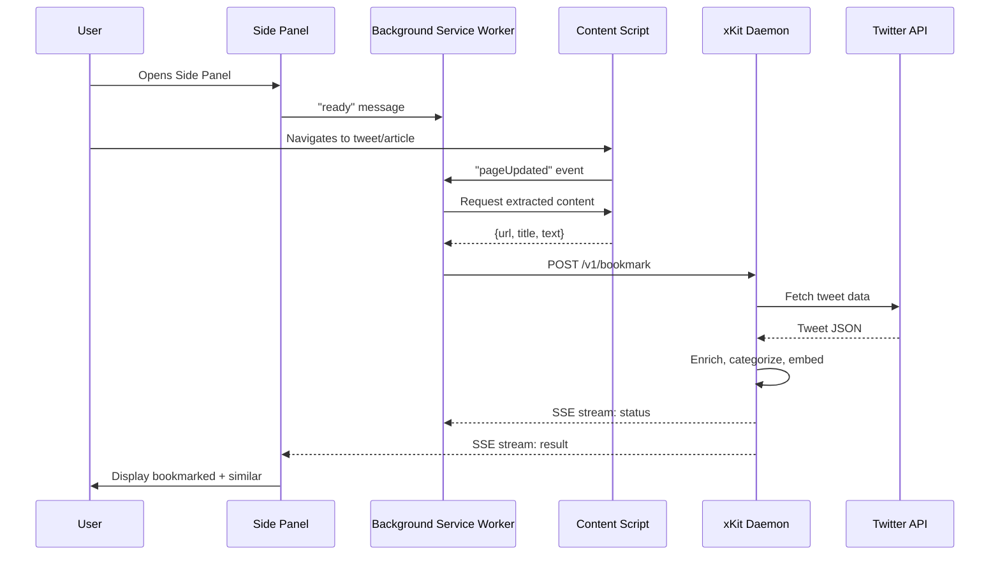

# xKit Enhancement Opportunities from Summarize

**Date:** 2026-01-20
**Type:** Feature Analysis
**Status:** Draft
**Schema Version:** 1

---

## Executive Summary

This document analyzes [steipete/summarize](https://github.com/steipete/summarize) - a CLI tool for summarizing web content, YouTube videos, podcasts, and files - to identify features that could enhance xKit's bookmark archiving and analysis capabilities.

**Key Finding:** Summarize and xKit serve different primary purposes (summarization vs archiving), but share significant architectural overlap in content extraction, LLM integration, and caching. Several features could meaningfully improve xKit's value proposition.

**Top 3 High-Impact Opportunities:**

1. **SQLite-based Cache with TTL** (Effort: Medium, Impact: High) - Eliminates redundant API calls, reduces costs
2. **Auto Model Selection with Fallback** (Effort: Medium, Impact: High) - Improves reliability and reduces manual configuration
3. **Chrome Extension for Real-time Summarization** (Effort: High, Impact: Very High) - New user-facing capability

---

## Context: Current xKit Capabilities

xKit is a Twitter/X bookmark archiving tool with the following features:

- **Bookmark Export:** Fetches bookmarks from Twitter API
- **Content Enrichment:** Expands URLs, extracts article content, fetches threads
- **Categorization:** Auto-categorizes into github/article/video/prompts/visual/tweet
- **Markdown Output:** Writes knowledge files organized by date/category/author
- **Analysis:** LLM-based categorization, usefulness scoring, embeddings (Ollama)
- **Stats:** Processing statistics, token tracking (recently added)

**Current Gaps:**
- No persistent caching of extracted content or LLM responses
- Manual model selection (no auto-fallback)
- No real-time/browser-integrated workflows
- Limited podcast/video transcription support
- No cost estimation or token tracking until recent implementation

---

## Feature Comparison Matrix

| Feature | Summarize | xKit | Port Value | Effort |
|---------|-----------|------|------------|--------|
| **SQLite Cache with TTL** | ✅ Full | ❌ None | High | Medium |
| **Auto Model Selection** | ✅ Full | ⚠️ Partial (plan only) | High | Medium |
| **Chrome Extension** | ✅ Full | ❌ None | Very High | High |
| **Podcast Transcription** | ✅ Full | ⚠️ YouTube only | Medium | Low |
| **Multi-format Input** | ✅ Full | ⚠️ URLs only | Low | High |
| **Cost Tracking** | ✅ Full | ✅ Recently added | Low | Done |
| **Daemon Mode** | ✅ Full | ❌ None | Medium | High |
| **Refresh-Free Command** | ✅ Full | ❌ None | Medium | Low |
| **Firecrawl Integration** | ✅ Full | ⚠️ Manual | Medium | Low |
| **MarkItDown Integration** | ✅ Full | ❌ None | Medium | Low |

---

## Detailed Feature Analysis

### 1. SQLite-based Cache with TTL and Eviction

**Summarize Implementation:**
- Single SQLite database at `~/.summarize/cache.sqlite`
- Keys: `sha256({url, options, formatVersion})` for extracts, `sha256({contentHash, promptHash, model, length, language})` for summaries
- TTL sweep on read/write (default 30 days)
- Size cap with LRU eviction (default 512MB, deletes oldest by `last_accessed_at`)
- WAL mode for performance, incremental vacuum for space recovery

**Key Files:**
- `src/cache.ts` (600+ lines)
- `docs/cache.md`

**Port Value for xKit:**
- **Eliminate redundant API calls:** Currently re-fetches/re-summarizes on every run
- **Reduce LLM costs:** Cache categorization and summarization results
- **Faster re-runs:** Skip already-processed bookmarks
- **Bounded disk usage:** No file sprawl, automatic eviction

**Implementation Effort:** Medium (2-3 days)

**Recommended Approach:**
1. Add `sqlite` dependency (built-in Node 22+, or `better-sqlite3` for older)
2. Create cache keys compatible with existing `StateManager`:
   - Extract cache: `hash({url, extractSettings})`
   - Summary cache: `hash({contentHash, promptHash, model})`
3. Integrate with existing enrichment pipeline
4. Add CLI flags: `--cache-stats`, `--clear-cache`, `--no-cache`
5. Default: enabled, 512MB cap, 30-day TTL

**Code Snippet from Summarize:**

```typescript
// Cache key generation
export function buildExtractCacheKey({
  url,
  options,
}: {
  url: string
  options: Record<string, unknown>
}): string {
  return hashJson({ url, options, formatVersion: CACHE_FORMAT_VERSION })
}

export function buildSummaryCacheKey({
  contentHash,
  promptHash,
  model,
  lengthKey,
  languageKey,
}: {
  contentHash: string
  promptHash: string
  model: string
  lengthKey: string
  languageKey: string
}): string {
  return hashJson({
    contentHash,
    promptHash,
    model,
    lengthKey,
    languageKey,
    formatVersion: CACHE_FORMAT_VERSION,
  })
}
```

---

### 2. Auto Model Selection with Intelligent Fallback

**Summarize Implementation:**
- `--model auto` builds ordered candidate list based on input kind (video/image/website/text) and token size
- Skips candidates without API keys
- Retries with next candidate on error
- Token band-based selection (e.g., use cheaper models for small inputs)
- CLI model support (local Claude/Codex/Gemini)
- OpenRouter fallback for cloud models

**Key Files:**
- `src/model-auto.ts` (500+ lines)
- `docs/model-auto.md`

**Port Value for xKit:**
- **Reliability:** Automatic fallback when API rate limits or errors occur
- **Cost optimization:** Use cheaper models for small tasks
- **Simplified UX:** Users don't need to manually configure models
- **Future-proof:** Easy to add new models/providers

**Current xKit State:**
- Has `model-router.ts` in plan (from Smaug port)
- Has `DEFAULT_MODEL_TIERS` and `PREDEFINED_STRATEGIES` defined
- Not yet integrated into actual categorization/enrichment flow

**Implementation Effort:** Medium (3-4 days)

**Recommended Approach:**
1. Adapt `model-auto.ts` logic for xKit's use case (categorization vs summarization)
2. Define rules for:
   - Small tweets (< 280 chars): use fast/cheap models
   - Long articles: use high-context models
   - Thread fetching: prefer Claude (better instruction following)
3. Integrate with existing `LLMCategorizer` and `OllamaClient`
4. Add config support for custom rules
5. Fallback chain: Ollama → OpenAI free → paid models

**Code Snippet from Summarize:**

```typescript
const DEFAULT_RULES: AutoRule[] = [
  {
    when: ['video'],
    candidates: ['google/gemini-3-flash-preview', 'google/gemini-2.5-flash-lite-preview-09-2025'],
  },
  {
    when: ['website', 'youtube', 'text'],
    bands: [
      {
        token: { max: 50_000 },
        candidates: [
          'google/gemini-3-flash-preview',
          'openai/gpt-5-mini',
          'anthropic/claude-sonnet-4-5',
        ],
      },
      {
        token: { max: 200_000 },
        candidates: [
          'google/gemini-3-flash-preview',
          'openai/gpt-5-mini',
          'anthropic/claude-sonnet-4-5',
        ],
      },
      {
        candidates: [
          'xai/grok-4-fast-non-reasoning',
          'google/gemini-3-flash-preview',
          'openai/gpt-5-mini',
          'anthropic/claude-sonnet-4-5',
        ],
      },
    ],
  },
]
```

---

### 3. Chrome Side Panel Extension

**Summarize Implementation:**
- Chrome MV3 extension with real Side Panel (not injected UI)
- Local daemon (HTTP server on localhost) for security
- Token-based authentication for daemon pairing
- Auto-summarize on page navigation
- Extracts readable text from rendered DOM
- SSE streaming for real-time Markdown rendering
- Cross-platform autostart (macOS LaunchAgent, Linux systemd, Windows Scheduled Task)

**Key Files:**
- `apps/chrome-extension/`
- `docs/chrome-extension.md`
- `src/daemon/`

**Port Value for xKit:**
- **New workflow:** Real-time bookmarking while browsing
- **Better UX:** No need to run CLI manually
- **Increased engagement:** Always-on sidebar for quick access
- **Differentiation:** Unique feature not in other bookmark tools

**Implementation Effort:** High (1-2 weeks)

**Recommended Approach:**
1. Build MV3 extension with Side Panel
2. Create daemon mode for xKit: `xkit daemon start`
3. Implement endpoints:
   - `POST /v1/bookmark` - Add current URL to bookmarks
   - `GET /v1/similar/:id` - Find similar bookmarks (using embeddings)
   - `GET /v1/bookmark/:id` - Get bookmark details
4. Content script extraction using Readability
5. Token-based authentication (same as Summarize)
6. Autostart service for daemon

**Architecture Diagram:**



---

### 4. Podcast and Audio Transcription

**Summarize Implementation:**
- Apple Podcasts, Spotify, RSS feed support
- Prefers published transcripts (Podcasting 2.0)
- Falls back to Whisper transcription (local `whisper.cpp` preferred, otherwise OpenAI/FAL)
- yt-dlp for audio download when needed
- Progress events during transcription

**Key Files:**
- `src/content/transcript/`
- `tests/transcript.*`

**Port Value for xKit:**
- **New content type:** Archive podcast bookmarks with transcripts
- **Better search:** Full-text search through podcast transcripts
- **Accessibility:** Read podcast content without listening

**Current xKit State:**
- Supports YouTube (via ytdlp integration)
- No general podcast/audio support

**Implementation Effort:** Low-Medium (3-5 days)

**Recommended Approach:**
1. Add podcast detection in bookmark enrichment
2. Use existing Summarize logic (could import as dependency)
3. Store transcripts in markdown files
4. Add `podcast` category

---

### 5. Refresh-Free Command (OpenRouter Model Discovery)

**Summarize Implementation:**
- `summarize refresh-free` fetches OpenRouter `:free` models
- Filters by age (default 180 days), parameter size (default 27B+)
- Tests each model with concurrency
- Selects mix of "smart" (high context) and fast models
- Writes `models.free` preset to config

**Key Files:**
- `src/refresh-free.ts` (600+ lines)

**Port Value for xKit:**
- **Cost savings:** Automatically discover working free models
- **Maintenance:** Model lists stay current without manual updates
- **Resilience:** Automatic fallback when free models change

**Implementation Effort:** Low (1-2 days)

**Recommended Approach:**
1. Adapt `refresh-free.ts` for xKit's use case
2. Test with categorization prompts (not just "Reply OK")
3. Create `xkit refresh-models` command
4. Update `model-router.ts` to use discovered models

**Code Snippet from Summarize:**

```typescript
// Key logic: test free models and select best
const results: Result[] = []
for (const openrouterModelId of freeIds) {
  try {
    await generateTextWithModelId({
      modelId: `openai/${openrouterModelId}`,
      apiKeys,
      prompt: 'Reply with a single word: OK',
      temperature: 0,
      maxOutputTokens: 16,
      timeoutMs: TIMEOUT_MS,
      fetchImpl,
      forceOpenRouter: true,
      retries: 0,
    })
    results.push({ ok: true, value: { openrouterModelId, latencyMs } })
  } catch (error) {
    results.push({ ok: false, openrouterModelId, error: String(error) })
  }
}
```

---

### 6. Firecrawl Integration

**Summarize Implementation:**
- `--firecrawl auto|always|off` flag
- Falls back to Firecrawl when direct extraction fails
- Used for sites that block bots

**Port Value for xKit:**
- **Higher success rate:** Extract content from paywalled/protected sites
- **Better quality:** Firecrawl's extraction is often better than naive Readability

**Implementation Effort:** Low (1 day)

**Recommended Approach:**
1. Add `FIRECRAWL_API_KEY` support
2. Add `--firecrawl` flag to archive command
3. Use Firecrawl as fallback in `ArticleExtractor`

---

### 7. MarkItDown Integration

**Summarize Implementation:**
- `--preprocess always|auto|off` flag
- Uses `uvx markitdown` for file preprocessing
- Supports PDF, images, audio, video, Office docs

**Port Value for xKit:**
- **File support:** Process PDFs, images, Office docs from bookmarks
- **Better extraction:** MarkItDown handles complex formats

**Implementation Effort:** Low (1 day)

**Recommended Approach:**
1. Add `--preprocess` flag
2. Check for `markitdown` availability
3. Use for file URLs in bookmarks

---

### 8. Daemon Mode

**Summarize Implementation:**
- `summarize daemon install|uninstall|status|restart`
- HTTP server on localhost:8787
- Token authentication
- Platform autostart integration

**Port Value for xKit:**
- **Chrome extension backend:** Required for Side Panel
- **Long-running process:** Keep embeddings/vector store in memory
- **Faster responses:** Avoid cold start overhead

**Implementation Effort:** High (5-7 days)

**Recommended Approach:**
1. Create `src/daemon/` directory
2. Implement HTTP server with token auth
3. Add endpoints for bookmark operations
4. Platform-specific autostart (LaunchAgent, systemd, Task Scheduler)
5. Logging to `~/.xkit/logs/`

**Daemon Endpoints:**

```typescript
// Proposed xKit daemon endpoints
interface DaemonEndpoints {
  // Health
  'GET /health': { ok: true; pid: number }

  // Bookmark operations
  'POST /v1/bookmark': { ok: true; id: string }
  'GET /v1/bookmark/:id': Bookmark
  'DELETE /v1/bookmark/:id': { ok: true }

  // Search (using embeddings)
  'GET /v1/search?q=...': Bookmark[]

  // Similarity
  'GET /v1/similar/:id': Bookmark[]

  // Status
  'GET /v1/stats': {
    totalBookmarks: number
    cached: number
    lastRun: string
  }
}
```

---

## Cost Tracking (Already Implemented)

**Summarize Implementation:**
- LiteLLM catalog integration via `tokentally` package
- Per-call cost tracking
- Summary report: `{ llm: [...], services: { firecrawl, apify } }`

**Current xKit State:**
- ✅ Recently implemented `TokenTracker` class
- ✅ Pricing data in `src/bookmark-analysis/pricing.ts`
- ✅ Token usage display in CLI output

**Status:** Complete - no action needed

---

## Implementation Prioritization

### Phase 1: Quick Wins (1-2 weeks)

| Feature | Effort | Impact | Dependencies |
|---------|--------|-------|--------------|
| SQLite Cache | Medium | High | None |
| Auto Model Selection | Medium | High | None |
| Refresh-Free Command | Low | Medium | OpenRouter key |
| Firecrawl Integration | Low | Medium | Firecrawl key |
| MarkItDown Integration | Low | Low | `markitdown` CLI |

**Benefits:**
- Immediate cost savings (cache, auto model)
- Better reliability (auto fallback)
- Faster iterations (cache)

### Phase 2: Chrome Extension (3-4 weeks)

| Feature | Effort | Impact | Dependencies |
|---------|--------|-------|--------------|
| Daemon Mode | High | Medium | None |
| Chrome Extension | High | Very High | Daemon |

**Benefits:**
- New user-facing capability
- Differentiation in market
- Increased engagement

### Phase 3: Advanced Features (2-3 weeks)

| Feature | Effort | Impact | Dependencies |
|---------|--------|-------|--------------|
| Podcast Transcription | Low-Medium | Medium | Whisper |
| Multi-format Input | High | Low | MarkItDown |

**Benefits:**
- Broader content support
- Niche use cases

---

## Technical Considerations

### Dependencies to Add

```json
{
  "dependencies": {
    "better-sqlite3": "^11.0.0",  // or use built-in 'node:sqlite' (Node 22+)
    "markdown-it": "^14.0.0",      // for Chrome extension rendering
    "wxt": "^0.19.0",              // Chrome extension framework
    "json5": "^2.3.0"              // already in summarize for lenient config
  },
  "devDependencies": {
    "@types/better-sqlite3": "^11.0.0"
  }
}
```

### Migration Path

1. **Backward compatibility:** All new features opt-in via flags/config
2. **Gradual rollout:**
   - Week 1: Add cache (disabled by default)
   - Week 2: Enable cache by default, monitor
   - Week 3: Add auto model selection
   - Week 4-6: Chrome extension beta
3. **Feature flags:** Use existing `--features` flag pattern

### Testing Strategy

```bash
# Cache tests
pnpm test src/cache/*.test.ts

# Auto model tests
pnpm test src/model-auto/*.test.ts

# Integration tests
pnpm test tests/cli.cache.test.ts
pnpm test tests/cli.auto.test.ts

# Chrome extension E2E
pnpm -C apps/chrome-extension test:e2e
```

---

## Risks and Mitigations

| Risk | Probability | Impact | Mitigation |
|------|-------------|--------|------------|
| Cache corruption | Low | Medium | Use WAL mode, checksums, easy `--clear-cache` |
| Auto model selects wrong model | Medium | Low | Log selections, allow manual override |
| Chrome extension adoption | Medium | High | Focus on power users first, improve UX |
| Daemon security | Low | High | Token auth, localhost-only, HTTPS cert pinning |
| Dependency bloat | Medium | Medium | Use built-in Node APIs where possible |

---

## Success Criteria

### Phase 1 (Quick Wins)

- [ ] Cache reduces API calls by 60%+ on second run
- [ ] Auto model selection success rate >95%
- [ ] Refresh-free discovers 5+ working models
- [ ] Firecrawl fallback works for paywalled sites
- [ ] No increase in bundle size >20%

### Phase 2 (Chrome Extension)

- [ ] Daemon install works on macOS/Linux/Windows
- [ ] Extension successfully bookmarks current page
- [ ] Similar search returns relevant results
- [ ] Average time from click to bookmark <5s
- [ ] Extension passes Chrome Web Store review

### Phase 3 (Advanced)

- [ ] Podcast transcripts extracted successfully
- [ ] Multi-format files processed via MarkItDown
- [ ] All features work together without conflicts

---

## Open Questions

1. **Cache invalidation:** How should xKit handle updated content? (TTL only, or manual invalidation?)
2. **Daemon resource usage:** What's the acceptable memory footprint for the daemon? (Vector store + embeddings)
3. **Chrome extension scope:** Should it just do bookmarking, or also allow browsing/searching the archive?
4. **Model selection for categorization:** Are Summarize's rules appropriate for xKit's categorization task, or do we need different heuristics?
5. **Podcast storage:** Where should long transcripts be stored? (Inline in markdown, separate files, database?)

---

## References

- [Summarize Repository](https://github.com/steipete/summarize)
- [Summarize README](https://github.com/steipete/summarize/blob/master/README.md)
- [xKit Repository](https://github.com/jscraik/xKit)
- [Smaug Feature Port Spec](./spec-2025-01-19-smaug-feature-port.md)

---

**Next Steps:**

1. Review and prioritize features with stakeholder feedback
2. Create technical specs for Phase 1 features
3. Set up development environment for Chrome extension
4. Begin implementation with SQLite cache (highest ROI)

---

**Document Version:** 1.0
**Last Updated:** 2026-01-20
**Status:** Ready for Review
