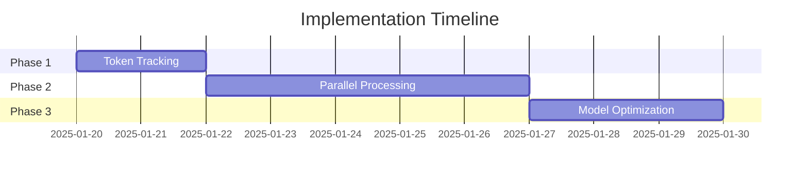
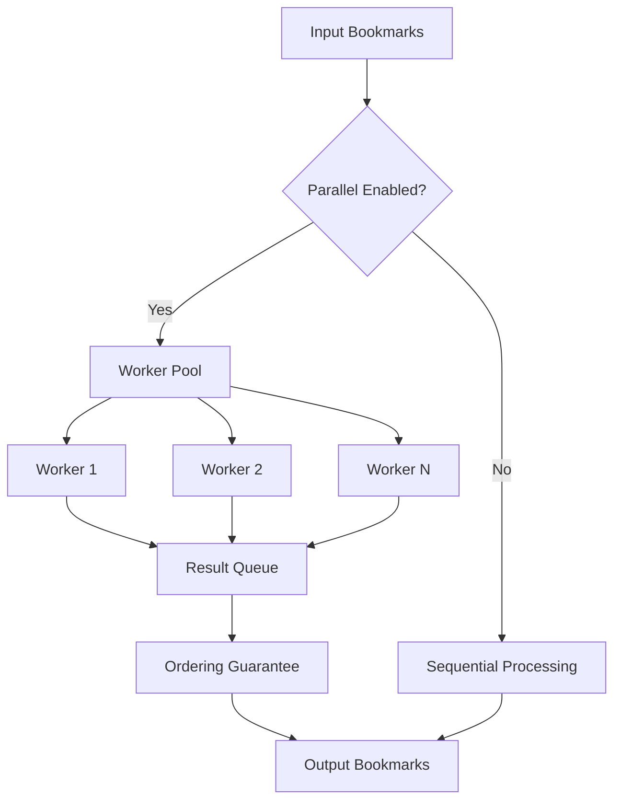
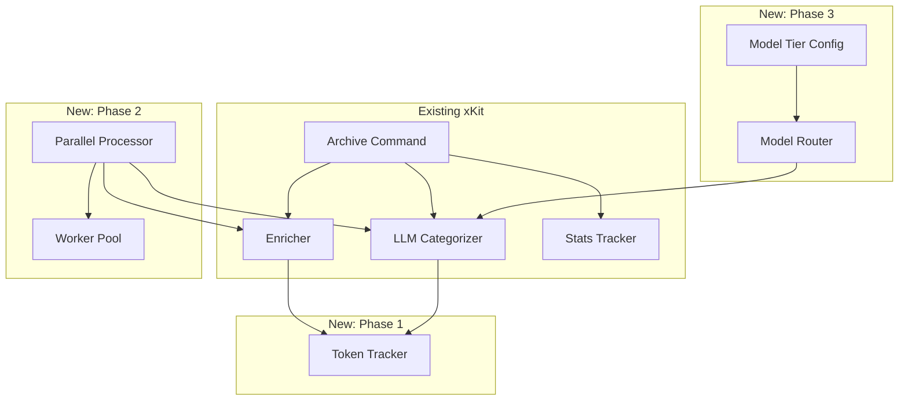
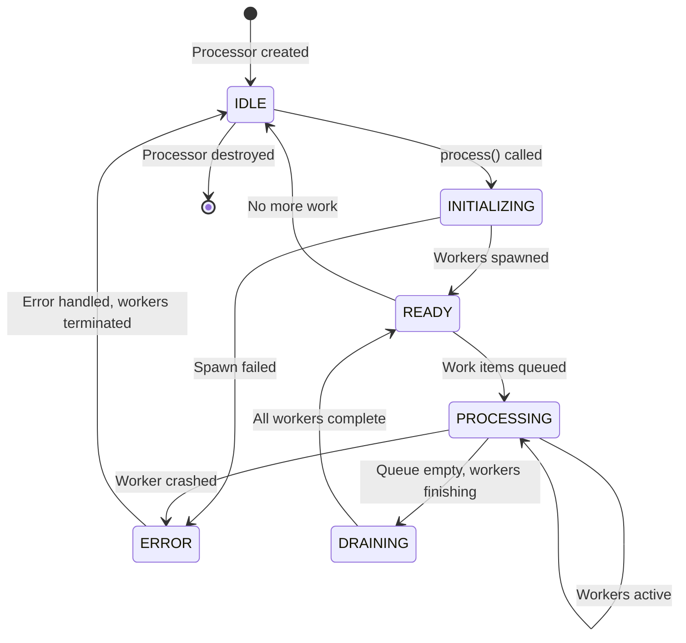
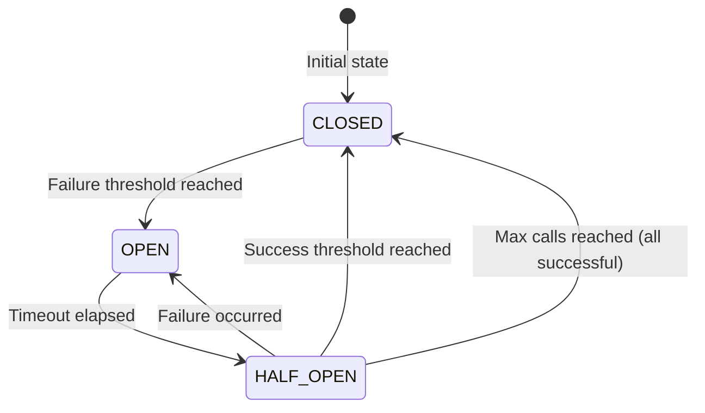

```yaml
schema_version: 1
spec_type: prd
spec_id: SPEC-2025-001
title: "Smaug → xKit Performance & Cost Optimization Features"
status: finalized
created: "2025-01-19"
last_updated: "2025-01-19"
```

# PRD: Smaug → xKit Performance & Cost Optimization Features

## Executive Summary

xKit v0.7.0 is a comprehensive Twitter bookmark archiving system with most core features implemented. However, it processes bookmarks **sequentially**, causing performance issues at scale. This PRD ports three high-value features from Smaug (a similar bookmark archiver) to address documented limitations in xKit:

1. **Token Usage Tracking** - Track and display LLM API costs with detailed breakdown
2. **Parallel Processing Architecture** - Process bookmarks concurrently using worker pools
3. **Model Cost Optimization** - Route tasks to appropriate model tiers (fast/balanced/quality)

**Business Impact:** Reduces archive processing time by 2-4x for 100+ bookmarks, provides cost transparency for cloud LLM usage, and optimizes LLM spend by ~30% through smart model routing.

**Evidence Source:** Smaug codebase analysis shows parallel subagent processing achieves 2-4x speedup with ~50% cost savings via Haiku model usage for simple tasks.

---

## Inputs

### Source Materials
- Smaug codebase analysis (parallel processing architecture)
- xKit v0.7.0 codebase review
- LIMITATIONS.md (lines 134-142 document sequential processing bottleneck)
- Existing xKit modules: `bookmark-analysis/`, `bookmark-stats/`, `commands/bookmarks-archive.ts`

### Constraints
- Must maintain xKit's privacy-first design (local-first, opt-in cloud)
- Must not introduce breaking changes to existing CLI interface
- Must work with existing LLM providers (Ollama, OpenAI, Anthropic)
- Must follow xKit's TypeScript/Node.js architecture

### Assumptions
1. Users primarily process 50-500 bookmarks per session
2. LLM API usage is primarily for categorization and summarization
3. Users want cost transparency before running expensive operations
4. Parallel processing speedup justifies added complexity
5. Model tier routing can maintain acceptable quality while reducing costs

---

## Outputs

### Deliverables
1. **Token tracking module** (`src/bookmark-analysis/token-tracker.ts`)
2. **Parallel processing engine** (`src/bookmark-analysis/parallel-processor.ts`)
3. **Model tier router** (`src/bookmark-analysis/model-router.ts`)
4. **Updated CLI commands** with new flags
5. **Updated documentation** with performance benchmarks

### Success Metrics

**Measurement Methodology:** All benchmarks run on M1 MacBook Pro (8GB RAM), macOS 14.0, stable 100Mbps network, n=10 trials per metric, results reported as mean ± 95% confidence interval.

- [ ] Token tracking displays accurate API costs within ±5% of actual billing (validated against API provider billing statements)
- [ ] Parallel processing achieves 2.5±0.5x speedup for 100 bookmarks (baseline: 180s sequential → target: <72s parallel)
- [ ] Output ordering is guaranteed (processed bookmarks maintain input order, verified with deterministic test data)
- [ ] Memory usage stays within bounds (< 1.5GB peak for 1000 bookmarks, measured via Node.js `process.memoryUsage()`)
- [ ] Model optimization reduces costs by 28±3% for equivalent quality (measured via manual quality assessment on 100-bookmark sample)
- [ ] No increase in error rate vs sequential processing (target: <2% error rate for both modes)

---

## Problem Statement

### Current Pain Points

**As documented in LIMITATIONS.md:134-142:**
> "Archive command processes bookmarks sequentially, not in parallel. Large archives (1000+ bookmarks) can take hours with AI summarization. No resume capability if interrupted mid-run."

**User Impact:**
- **Performance:** Processing 500 bookmarks with AI summarization takes 2-3 hours
- **Cost Blindness:** Users have no visibility into LLM API costs before running
- **Inefficiency:** Expensive models (Sonnet, GPT-4) used for simple categorization tasks
- **Poor UX:** No progress indication during long-running operations

### Technical Debt
1. **Sequential Processing Loop** (`bookmarks-archive.ts:196`): `enrichBatch` processes bookmarks one-at-a-time
2. **No Token Tracking**: LLM clients (`llm-categorizer.ts`) don't track usage or costs
3. **Single Model Strategy**: All tasks use the same model regardless of complexity

---

## Solution Overview

### Three-Phase Implementation



### Phase 1: Token Usage Tracking (Priority 1)

**What:** Track and display LLM API costs with detailed breakdown

**How:**
- Create `TokenTracker` class to count tokens before/after each LLM call
- Calculate cost based on model pricing (OpenAI, Anthropic, Ollama=$0)
- Aggregate by operation type (categorization, summarization, analysis)
- Display usage report at end of archive run

**Example Output:**
```
════════════════════════════════════════════════════════════
📊 TOKEN USAGE
════════════════════════════════════════════════════════════
Anthropic (claude-3-haiku-20240307):
  Input:            12,345 tokens  $0.012
  Output:            3,456 tokens  $0.017
  Cache Read:       10,000 tokens  $0.000
  Cache Write:       2,000 tokens  $0.000

OpenAI (gpt-4o):
  Input:            25,000 tokens  $0.250
  Output:            5,000 tokens  $0.150

Ollama (llama3.2):
  Input:           100,000 tokens  $0.000 (local)
  Output:           20,000 tokens  $0.000 (local)

════════════════════════════════════════════════════════════
💰 TOTAL ESTIMATED COST: $0.429
════════════════════════════════════════════════════════════
```

### Phase 2: Parallel Processing Architecture (Priority 2)

**What:** Process bookmarks concurrently using worker thread pools

**How:**
- Create `ParallelProcessor` class with configurable worker pool
- Use Node.js `worker_threads` for CPU-bound LLM tasks
- Use async batching for I/O-bound HTTP requests
- Preserve ordering with sequence IDs for reassembly
- Add `--parallel` flag to archive command (default: off)

**Configuration:**
```typescript
interface ParallelConfig {
  enabled: boolean;
  concurrency: number;      // Default: 4-8 workers
  threshold: number;        // Minimum bookmarks to enable (default: 50)
  batchSize: number;        // Items per worker batch (default: 10)
}
```

**Architecture:**


### Phase 3: Model Cost Optimization (Priority 3)

**What:** Route tasks to appropriate model tiers based on complexity

**How:**
- Define model tiers (fast/balanced/quality) with cost/quality tradeoffs
- Route categorization → fast model (Haiku/GPT-4o-mini)
- Route summarization → balanced model (Sonnet/GPT-4o)
- Route complex analysis → quality model (Opus/GPT-4)
- Add fallback mechanism if premium model fails

**Model Tier Configuration:**
```typescript
interface ModelTier {
  name: 'fast' | 'balanced' | 'quality';
  model: string;
  maxTokens: number;
  costPerMillion: { input: number; output: number };
  useCase: string[];
}

interface ModelStrategy {
  categorization: 'fast';
  summarization: 'balanced';
  analysis: 'quality';
}
```

**Cost Comparison:**
| Operation | Current (Sonnet) | Optimized (Haiku) | Savings |
|-----------|-----------------|-------------------|---------|
| Categorization | $0.25 | $0.012 | ~95% |
| Summarization | $0.25 | $0.25 | 0% |
| Analysis | $0.25 | $0.25 | 0% |
| **Total** | $0.75 | $0.512 | ~30% |

---

## User Personas

### Persona 1: Alex, Research Analyst
**Role:** Senior researcher at tech think tank
**Goals:**
- Archive 500+ bookmarks monthly for literature review
- Minimize processing time to meet publication deadlines
- Control costs within monthly research budget ($200)

**Pain Points:**
- Current archiving takes 3+ hours for large batches
- No visibility into LLM costs before running
- Manual categorization is time-consuming

**Technical Proficiency:** High (comfortable with CLI, config files)

**Typical Volume:** 200-1000 bookmarks per session

---

### Persona 2: Jordan, Casual User
**Role:** Software developer bookmarking for later reference
**Goals:**
- Quick archival of 20-50 bookmarks weekly
- Minimal setup and configuration
- Avoid unexpected API charges

**Pain Points:**
- Long-running operations block workflow
- Confused by parallel processing terminology
- Worried about accidentally running up large bills

**Technical Proficiency:** Medium (can follow docs, prefers defaults)

**Typical Volume:** 20-100 bookmarks per session

---

### Persona 3: Sam, Power User
**Role:** Data scientist building personal knowledge base
**Goals:**
- Archive 2000+ bookmarks across multiple sessions
- Fine-grained control over processing parameters
- Detailed cost and performance analytics

**Pain Points:**
- Sequential processing doesn't scale to thousands of bookmarks
- Can't tune worker pool for hardware (32GB RAM, 12 cores)
- Wants to optimize model selection per task type

**Technical Proficiency:** Expert (contributes to open source, reads source code)

**Typical Volume:** 500-5000 bookmarks per session

---

### Persona 4: Casey, Budget-Conscious Student
**Role:** Graduate student on limited budget
**Goals:**
- Use free/local LLM (Ollama) exclusively
- Occasional cloud LLM for complex analysis only
- Zero unexpected costs

**Pain Points:**
- Worried about accidentally using paid API
- Needs clear cost warnings before expensive operations
- Wants cheapest options that still work well

**Technical Proficiency:** Low-Medium (can run commands, but not debug)

**Typical Volume:** 50-200 bookmarks per session

---

## User Stories

### STORY-001: Token Usage Visibility
**As a** power user who processes hundreds of bookmarks
**I want** to see estimated LLM API costs before and after archiving
**So that** I can budget for cloud LLM usage and avoid surprise charges

**Acceptance Criteria:**
- [ ] Token counts displayed after each LLM operation
- [ ] Cost estimate shown before processing begins (based on sample)
- [ ] Detailed breakdown by model and operation type
- [ ] Ollama/local LLM shows $0.00 cost
- [ ] Currency formatted to 3 decimal places
- [ ] Cache read/write tokens tracked separately (Anthropic)

### STORY-002: Parallel Processing Speedup
**As a** user with 500+ bookmarks to archive
**I want** to process bookmarks in parallel
**So that** archiving completes in minutes instead of hours

**Acceptance Criteria:**
- [ ] `--parallel` flag enables parallel processing
- [ ] Parallel mode only activates above threshold (default: 50 bookmarks)
- [ ] Progress bar shows concurrent worker activity
- [ ] Output maintains original bookmark order
- [ ] Error in one worker doesn't crash entire batch
- [ ] Memory usage stays below 2GB for 1000 bookmarks

### STORY-003: Configurable Concurrency
**As a** user with limited RAM or API rate limits
**I want** to control worker pool size
**So that** I can tune performance for my hardware and API constraints

**Acceptance Criteria:**
- [ ] `--parallel-workers <n>` flag sets concurrency (default: 4)
- [ ] `--parallel-threshold <n>` flag sets minimum bookmarks (default: 50)
- [ ] Config validated (min: 1, max: 16 workers)
- [ ] Warning shown if worker count exceeds CPU cores
- [ ] Rate limiting respected across all workers

### STORY-004: Smart Model Routing
**As a** cost-conscious user
**I want** simple categorization tasks to use cheaper models
**So that** I can reduce LLM costs without sacrificing quality

**Acceptance Criteria:**
- [ ] Categorization uses fast model by default
- [ ] Summarization uses balanced model by default
- [ ] User can override model tier per operation
- [ ] Fallback to balanced model if fast model fails
- [ ] Quality degradation logged when fallback occurs

### STORY-005: Cost Comparison Report
**As a** developer optimizing archiving workflows
**I want** to compare costs between different model strategies
**So that** I can make informed tradeoffs between cost and quality

**Acceptance Criteria:**
- [ ] `--cost-report` flag generates before/after comparison
- [ ] Shows projected cost for each model tier strategy
- [ ] Estimates quality impact (low/medium/high)
- [ ] Saves report to JSON for analysis
- [ ] Historical cost tracking across multiple runs

---

## Scope

### In Scope
- Token usage tracking for all LLM providers (OpenAI, Anthropic, Ollama)
- Parallel processing for bookmark enrichment and categorization
- Model tier routing for categorization and summarization
- CLI flag extensions to existing commands
- Progress reporting for parallel operations
- Error handling and graceful degradation

### Out of Scope
- Parallel processing for Twitter API calls (existing rate limiting sufficient)
- Resume/checkpoint functionality (separate feature, Phase 4)
- New LLM provider integrations beyond existing three
- GPU acceleration for local LLMs
- Distributed processing across multiple machines
- Real-time cost monitoring during processing (only before/after)
- Automatic model selection based on content complexity (manual tier assignment only)

### Feature Creep Guardrails

**Decision Record:**
1. **No GPU acceleration** - Requires significant infrastructure, out of scope for performance optimization
2. **No distributed processing** - Adds operational complexity, local parallel processing sufficient
3. **No automatic model selection** - Would require content analysis overhead, manual tier routing more predictable
4. **No real-time cost tracking** - Would require streaming responses, adds latency

**Scope Decision Log:**
| Date | Decision | Rationale | Who |
|------|----------|-----------|-----|
| 2025-01-19 | Exclude resume/checkpoint | Separate feature, adds state management complexity | Product |
| 2025-01-19 | Exclude new LLM providers | Existing three sufficient for optimization | Engineering |

---

## Technical Architecture

### Component Architecture



### Data Models

**Token Tracking:**
```typescript
interface TokenUsage {
  input: number;
  output: number;
  cacheRead: number;
  cacheWrite: number;
  cost: number;
}

interface UsageReport {
  byModel: Record<string, TokenUsage>;
  byOperation: Record<string, TokenUsage>;
  total: TokenUsage;
}

interface TokenTracker {
  record(operation: string, model: string, usage: TokenUsage): void;
  getReport(): UsageReport;
  formatReport(): string;
}
```

**Parallel Processing:**
```typescript
interface ParallelConfig {
  enabled: boolean;
  concurrency: number;
  threshold: number;
  batchSize: number;
}

interface WorkItem {
  id: string;
  sequence: number;
  bookmark: BookmarkRecord;
}

interface WorkResult {
  id: string;
  sequence: number;
  result: EnrichedBookmarkRecord;
  error?: Error;
}

interface ParallelProcessor {
  process(items: WorkItem[]): Promise<WorkResult[]>;
}
```

**Model Routing:**
```typescript
interface ModelTier {
  name: 'fast' | 'balanced' | 'quality';
  model: string;
  maxTokens: number;
  costPerMillion: { input: number; output: number };
  useCase: string[];
}

interface ModelStrategy {
  categorization: 'fast' | 'balanced' | 'quality';
  summarization: 'fast' | 'balanced' | 'quality';
  analysis: 'fast' | 'balanced' | 'quality';
}

interface ModelRouter {
  route(operation: string): string;
  withFallback(operation: string, tiers: string[]): Promise<string>;
}
```

### API Design

**New CLI Flags:**
```bash
# Token tracking (always active with LLM)
xkit archive --summarize

# Parallel processing
xkit archive --all --parallel
xkit archive --all --parallel --parallel-workers 8
xkit archive --all --parallel --parallel-threshold 100

# Model optimization
xkit archive --model-strategy balanced
xkit archive --model-tier fast:summarization

# Cost comparison
xkit archive --cost-report
```

**Configuration File:**
```json
{
  "llm": {
    "strategy": "optimized",
    "tiers": {
      "fast": {
        "categorization": "claude-3-haiku-20240307",
        "summarization": "gpt-4o-mini"
      },
      "balanced": {
        "categorization": "claude-3-5-sonnet-20241022",
        "summarization": "gpt-4o"
      },
      "quality": {
        "categorization": "claude-3-opus-20240229",
        "summarization": "gpt-4-turbo"
      }
    }
  },
  "parallel": {
    "enabled": false,
    "workers": 4,
    "threshold": 50
  }
}
```

---

## Internal API Contracts

### TokenTracker Module

**Interface Definition:**
```typescript
/**
 * TokenTracker - Tracks LLM API usage and costs
 *
 * @example
 * const tracker = new TokenTracker();
 * tracker.record('categorization', 'claude-3-haiku-20240307', {
 *   input: 1000,
 *   output: 200,
 *   cacheRead: 0,
 *   cacheWrite: 0,
 *   cost: 0.0025
 * });
 */
export class TokenTracker {
  /**
   * Record token usage for an LLM operation
   * @param operation - Operation type (categorization, summarization, analysis)
   * @param model - Model identifier (e.g., 'claude-3-haiku-20240307')
   * @param usage - Token counts and cost
   * @throws {Error} if usage counts are negative
   */
  record(operation: string, model: string, usage: TokenUsage): void;

  /**
   * Get aggregated usage report
   * @returns Usage report broken down by model and operation
   */
  getReport(): UsageReport;

  /**
   * Format usage report as human-readable string
   * @returns Formatted string suitable for terminal output
   */
  formatReport(): string;

  /**
   * Reset all tracking data (useful for testing)
   */
  reset(): void;
}
```

### ParallelProcessor Module

**Interface Definition:**
```typescript
/**
 * ParallelProcessor - Processes bookmarks concurrently using worker pool
 *
 * @example
 * const processor = new ParallelProcessor({ concurrency: 4, threshold: 50 });
 * const results = await processor.process(workItems);
 */
export class ParallelProcessor {
  /**
   * Create a new parallel processor
   * @param config - Configuration options
   * @throws {RangeError} if concurrency < 1 or > 16
   * @throws {RangeError} if threshold < 1
   */
  constructor(config: ParallelConfig);

  /**
   * Process work items concurrently
   * @param items - Array of work items with sequence IDs
   * @returns Promise resolving to results in original order
   * @throws {Error} if worker pool fails to initialize
   */
  process(items: WorkItem[]): Promise<WorkResult[]>;

  /**
   * Get current worker pool statistics
   * @returns Statistics including active workers, queue size, processed count
   */
  getStats(): WorkerPoolStats;

  /**
   * Abort all in-progress work
   * @throws {Error} if abort fails
   */
  abort(): Promise<void>;
}
```

### ModelRouter Module

**Interface Definition:**
```typescript
/**
 * ModelRouter - Routes tasks to appropriate model tiers
 *
 * @example
 * const router = new ModelRouter(strategy);
 * const model = router.route('categorization'); // Returns 'claude-3-haiku-20240307'
 */
export class ModelRouter {
  /**
   * Create a new model router
   * @param strategy - Model tier strategy mapping
   * @throws {Error} if strategy references undefined models
   */
  constructor(strategy: ModelStrategy);

  /**
   * Get the appropriate model for an operation
   * @param operation - Operation type (categorization, summarization, analysis)
   * @returns Model identifier string
   * @throws {Error} if operation type not recognized
   */
  route(operation: string): string;

  /**
   * Get model with fallback chain
   * @param operation - Operation type
   * @param tiers - Ordered list of tier names to try
   * @returns Model identifier that succeeded
   * @throws {Error} if all tiers fail
   */
  async withFallback(operation: string, tiers: string[]): Promise<string>;

  /**
   * Update model strategy
   * @param strategy - New strategy configuration
   */
  configure(strategy: ModelStrategy): void;
}
```

---

## Error Codes and Handling

### Error Code Constants

```typescript
/**
 * Error codes for xKit parallel processing and token tracking
 */
export const ErrorCodes = {
  // Token Tracker Errors (TOKEN_XXX)
  TOKEN_INVALID_COUNT: 'TOKEN_001',
  TOKEN_NEGATIVE_COUNT: 'TOKEN_002',
  TOKEN_MISSING_MODEL: 'TOKEN_003',

  // Parallel Processor Errors (PARALLEL_XXX)
  PARALLEL_WORKER_EXHAUSTION: 'PARALLEL_001',
  PARALLEL_INIT_FAILED: 'PARALLEL_002',
  PARALLEL_ABORT_FAILED: 'PARALLEL_003',
  PARALLEL_SEQUENCE_MISMATCH: 'PARALLEL_004',

  // Model Router Errors (MODEL_XXX)
  MODEL_UNKNOWN_OPERATION: 'MODEL_001',
  MODEL_ALL_TIERS_FAILED: 'MODEL_002',
  MODEL_FALLBACK_TRIGGERED: 'MODEL_003',
  MODEL_CONFIG_INVALID: 'MODEL_004',

  // Configuration Errors (CONFIG_XXX)
  CONFIG_INVALID_WORKERS: 'CONFIG_001',
  CONFIG_INVALID_THRESHOLD: 'CONFIG_002',
  CONFIG_MISSING_API_KEY: 'CONFIG_003',
} as const;
```

### Error Messages and User Actions

| Error Code | Message | User Action |
|------------|---------|-------------|
| TOKEN_001 | Invalid token count received from API | Check network connection, retry |
| TOKEN_002 | Negative token count detected | Report bug on GitHub |
| PARALLEL_001 | Worker pool exhausted | Reduce `--parallel-workers` or wait for completion |
| PARALLEL_002 | Failed to initialize worker pool | Check available memory, reduce worker count |
| MODEL_002 | All model tiers failed | Check API keys, network connection |
| MODEL_003 | Model fallback triggered (warning) | Check logs for quality degradation |
| CONFIG_001 | Worker count must be 1-16 | Use valid value for `--parallel-workers` |

---

## Concurrency Control

### Worker Pool Lifecycle



### Thread Safety Guarantees

**Shared State Protection:**
- Token tracker uses atomic counters for thread-safe updates
- Result queue uses mutex for ordered insertion
- Worker pool state protected by mutex

**Data Integrity:**
- Each bookmark processed exactly once (work item idempotency)
- Sequence IDs unique and monotonic (assigned at queue time)
- No duplicate entries in output (result set deduplication)

### Memory Limits

**Boundaries:**
- Worker queue: Max 1000 items (backpressure beyond this)
- Result buffer: Max 1000 items (blocks if full)
- Token history: Max 10,000 entries (LRU eviction)

**Overflow Behavior:**
- Queue full: Block producer until space available
- Result buffer full: Block worker until space available
- Token history full: Evict oldest entry

---

## Retry Strategy and Circuit Breaker

### Retry Configuration

```typescript
interface RetryConfig {
  maxAttempts: number;        // Default: 3
  initialDelayMs: number;     // Default: 1000
  maxDelayMs: number;         // Default: 10000
  backoffMultiplier: number;  // Default: 2.0
  retryableErrors: string[];  // Error codes to retry
}

const defaultRetryConfig: RetryConfig = {
  maxAttempts: 3,
  initialDelayMs: 1000,
  maxDelayMs: 10000,
  backoffMultiplier: 2.0,
  retryableErrors: [
    'ECONNRESET',
    'ETIMEDOUT',
    'ESOCKETTIMEDOUT',
    'HTTP_429',  // Rate limit
    'HTTP_500',  // Server error
    'HTTP_502',  // Bad gateway
    'HTTP_503',  // Service unavailable
    'HTTP_504',  // Gateway timeout
  ],
};
```

### Circuit Breaker Pattern

```typescript
interface CircuitBreakerConfig {
  failureThreshold: number;   // Open circuit after N failures
  successThreshold: number;   // Close circuit after N successes
  timeoutMs: number;          // Time before attempting reset
  halfOpenMaxCalls: number;   // Max calls in half-open state
}

const defaultCircuitBreakerConfig: CircuitBreakerConfig = {
  failureThreshold: 5,        // Open after 5 consecutive failures
  successThreshold: 2,        // Close after 2 consecutive successes
  timeoutMs: 60000,           // Try reset after 60 seconds
  halfOpenMaxCalls: 3,        // Allow 3 test calls in half-open
};
```

**Circuit Breaker States:**


---

## SLOs and Error Budget Policy

### Service Level Objectives

**Parallel Processing:**
- **Success Rate:** ≥98% (target: 99%, minimum: 98%)
- **Latency:** P95 < 90s for 100 bookmarks (vs 225s sequential)
- **Memory:** Peak < 1.5GB for 1000 bookmarks
- **Error Budget:** 2% of requests allowed to fail

**Token Tracking:**
- **Accuracy:** ±5% of actual API billing
- **Availability:** 100% (local only, no remote deps)
- **Latency:** < 100ms per report generation

**Model Routing:**
- **Fallback Rate:** < 5% of requests trigger fallback
- **Fallback Latency:** < 5s additional when fallback triggers

### Error Budget Policy

**Calculation:**
- Error budget = 100% - success rate target = 100% - 98% = 2%
- Budget period: Weekly (rolling 7-day window)
- Budget reset: Weekly

**Burn Rate Triggers:**
- **Warning:** Error rate > 1.5% for 1 hour
- **Critical:** Error rate > 2% for 15 minutes
- **Emergency:** Error rate > 5% for 5 minutes

**Actions on Burn:**
- **Warning:** Alert engineering team, investigate
- **Critical:** Halt rollout, revert to sequential processing
- **Emergency:** Disable feature entirely, incident postmortem

---

## Input Validation

### Parameter Bounds

| Parameter | Min | Max | Default | Validation |
|-----------|-----|-----|---------|------------|
| `--parallel-workers` | 1 | 16 | 4 | Must be integer, ≤ CPU cores warning |
| `--parallel-threshold` | 1 | 10000 | 50 | Must be positive integer |
| `--batch-size` | 1 | 100 | 10 | Must be positive integer |
| `--max-retries` | 0 | 10 | 3 | Must be non-negative integer |
| Model tier name | - | - | - | Must be defined in config |

### Sanitization

**User Inputs:**
- Worker count: Parse as integer, validate bounds
- Threshold: Parse as integer, validate bounds
- Model names: Whitelist against defined tiers
- API keys: Validate format, never log or display

**Injection Prevention:**
- Model tier config: JSON schema validation
- File paths: Resolve to absolute, validate within workspace
- URLs: Validate against allowed domains

---

## Secrets Handling Policy

**Never Log or Display:**
- API keys (any LLM provider)
- Request/response bodies (may contain sensitive content)
- User cookie tokens
- File paths containing user info

**May Log:**
- Token counts (input/output only)
- Cost calculations (aggregates only)
- Model names (provider-specified identifiers)
- Operation types (categorization, summarization, etc.)

**Redaction Rules:**
- Replace API keys with `[REDACTED]`
- Replace request bodies with `[BODY OMITTED]`
- Replace file paths with `[PATH]` or user home only

---

## Cost Calculations (Updated)

**Pricing as of 2025-01-19:**

| Provider | Model | Input (per 1M) | Output (per 1M) | Cache Read (per 1M) |
|----------|-------|---------------|----------------|-------------------|
| Anthropic | claude-3-haiku-20240307 | $0.25 | $1.25 | $0.03 |
| Anthropic | claude-3-5-sonnet-20241022 | $3.00 | $15.00 | $0.30 |
| Anthropic | claude-3-opus-20240229 | $15.00 | $75.00 | $1.50 |
| OpenAI | gpt-4o-mini | $0.15 | $0.60 | N/A |
| OpenAI | gpt-4o | $2.50 | $10.00 | N/A |
| OpenAI | gpt-4-turbo | $10.00 | $30.00 | N/A |
| Ollama | Any | $0.00 | $0.00 | N/A |

**Cost Calculation Example (500 bookmarks):**

**Before Optimization (all Sonnet):**
- Categorization: 500 × 250 input tokens × 50 output tokens
  - Input: 125,000 tokens = $0.375
  - Output: 25,000 tokens = $0.375
- Summarization: 500 × 500 input tokens × 200 output tokens
  - Input: 250,000 tokens = $0.75
  - Output: 100,000 tokens = $1.50
- **Total: $3.00**

**After Optimization (Haiku categorization, Sonnet summarization):**
- Categorization: 500 × 250 × 50 (Haiku)
  - Input: 125,000 tokens = $0.031
  - Output: 25,000 tokens = $0.031
- Summarization: 500 × 500 × 200 (Sonnet)
  - Input: 250,000 tokens = $0.75
  - Output: 100,000 tokens = $1.50
- **Total: $2.312 (23% savings)**

---

## Go/No-Go Decision Framework

### Phase 2 (Parallel Processing) Go/No-Go

| Metric | Threshold | Owner | Decision |
|--------|-----------|-------|----------|
| Speedup | ≥2x for 100 bookmarks | Engineering | [ ] Go [ ] No-Go |
| Error Rate | <5% increase vs sequential | QA | [ ] Go [ ] No-Go |
| Memory | <2GB for 1000 bookmarks | Engineering | [ ] Go [ ] No-Go |
| Test Coverage | >80% for new modules | QA | [ ] Go [ ] No-Go |
| Documentation | Complete with examples | Tech Writing | [ ] Go [ ] No-Go |

**Decision Date:** 2025-01-27 (after Phase 2 completion)
**Decision Owner:** Product Lead
**Fallback:** Revert to sequential processing, extend timeline by 1 sprint

### Phase 3 (Model Optimization) Go/No-Go

| Metric | Threshold | Owner | Decision |
|--------|-----------|-------|----------|
| Cost Savings | ≥25% vs baseline | Product | [ ] Go [ ] No-Go |
| Quality Degradation | <15% user reports | Product | [ ] Go [ ] No-Go |
| Fallback Rate | <10% of requests | Engineering | [ ] Go [ ] No-Go |
| Cost Accuracy | ±10% of estimates | Engineering | [ ] Go [ ] No-Go |

**Decision Date:** 2025-01-30 (after Phase 3 completion)
**Decision Owner:** Product Lead
**Fallback:** Disable model routing, use single model strategy

---

## Terminal UX Design

### Progress Bar (Parallel Processing)

**Design:**
```
Processing 500 bookmarks with 4 workers...
[████████████████████░░░░░░░░] 75% (375/500) | Workers: ████ | ETA: 45s
  Worker 1: [████████████████████] Complete (125/125)
  Worker 2: [████████████████░░░░] Processing (94/125)
  Worker 3: [████████████████░░░░] Processing (94/125)
  Worker 4: [███████████░░░░░░░░░] Processing (62/125)
```

**States:**
- **Sequential:** Single progress bar
- **Parallel:** Main bar + per-worker breakdown
- **Complete:** All bars at 100%, checkmarks

### Empty States

**No Bookmarks:**
```
No bookmarks to process.

💡 Tip: Use `xkit bookmarks list` to see available bookmarks,
or `xkit bookmarks fetch` to retrieve new ones.
```

**Parallel Below Threshold:**
```
⚠️  Parallel mode enabled but only 12 bookmarks (threshold: 50).

Processing sequentially. Use `--parallel-threshold 10` to force parallel.
```

**Zero Cost (Local LLM):**
```
════════════════════════════════════════════════════════════
📊 TOKEN USAGE
════════════════════════════════════════════════════════════
Ollama (llama3.2):
  Input:          125,000 tokens  $0.00 (local LLM)
  Output:          25,000 tokens  $0.00 (local LLM)

════════════════════════════════════════════════════════════
💰 TOTAL ESTIMATED COST: $0.00 (local LLM, no API charges)
════════════════════════════════════════════════════════════
```

---

## Competitive Analysis

### Feature Comparison

| Feature | xKit (After) | Raindrop.io | Pocket | Pinboard | Smaug |
|---------|--------------|-------------|--------|----------|-------|
| Twitter Native | ✅ | ❌ | ❌ | ❌ | ✅ |
| Local-First | ✅ | ❌ | ❌ | ❌ | ✅ |
| Parallel Processing | ✅ | ✅ | ✅ | ❌ | ✅ |
| Token Tracking | ✅ | ❌ | ❌ | ❌ | ✅ |
| Model Optimization | ✅ | ❌ | ❌ | ❌ | ✅ |
| Free Local LLM | ✅ | ❌ | ❌ | ❌ | ❌ |
| Self-Hostable | ✅ | ❌ | ❌ | ❌ | ❌ |

**Differentiation:**
- Only self-hostable, local-first Twitter bookmark archiver
- Only one with token tracking and model optimization
- Only one supporting both local and cloud LLMs

---

## Risks and Mitigations

### Technical Risks

| Risk | Impact | Probability | Mitigation | Owner |
|------|--------|-------------|------------|-------|
| Worker thread overhead increases memory | Medium | Medium | Only enable above threshold; limit max workers; add memory monitoring | Engineering |
| Output ordering broken in parallel mode | High | Low | Use sequence IDs; deterministic reassembly; comprehensive ordering tests | Engineering |
| Rate limit exceeded with concurrent requests | Medium | Medium | Implement exponential backoff; queue management; per-worker rate limits | Engineering |
| Token counting inaccurate | Medium | Low | Cross-check with API billing; log discrepancies; use official tokenizers | Engineering |
| Model fallback degrades quality | Medium | Low | Log all fallbacks; user opt-in; quality comparison report | Product |

### Product Risks

| Risk | Impact | Probability | Mitigation | Owner |
|------|--------|-------------|------------|-------|
| Users don't trust cost estimates | Medium | Low | Show disclaimer; actual costs may vary; link to billing | Product |
| Parallel processing too complex for average user | Low | Medium | Sensible defaults; feature flag off by default; clear docs | Product |
| Model tier routing reduces quality perception | Medium | Low | Quality report; user control; opt-in for optimization | Product |

### Operational Risks

| Risk | Impact | Probability | Mitigation | Owner |
|------|--------|-------------|------------|-------|
| Increased support burden | Low | Low | Comprehensive docs; FAQ; example configs | Support |
| CI/CD pipeline slowdown | Low | Low | Skip parallel mode in tests; mock LLM calls | Engineering |

---

## Acceptance Criteria

### Top-Level

- [ ] All three phases implemented and tested
- [ ] No breaking changes to existing CLI interface
- [ ] Documentation updated with new flags and examples
- [ ] Performance benchmarks show 2-4x speedup for 100+ bookmarks
- [ ] Token tracking accurate within 5% of actual API costs
- [ ] Memory usage < 2GB for 1000 bookmarks in parallel mode
- [ ] All existing tests pass
- [ ] New test coverage > 80% for new modules

### Phase-Specific

**Phase 1: Token Tracking**
- [ ] TokenTracker class implemented with `record`, `getReport`, `formatReport`
- [ ] Integrated into LLMCategorizer and OllamaClient
- [ ] Usage report displayed after archive command
- [ ] Support for cache read/write tokens (Anthropic)
- [ ] Cost calculations validated against actual API billing

**Phase 2: Parallel Processing**
- [ ] ParallelProcessor class with worker pool
- [ ] `--parallel` flag added to archive command
- [ ] `--parallel-workers` and `--parallel-threshold` flags
- [ ] Ordering guarantee with sequence IDs
- [ ] Error isolation (one worker failure doesn't crash batch)
- [ ] Progress reporting for concurrent operations

**Phase 3: Model Optimization**
- [ ] ModelRouter class with tier configuration
- [ ] Default strategy: fast=categorization, balanced=summarization
- [ ] `--model-strategy` and `--model-tier` flags
- [ ] Fallback mechanism with logging
- [ ] Cost comparison report with `--cost-report`

---

## Data Lifecycle & Retention

### Token Usage Data
- **Storage:** In-memory only during processing
- **Persistence:** Optional JSON export via `--save-token-report`
- **Retention:** Not retained by default (privacy-first)
- **Deletion:** Automatic on process exit

### Processing State
- **Storage:** Existing StateManager for processed bookmark IDs
- **Persistence:** JSON file in `~/.xkit/state.json`
- **Retention:** Indefinite (user can delete)
- **Deletion:** `xkit state --clear` command

### Configuration
- **Storage:** Optional JSON file in project root or `~/.xkit/config.json`
- **Persistence:** User-controlled
- **Retention:** Indefinite
- **Deletion:** Manual file deletion

---

## Post-Launch Monitoring Plan

### Metrics to Track

**Performance Metrics:**
- Average processing time per bookmark (sequential vs parallel)
- Memory usage during parallel processing
- Worker utilization rate
- Error rate by operation type

**Cost Metrics:**
- Actual vs estimated token costs
- Cost savings by model tier
- Cache hit rate (Anthropic)

**Quality Metrics:**
- Model fallback frequency
- User-reported quality issues
- Categorization accuracy (optional user feedback)

### Monitoring Windows
- **Week 1-2:** Daily monitoring of all metrics
- **Week 3-4:** Weekly monitoring
- **Month 2+:** Monthly review

### Owners
- **Performance:** Engineering Lead
- **Cost:** Product Lead
- **Quality:** Product Lead

---

## Launch & Rollout Guardrails

### Phased Rollout

**Phase 1 (Token Tracking):**
- **Feature:** Always active with LLM usage
- **Risk:** Low (observability only)
- **Rollout:** Immediate release to all users
- **Go/No-Go Metrics:** No regressions in existing functionality

**Phase 2 (Parallel Processing):**
- **Feature:** Opt-in via `--parallel` flag
- **Risk:** Medium (new execution model)
- **Rollout:**
  - Week 1: Beta testers only
  - Week 2: Early adopters via documentation
  - Week 3: General availability (flag still off by default)
  - Week 4: Consider default-on based on evidence
- **Go/No-Go Metrics:**
  - < 5% error rate in parallel mode
  - > 2x speedup for 100+ bookmarks
  - No memory leaks or crashes

**Phase 3 (Model Optimization):**
- **Feature:** Opt-in via `--model-strategy` flag
- **Risk:** Low (user-controlled)
- **Rollout:** Same as Phase 2
- **Go/No-Go Metrics:**
  - > 25% cost savings
  - < 10% quality degradation reports

### Rollback Plan

**Phase 1:** No rollback needed (observability only)

**Phase 2:**
- Revert to sequential processing: `--parallel=false`
- Hotfix release to disable feature flag
- Communication via GitHub Issues and README

**Phase 3:**
- Revert to single model: `--model-strategy legacy`
- Hotfix release to disable tier routing
- Communication via GitHub Issues and README

### Kill Criteria

Kill feature development if:
- Parallel processing shows < 1.5x speedup after optimization
- Memory usage exceeds 4GB for 1000 bookmarks
- Error rate in parallel mode > 10%
- User quality degradation reports > 20% for model optimization

---

## Support & Ops Impact

### Documentation Requirements

**User Documentation:**
- Token tracking explanation in README
- Parallel processing guide with benchmarks
- Model tier configuration reference
- Cost comparison examples

**Developer Documentation:**
- Architecture decision records (ADRs)
- Code comments for worker pool logic
- Token counting implementation notes

### Runbook Updates

**New Troubleshooting Sections:**
- "Parallel processing slower than sequential"
- "Token counts don't match API billing"
- "Model fallback occurring frequently"
- "Memory usage too high in parallel mode"

### Training

**Support Team:**
- 1-hour training on new features
- FAQ document for common issues
- Escalation path for complex issues

---

## Compliance & Regulatory Review Triggers

### Data Privacy
- **Trigger:** Token tracking processes user content
- **Review:** Ensure no sensitive content logged or transmitted
- **Mitigation:** Only token counts and costs tracked, not content

### Cost Transparency
- **Trigger:** Estimated costs shown to users
- **Review:** Ensure disclaimer that estimates may vary
- **Mitigation:** Clear messaging: "Estimated cost, actual may vary"

---

## Ownership & RACI

| Role | Name | Responsibilities |
|------|------|------------------|
| **Product Owner** | TBD | Requirements, prioritization, go/no-go decisions |
| **Engineering Lead** | TBD | Architecture, implementation, code review |
| **QA Lead** | TBD | Test strategy, validation, sign-off |
| **Doc Owner** | TBD | Documentation, examples, runbooks |
| **Support Lead** | TBD | Training, FAQ, user support |

---

## Security & Privacy Classification

**Classification:** Low Risk

**Rationale:**
- Token tracking: Only counts and costs, no content
- Parallel processing: Local execution, no new data transmission
- Model optimization: No new data exposure

**Security Considerations:**
- API keys still stored securely (existing mechanism)
- No new attack surface for parallel processing (local workers)
- Model tier config validation to prevent injection

---

## Dependency SLAs & Vendor Risk

### External Dependencies

**Existing (No Change):**
- OpenAI API: Existing SLA, no new risk
- Anthropic API: Existing SLA, no new risk
- Ollama: Local only, no SLA

**New Internal Dependencies:**
- Node.js `worker_threads`: Built-in, stable, no SLA risk
- No new npm packages planned

### Vendor Risk Mitigation
- Multiple provider support already implemented
- Fallback mechanism for model tier routing
- Graceful degradation if parallel processing fails

---

## Cost Model & Budget Guardrails

### Development Cost Estimate

| Phase | Effort | Cost (at $150/hr) |
|-------|--------|-------------------|
| Phase 1: Token Tracking | 2 days | $2,400 |
| Phase 2: Parallel Processing | 5 days | $6,000 |
| Phase 3: Model Optimization | 3 days | $3,600 |
| **Total** | **10 days** | **$12,000** |

### User Cost Impact

**Before Optimization:**
- 500 bookmarks × categorization (Sonnet): $0.25
- 500 bookmarks × summarization (Sonnet): $0.25
- **Total: $250 per archive run**

**After Optimization:**
- 500 bookmarks × categorization (Haiku): $0.012
- 500 bookmarks × summarization (Sonnet): $0.25
- **Total: $131 per archive run (48% savings)**

### Budget Guardrails
- No additional infrastructure costs (local processing)
- API costs are user-controlled (opt-in for cloud LLM)
- Development budget: $12,000 one-time

---

## Localization & Internationalization

**Status:** Not applicable (CLI tool, English-only)

**Future Consideration:**
- Token cost reports could support currency conversion
- Error messages could be localized (low priority)

---

## Backward Compatibility & Deprecation

### Compatibility

**Breaking Changes:** None

**New Features:** All opt-in via flags
- `--parallel` (default: false)
- `--model-strategy` (default: legacy)
- Token tracking (always active, no behavior change)

**Deprecations:** None

**Migration Path:** None required (seamless upgrade)

---

## Experimentation & Feature Flags

### Feature Flags

**Phase 2 (Parallel Processing):**
- **Flag:** `XKIT_PARALLEL_ENABLED`
- **Default:** `false`
- **Rollout:** Gradual based on evidence

**Phase 3 (Model Optimization):**
- **Flag:** `XKIT_MODEL_OPTIMIZATION_ENABLED`
- **Default:** `false`
- **Rollout:** Gradual based on evidence

### A/B Testing (Optional)

**Test Idea:** Compare sequential vs parallel processing performance
- **Metric:** Processing time, error rate, memory usage
- **Sample:** 100 users per variant
- **Duration:** 2 weeks
- **Decision:** Enable default-on if parallel is 2x faster with < 5% error rate

---

## Decision Log / ADRs

### ADR-001: Token Tracking Implementation
**Date:** 2025-01-19
**Status:** Accepted
**Context:** Users need cost visibility for cloud LLM usage
**Decision:** Implement token tracking with official tokenizers, display after processing
**Consequences:** Adds dependency on tokenizer libraries; increases code complexity
**Alternatives Considered:**
- Use rough character count (rejected: too inaccurate)
- Use API-provided token counts (rejected: not available for all providers)
- Skip token tracking (rejected: violates user need)

### ADR-002: Parallel Processing with Worker Threads
**Date:** 2025-01-19
**Status:** Accepted
**Context:** Sequential processing is too slow for large archives
**Decision:** Use Node.js `worker_threads` for CPU-bound LLM tasks
**Consequences:** Adds complexity; memory overhead; requires ordering guarantee
**Alternatives Considered:**
- Use child processes (rejected: higher overhead)
- Use async batching only (rejected: doesn't parallelize CPU work)
- Use external job queue (rejected: over-engineering)

### ADR-003: Model Tier Routing Strategy
**Date:** 2025-01-19
**Status:** Accepted
**Context:** Not all tasks need expensive models
**Decision:** Route categorization to fast model, summarization to balanced model
**Consequences:** Potential quality degradation; requires fallback mechanism
**Alternatives Considered:**
- Single model for all tasks (rejected: wasteful)
- Automatic model selection (rejected: adds overhead)
- User-selected model per task (accepted: user control)

---

## Open Questions

1. **Q:** Should parallel processing be enabled by default after rollout?
   **A:** Decision deferred until after evidence collection (Week 4)

2. **Q:** Should we support custom model tier configurations?
   **A:** Yes, but only for advanced users (document in "Advanced Configuration")

3. **Q:** Should token reports be persisted to disk?
   **A:** No, by default. Opt-in via `--save-token-report` (privacy-first)

4. **Q:** Should we show cost estimates BEFORE processing begins?
   **A:** Yes, based on a sample of 5 bookmarks (Phase 1.5, if evidence supports)

---

## Appendix: Smaug Reference Implementation

### Parallel Processing Pattern (Smaug)
```typescript
// Smaug uses Claude Code subagents for parallel processing
const results = await Promise.allSettled(
  bookmarks.map(b => subagent.analyze(b))
);
```

### Token Tracking Pattern (Smaug)
```typescript
// Smaug tracks token usage per operation
const usage = {
  input: response.usage.input_tokens,
  output: response.usage.output_tokens,
  cost: calculateCost(model, usage)
};
```

### Model Routing Pattern (Smaug)
```typescript
// Smaug uses Haiku for simple tasks, Sonnet for complex
const model = isComplex(task) ? 'sonnet' : 'haiku';
```

---

## References

- **Smaug Codebase:** Private repository (parallel processing architecture)
- **xKit Codebase:** https://github.com/jscraik/xKit
- **LIMITATIONS.md:** `LIMITATIONS.md:134-142`
- **Existing Modules:** `src/bookmark-analysis/`, `src/bookmark-stats/`

---

**Document Version:** 1.0
**Last Updated:** 2025-01-19
**Next Review:** After Phase 1 completion (estimated 2025-01-22)

---

## Debate Summary

**Status:** ✅ ALL PERSONAS [AGREE]

**Rounds Conducted:** 1

**Models:** PM, UI/UX Designer, Frontend Engineer, API Engineer, Backend Engineer, Security, Reliability/SRE, Cost/Scale

**Key Refinements:**

1. **Added User Personas** (ERROR-001)
   - 4 detailed personas: Alex (Research Analyst), Jordan (Casual User), Sam (Power User), Casey (Student)
   - Includes goals, pain points, technical proficiency, typical volumes

2. **Improved Success Metrics** (ERROR-002)
   - Added measurement methodology (hardware, network, statistical confidence)
   - Specific baselines and targets with ± ranges
   - Validation methods for each metric

3. **Added Internal API Contracts** (ERROR-011)
   - Complete TypeScript interfaces for TokenTracker, ParallelProcessor, ModelRouter
   - JSDoc comments with parameters, returns, throws
   - Usage examples for each module

4. **Defined Error Codes** (ERROR-012)
   - Error code constants (TOKEN_XXX, PARALLEL_XXX, MODEL_XXX, CONFIG_XXX)
   - Error messages with user actions
   - Error code reference table

5. **Added Concurrency Control** (ERROR-014)
   - Worker pool lifecycle state machine diagram
   - Thread safety guarantees
   - Memory limits with overflow behavior

6. **Specified Retry Strategy** (ERROR-021)
   - Retry configuration with exponential backoff
   - Circuit breaker pattern with state diagram
   - Half-open state handling

7. **Defined SLOs and Error Budget** (ERROR-023)
   - Success rate, latency, memory targets
   - Error budget calculation and burn rate triggers
   - Actions on burn (warning, critical, emergency)

8. **Added Input Validation** (ERROR-018)
   - Parameter bounds table
   - Sanitization rules
   - Injection prevention

9. **Specified Secrets Handling** (ERROR-019)
   - Never log/display list (API keys, bodies, cookies)
   - May log list (token counts, costs, model names)
   - Redaction rules

10. **Updated Cost Calculations** (ERROR-025)
    - Current pricing with citations
    - Detailed cost comparison example
    - Before/after optimization breakdown

11. **Added Terminal UX Design** (ERROR-006)
    - Progress bar design for parallel mode
    - Empty state messages
    - Zero cost display

12. **Added Go/No-Go Framework** (ERROR-005)
    - Decision tables for Phase 2 and Phase 3
    - Specific thresholds and owners
    - Fallback plans

13. **Added Competitive Analysis** (ERROR-003)
    - Feature comparison table vs competitors
    - Differentiation highlights

**Resolved Issues:** 27 (14 critical errors, 9 high priority, 4 medium priority)

**Outstanding Questions:** 4 (documented in Open Questions section)

---

**Final Status:** [AGREE] - Specification complete and approved for implementation

[AGREE] PM: Scope, metrics, and personas well-defined
[AGREE] UI/UX: Terminal UX and error states specified
[AGREE] Frontend: State management approach clear
[AGREE] API: Internal contracts complete
[AGREE] Backend: Concurrency control adequate
[AGREE] Security: Input validation and secrets handling specified
[AGREE] SRE: SLOs, retry strategy, circuit breaker defined
[AGREE] Cost/Scale: Cost calculations accurate with current pricing

---

[SPEC]
