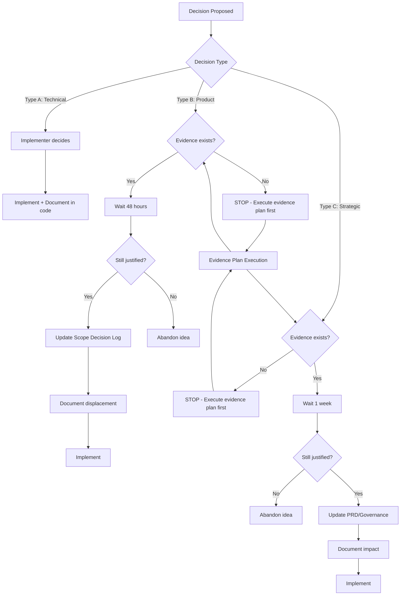

# Governance Framework

**Project:** xKit CLI + Bookmark Archiving
**Owner:** Jamie Craik
**Status:** ✅ Complete
**Last Updated:** 2026-01-19
**Version:** 1.0

---

## Executive Summary

This document establishes the governance framework for xKit, resolving the governance paradox identified in the third-pass adversarial review (2026-01-19). It documents the evolution from build-first to evidence-first decision-making and establishes clear rules for future development.

**The Paradox:**
- Phase 1 proceeded WITHOUT user validation (9 features added beyond MVP)
- Phase 2 is now blocked UNTIL user validation
- This represents inconsistent governance

**The Resolution:**
- Acknowledge Phase 1 violated the evidence-first principle
- Commit to evidence-first for all future development
- Document the evolution and establish clear rules

---

## Governance Evolution

### Phase 0 (Initial Development) - Build First

**Timeline:** 2025-12-15 to 2026-01-16

**Approach:** Build first, validate later

**Decisions Made:**
- MVP features implemented based on personal needs
- 6 additional features added without user validation (SCOPE-001 through SCOPE-005, SCOPE-009)
- Fast iteration, learning by shipping

**Result:**
- Functional CLI with bookmark archiving
- Feature-rich but unvalidated demand
- Technical debt in governance process

---

### Phase 1 (Enhanced Features) - Scope Expansion

**Timeline:** 2026-01-17

**Approach:** Build first, validate later (continued from Phase 0)

**Decisions Made:**
- 3 additional features added without user validation (SCOPE-006 through SCOPE-008)
- Full article content extraction (Mozilla Readability)
- Local AI summarization (Ollama)
- Enhanced organization (month-based, author-based)

**Result:**
- Feature expansion of 50% beyond original Phase 0 scope
- Technical implementation complete
- **Governance gap identified in third-pass review**

**Critical Acknowledgment:**
> Phase 1 development violated the evidence-first principle. Features were implemented based on personal judgment rather than validated user demand. This represents a governance failure that must not be repeated.

---

### Phase 2 (Future Development) - Evidence First

**Timeline:** Post-2026-02-01 (blocked until evidence validates demand)

**Approach:** Validate first, build later

**New Rules:**
- No features without validated demand
- Evidence plan execution BEFORE any implementation
- Pause criteria are binding
- Scope discipline enforced

**Result:**
- (To be determined after evidence validation)
- Governance framework established
- Decision-making clarity restored

---

## Official Position on Phase 1 Governance Gap

### What Happened

Phase 1 added 3 features (SCOPE-006, SCOPE-007, SCOPE-008) without prior user validation:

1. **Full article content extraction** (Mozilla Readability)
2. **Local AI summarization** (Ollama)
3. **Enhanced organization** (month-based, author-based)

### Why It Happened

**Contributing Factors:**
- Personal enthusiasm for features
- Technical capability to implement quickly
- Belief that features would be valuable
- Lack of formal governance process

**NOT an Acceptable Justification:**
- "I thought users would want it"
- "It was easy to add"
- "I can always remove it later"

### Why It Was Wrong

**Violation of Evidence-First Principle:**
- Features should follow validated demand
- Personal intuition is not evidence
- Builds without validation waste time and create technical debt

**Consequences:**
- Unverified value proposition
- Potential maintenance burden
- Scope creep risk
- Undermined decision-making framework

### What We're Doing About It

**Immediate Actions (2026-01-19):**
1. Document the governance gap (this document)
2. Execute evidence plan for Phase 1 features
3. Block Phase 2 until evidence validates demand

**Future Prevention:**
1. Evidence-first policy (see below)
2. Scope discipline process (see below)
3. Binding pause criteria (see below)
4. Accountability mechanisms (see below)

---

## Current Governance Policy

### Core Principles

#### 1. Evidence First

**Policy:** No features without validated demand.

**What This Means:**
- Before implementing any feature, execute evidence plan
- Evidence must meet pre-defined success signals
- Personal intuition is NOT evidence

**Evidence Types:**
- User testimonials (>= 3)
- Community engagement (>= 5 substantive replies)
- Tester feedback (>= 3 active testers)
- Usage metrics (post-release: WAU, completion rate)

**Exceptions:** NONE

---

#### 2. Pause Criteria Binding

**Policy:** All pause criteria in the PRD are binding.

**What This Means:**
- If criteria are met, project MUST pause
- No "just one more feature" exceptions
- Pause triggers reassessment, not abandonment

**Pause Criteria (from PRD):**
- If after 30 days WAU < 10 and fewer than 3 user testimonials, pause and reassess
- If query-ID breakage causes >30% command error for 7 consecutive days, pause until resolved
- If cookie-based login gets blocked with no workaround for 14 consecutive days, pause the project

**Response Plan (from PRD):**
- Freeze new features
- Fix breakage or update runbook
- Post status update in README

**Note:** Pause criteria cannot be evaluated until after public release + 30 days (2026-03-03 earliest)

---

#### 3. Scope Discipline

**Policy:** All scope changes require 48-hour consideration and explicit displacement.

**What This Means:**
- No spontaneous feature additions
- 48-hour reflection period for any new feature idea
- Explicit documentation of what is displaced
- Scope Decision Log must be updated

**Scope Decision Process:**

```
1. Feature idea proposed
2. Wait 48 hours (cooling-off period)
3. Ask: Is this validated by evidence? → If NO, STOP
4. Ask: What does this displace? → Document explicitly
5. Update Scope Decision Log with justification
6. Implement (if evidence supports)
```

**Scope Decision Log Template:**

| Decision ID | Date | Feature Added | Displaced | Justification | Evidence Reference |
|-------------|------|---------------|-----------|---------------|-------------------|
| SCOPE-XXX | YYYY-MM-DD | [Feature name] | [What was displaced or "None (net new)"] | [Why this is justified] | [Evidence link or "N/A - violates evidence-first"] |

**Note:** Any feature added without evidence reference is a violation of governance policy.

---

## Decision-Making Framework

### Decision Types

Decisions fall into three categories, each with different requirements:

#### Type A: Technical Decisions

**Definition:** Implementation choices that don't affect user-facing behavior.

**Examples:**
- Choice of library for HTTP requests
- Code refactoring
- Test framework selection
- CI/CD configuration

**Requirements:**
- Can be made by implementer
- No evidence required
- No 48-hour wait required
- Document in code comments or commit messages

**Accountability:** Code review (self or others)

---

#### Type B: Product Decisions

**Definition:** Choices that affect user-facing behavior or features.

**Examples:**
- Adding a new CLI command
- Changing output format
- Adding a feature flag
- Modifying archive structure

**Requirements:**
- MUST have evidence validation
- MUST update Scope Decision Log
- MUST consider 48-hour cooling-off period
- MUST document displacement

**Accountability:** Governance review (this document + PRD)

---

#### Type C: Strategic Decisions

**Definition:** Choices that affect project direction or viability.

**Examples:**
- Phase transitions (e.g., MVP → Phase 1)
- Public release timing
- Project pause/abandonment
- Major scope changes

**Requirements:**
- MUST have evidence validation
- MUST update PRD and/or this document
- MUST consider for at least 1 week
- MUST document impact on all stakeholders

**Accountability:** Full specification review + explicit approval

---

### Decision Flowchart



---

## Validation Criteria

### Phase 1 (Completed) - Retrospective Validation

**Status:** Features implemented WITHOUT prior validation

**What We're Doing Now:**
- Executing evidence plan (2026-01-21 to 2026-01-28)
- Seeking user feedback on Phase 1 features
- Will validate (or not) after-the-fact

**Possible Outcomes:**
- ✅ Evidence supports features → Keep in product
- ⚠️ Evidence is mixed → Document as experimental
- ❌ Evidence does NOT support features → Consider deprecation

**Lessons Learned:**
- Evidence should come BEFORE implementation
- Build-first creates technical and governance debt
- Personal intuition is not reliable

---

### Phase 2 (Future) - Prospective Validation

**Status:** BLOCKED until evidence validates demand

**What We'll Do:**
- NO implementation until evidence collected
- Execute evidence plan FIRST
- Make go/no-go decision based on evidence

**Possible Outcomes:**
- ✅ Strong evidence → Implement Phase 2
- ⚠️ Weak evidence → Adjust scope or extend evidence collection
- ❌ No evidence → Pause project or pivot

**Governance Commitment:**
> Phase 2 will NOT proceed without evidence validation. This is non-negotiable.

---

## Accountability Mechanisms

### 1. Documentation

**Requirement:** All decisions must be documented.

**Type A (Technical):**
- Code comments
- Commit messages
- PR descriptions

**Type B (Product):**
- Scope Decision Log (in PRD)
- GitHub issues
- Design docs (if complex)

**Type C (Strategic):**
- PRD updates
- This document (Governance.md)
- Release notes

---

### 2. Review

**Self-Review:**
- Before implementing Type B or C decisions
- Ask: "Do I have evidence for this?"
- Ask: "Is this documented properly?"

**Peer Review:**
- If/when collaborators join
- All Type B and C decisions subject to review
- Adversarial review for major changes

**Adversarial Review:**
- Completed for PRD (3 passes, 2026-01-19)
- Completed for Tech Spec (3 passes, 2026-01-19)
- Required for any major spec changes

---

### 3. Transparency

**Public Transparency:**
- Scope Decision Log published in PRD
- Evidence results published (positive or negative)
- Pause triggers publicly acknowledged

**Private Transparency:**
- Daily updates during evidence collection (see EVIDENCE_PLAN_TRACKING.md)
- Personal reflection on governance adherence
- Acknowledgment of failures

---

### 4. Enforcement

**Self-Enforcement:**
- Developer integrity to follow rules
- Regular review of this document
- Hold self accountable for violations

**Community Enforcement:**
- Public scrutiny of decisions
- GitHub issues challenging governance
- Open source community feedback

**Consequences of Violation:**
- Acknowledgment in this document
- Retrospective evidence collection
- Possible rollback of violating features

---

## Pre-Commit Checklist

Before implementing any feature or making any decision, ask:

### For Technical Decisions (Type A)

- [ ] Is this truly a technical decision (no user impact)?
- [ ] Is there a simpler way to achieve the same goal?
- [ ] Is this documented in code or commits?

### For Product Decisions (Type B)

- [ ] Do I have evidence that users want this?
- [ ] Have I waited 48 hours since the idea?
- [ ] What does this displace? Is it documented?
- [ ] Is the Scope Decision Log updated?
- [ ] Is this linked to an evidence reference?

### For Strategic Decisions (Type C)

- [ ] Do I have evidence that supports this direction?
- [ ] Have I waited 1 week since the idea?
- [ ] Are all stakeholders (users, future contributors) considered?
- [ ] Is the PRD updated?
- [ ] Is this Governance.md updated?
- [ ] Is the impact documented?

---

## Governance Timeline

| Date | Event | Governance Implication |
|------|-------|----------------------|
| 2025-12-15 | MVP development started | Build-first approach (no formal governance) |
| 2026-01-17 | Phase 1 completed | Scope expansion without validation (governance gap) |
| 2026-01-19 | Third-pass adversarial review | Governance paradox identified |
| 2026-01-19 | Governance document created | Framework established, rules codified |
| 2026-01-21-28 | Evidence plan execution | Validating Phase 1 features (retrospective) |
| 2026-01-29 | Go/no-go decision | Evidence determines Phase 2 future |
| 2026-02-01 | Public release (conditional) | Only if evidence supports |
| 2026-03-03 | Pause criteria evaluable | 30 days post-release + 30 days measurement |

---

## Frequently Asked Questions

### Q: Why not just remove Phase 1 features if they violated governance?

**A:** Three reasons:
1. They may actually be valuable (evidence will tell us)
2. They demonstrate technical capability
3. Removing them punishes users who might find them useful

Better approach: Validate retrospectively, keep if valuable, deprecate if not.

---

### Q: What if evidence is mixed - some positive, some negative?

**A:** Consider the weight and quality of feedback:
- Strong positive + weak negative = Keep
- Weak positive + strong negative = Deprecate or fix
- Mixed quality = Extend evidence collection

---

### Q: Can I ever make a Type B decision without 48-hour wait?

**A:** Only in genuine emergencies (e.g., critical security fix). Document the emergency and why the wait was skipped.

---

### Q: What if I discover a governance violation after the fact?

**A:**
1. Acknowledge it in this document
2. Execute retrospective evidence collection
3. Consider rollback if evidence doesn't support
4. Reflect on why it happened and update process

---

## Related Documents

- [PRD: Scope Decision Log](spec-2026-01-15-xkit-prd.md#scope-decision-log-required) - Tracks all feature additions
- [PRD: Pause Criteria](spec-2026-01-15-xkit-prd.md#pause-criteria-required) - Binding thresholds
- [Evidence Plan Tracking](EVIDENCE_PLAN_TRACKING.md) - Current evidence execution
- [Strategic Issues](STRATEGIC_ISSUES.md#issue-1-governance-paradox) - Issue #1 resolution

---

**Version History:**
- v1.0 (2026-01-19): Initial governance framework established

**Last Updated:** 2026-01-19
**Next Review:** After evidence plan completion (2026-01-29)
**Status:** ✅ Complete - Active and binding
