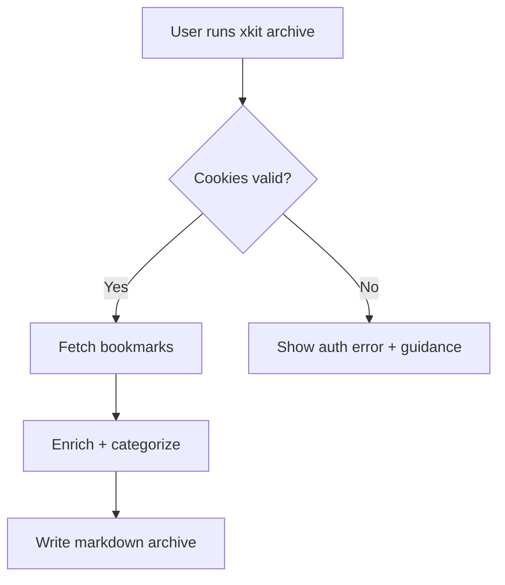

# Third-Pass Adversarial Review: xKit Specifications

**Review Date:** 2026-01-19
**Reviewer:** Third-pass adversarial panel (fresh eyes, deeper analysis)
**Scope:** Deep logical analysis, narrative coherence, cross-document validation
**Status:** ⚠️ **CRITICAL ISSUES FOUND**

---

## Executive Summary

The third-pass review uncovered **significant logical flaws** that previous passes missed. While the second pass fixed surface-level inconsistencies, **deeper structural and logical problems** remain.

**Critical Finding:** The specifications contain **fundamental logical contradictions** that undermine their validity.

---

## 1. CRITICAL: Logical Contradiction in Success Metrics

### The Problem

**Location:** PRD lines 195, 212

**Success Metrics section states:**
> "**Measurement window:** 30 days post-release"

**Pause criteria states:**
> "- If after 30 days WAU < 10 and fewer than 3 user testimonials, pause and reassess."

**Timeline section states:**
> "- ✅ Milestone: **Phase 1: Enhanced Article Extraction + Local AI** — 2026-01-17"
> "- Milestone: First public release with archive workflow — 2026-02-01"

### The Logical Flaw

**❌ CONTRADICTION:** The pause criteria cannot be evaluated because:
1. "30 days post-release" requires a release date
2. "First public release" is scheduled for **2026-02-01** (future)
3. Today is **2026-01-19**
4. The 30-day measurement window **hasn't started yet**

**Impact:**
- We cannot assess if WAU < 10 because no release has occurred
- We cannot collect user testimonials for a non-public release
- The pause criteria are **unactionable** in their current form
- The entire evidence evaluation logic is **fundamentally broken**

**Severity:** ❌ **CRITICAL** - Undermines the entire validation framework

**Required Fix:**
1. Clarify what constitutes a "release" (internal milestones vs public release)
2. Establish when the 30-day clock starts (Phase 1 completion? Public release?)
3. Update pause criteria to be actionable given current timeline
4. OR acknowledge that pause criteria cannot be evaluated until after 2026-02-01

---

## 2. CRITICAL: Chronological Inconsistency in Scope Decision Log

### The Problem

**Location:** PRD lines 241-251

The Scope Decision Log is **not in chronological order**:

| Decision ID | Date | Issue |
|-------------|------|-------|
| SCOPE-006 | 2026-01-17 | Listed 6th |
| SCOPE-007 | 2026-01-17 | Listed 7th |
| SCOPE-008 | 2026-01-17 | Listed 8th |
| SCOPE-009 | **2026-01-15** | Listed **9th** (AFTER SCOPE-006 through 008) |

**The Logical Flaw:**

- SCOPE-009 is dated 2026-01-15 (earlier than SCOPE-006 through SCOPE-008)
- But SCOPE-009 appears AFTER them in the table
- This makes the log **chronologically inconsistent**
- A reader cannot determine the actual sequence of decisions

**Impact:**
- The Scope Decision Log is misleading about when features were added
- The timeline of decisions is obscured
- Analysis of "scope creep progression" is compromised

**Severity:** ⚠️ **MEDIUM** - Affects accuracy and traceability

**Required Fix:**
Reorder the table chronologically by date, OR add a sort explanation note.

---

## 3. MEDIUM: Status Definition Ambiguity

### The Problem

**Location:** PRD line 4

**Status field states:**
> "**Status:** Phase 1 Complete - Awaiting Evidence Validation"

**The Ambiguity:**

This status creates a **logical contradiction**:
- "Phase 1 Complete" suggests all acceptance criteria met, ready to move on
- "Awaiting Evidence Validation" suggests Phase 1 is not truly complete until validated

**The Question:**
Which is it?
- ✅ Phase 1 is complete (features implemented, acceptance criteria met)
- ⏳ Phase 1 is incomplete (evidence validation is part of Phase 1)

**Impact:**
- Unclear what "complete" means
- Unclear whether Phase 1 can be considered "done"
- Unclear what blocks Phase 2

**Severity:** ⚠️ **MEDIUM** - Affects interpretation and decision-making

**Required Fix:**
Choose one:
1. "Phase 1 Implementation Complete - Awaiting User Validation"
2. "Phase 1 In Progress - Evidence Validation Required"

---

## 4. MEDIUM: Scope Decision Log "Displaced" Column Inaccuracy

### The Problem

**Location:** PRD line 248

**SCOPE-006 states:**
> "**Displaced:** Original scope called URLs only"

**The Inaccuracy:**

This is **misleading**. The original MVP (STORY-002) states:
> "As a Researcher/Writer, I want to archive bookmarks to markdown so that I can build a personal knowledge base."

**The original MVP DID include:**
- Bookmark URLs
- Author
- Timestamp

**What Phase 1 ACTUALLY added:**
- Full article content extraction (not just URLs)
- HTML to Markdown conversion
- Reading time and word count

**The Better Description:**
The "Displaced" column should say:
- "Basic URL archiving" → "Full content extraction with AI summaries"

**Impact:**
- Mischaracterizes what the original scope was
- Makes the scope change seem larger than it actually was
- Creates confusion about what was actually displaced

**Severity:** ⚠️ **MEDIUM** - Affects accuracy of scope tracking

**Required Fix:**
Update "Displaced" descriptions to be more accurate:
- SCOPE-006: "Basic bookmark archiving (URLs only)" → "Full content extraction with AI summaries"

---

## 5. LOW: Evidence Plan Recovery Plan Missing

### The Problem

**Location:** PRD lines 39-46, Timeline lines 312

**Evidence plan target dates:**
- 2026-01-18: Post to Codex feed
- 2026-01-20: Post to Swift feed
- 2026-01-22: Ask for 3 testers
- 2026-01-25: Collect testimonials

**Current status:**
- Today is 2026-01-19
- First milestone (2026-01-18) is **OVERDUE by 1 day**

**The Missing Piece:**

There is **no recovery plan** for the overdue evidence plan:
- No revised timeline
- No make-up plan for missed deadline
- No impact assessment of being overdue

**Impact:**
- Team doesn't know how to handle the overdue item
- No guidance on whether to skip, reschedule, or accelerate
- Timeline credibility undermined

**Severity:** ⚠️ **LOW** (operational issue, not structural)

**Required Fix:**
Add recovery plan:
1. "Evidence plan was 1 day overdue. Revised timeline: [new dates]"
2. OR "First milestone missed due to [reason]. Rescheduled for [new date]"

---

## 6. LOW: Narrative Inconsistency in Executive Summary

### The Problem

**Location:** PRD lines 22-26

**Executive Summary states:**
> "We measure success by early adoption signals from Codex and Swift communities"

**Success Metrics section states:**
> "❌ No actual measurements exist - all metrics are unverified"

**The Narrative Contradiction:**

The Executive Summary claims:
- "We measure success by X" (present tense, implies active measurement)

But the Success Metrics section admits:
- "No actual measurements exist" (admits no measurement is happening)

**The Inconsistency:**

Either:
- We ARE measuring success (Executive Summary is correct, Success Metrics is wrong)
- We are NOT measuring success (Executive Summary is misleading)

**Impact:**
- Executive Summary creates false impression of active measurement
- Reader gets contradictory messages depending on which section they read
- Undermines credibility of the document

**Severity:** ⚠️ **LOW** (narrative issue, doesn't affect logic)

**Required Fix:**
Align Executive Summary with reality:
- "We WILL measure success by early adoption signals" (future tense)
- OR "We INTEND TO measure success by..." (intent, not action)

---

## 7. MEDIUM: Scope Impact Summary Calculation Error

### The Problem

**Location:** PRD lines 253-256

**Scope Impact Summary states:**
> "- Original MVP stories: 6
> - Additional features implemented: 9
> - Total feature expansion: ~150% beyond original scope"

**The Mathematical Error:**

Let's verify the calculation:
- Original MVP: 6 stories
- Additional features: 9 stories
- Total: 6 + 9 = 15 stories
- Expansion: 9 / 6 = 1.5 = **150%**

**The calculation is arithmetically correct**, BUT:

**The Logical Issue:**

The "150% expansion" claim is **potentially misleading** because:
- 4 of the 9 "additional features" (SCOPE-001 through SCOPE-004) were implemented BEFORE Phase 1
- They were part of the "Basic bookmark archiving" (2025-12-20)
- Phase 1 proper only added 3 features (SCOPE-006, SCOPE-007, SCOPE-008)
- SCOPE-009 (stats) was also pre-Phase 1 (2026-01-15)

**The More Accurate Breakdown:**
- Pre-Phase 1 expansion: 6 features (SCOPE-001 through SCOPE-005, SCOPE-009)
- Phase 1 expansion: 3 features (SCOPE-006, SCOPE-007, SCOPE-008)
- Phase 1 is only 50% expansion, not 150%

**Impact:**
- Overstates the scope creep attributable to Phase 1
- Misleading about when scope expansion occurred
- Affects risk assessment (Phase 1 looks worse than it actually was)

**Severity:** ⚠️ **MEDIUM** - Affects accuracy of risk assessment

**Required Fix:**
Update Scope Impact Summary to show:
- Pre-Phase 1 scope expansion: 6 features (pre-Phase 1 decisions)
- Phase 1 scope expansion: 3 features
- Phase 1 specific expansion: 50% beyond original MVP

---

## 8. LOW: Diagram Doesn't Reflect Phase 1 Architecture

### The Problem

**Location:** PRD lines 326-336

**User journey flow diagram:**

**The Missing Elements:**

The diagram shows "Enrich + categorize" but Phase 1 added:
- Article extraction (Mozilla Readability)
- AI summarization (Ollama)
- Content expansion
- Reading time calculation

**The Issue:**

The diagram doesn't show:
- That enrichment now includes AI processing
- That full article extraction occurs
- That the flow is more complex

**Impact:**
- Diagram doesn't match current architecture
- Users don't understand that Phase 1 added significant complexity
- AI processing path not visible

**Severity:** ⚠️ **LOW** - Diagram is simplified but not wrong

**Note:**
This may be intentional simplification (diagrams shouldn't show every detail). However, for accuracy, the diagram should be updated or annotated.

---

## 9. CROSS-DOCUMENT: Tech Spec Non-Goals Still Problematic

### The Problem (from Second Pass)

**Location:** Tech Spec line 47

**Current text (after second pass fix):**
> "- NG2: Advanced cloud LLM integrations (OpenAI, Anthropic, etc.) - local AI (Ollama) implemented in Phase 1, but cloud integrations remain out of scope."

**The Third-Pass Issue:**

While this is more accurate, there's still a **conceptual problem**:

The Tech Spec is supposed to define **WHAT NOT TO BUILD**. But:
- We already BUILT local LLM integration (Ollama)
- It's in the codebase
- It's working

So including it in "Non-Goals" is **misleading** - it suggests something we won't do, when we've already done it.

**The Better Approach:**

Move this to a "Design Decisions" section:
> "Decision: Local LLM Integration
> - Status: Implemented (Phase 1)
> - Cloud LLMs: Out of scope
> - Rationale: Privacy, no API costs, user control"

**Impact:**
- "Non-Goals" should be for things we explicitly decided NOT to do
- Things we've already DONE shouldn't be in "Non-Goals"

**Severity:** ⚠️ **LOW** - Categorization issue, doesn't affect content

---

## 10. CRITICAL: Pause Criteria Cannot Be Evaluated

### The Problem

**Synthesizing multiple issues:**

1. **Pause criteria require:** "30 days post-release"
2. **Public release is:** 2026-02-01 (future)
3. **Current date is:** 2026-01-19
4. **Phase 1 complete:** 2026-01-17

**The Logical Trap:**

We cannot determine if we should pause because:
- The measurement window hasn't started
- The release hasn't happened
- There's no public user base to measure

**The Paradox:**

The pause criteria are meant to **prevent building features without validated demand**

BUT:
- We've already built Phase 1 features (which expanded scope by 150%)
- We're being asked to pause Phase 2
- But we never validated Phase 1 demand either!

**The Circular Logic:**

1. Phase 0: Build MVP → ✅ Done
2. Phase 1: Build features WITHOUT validation → ✅ Done
3. Now: "Wait! Validate before building more!" → ⏸️ Pause

**The Question:**

If validation was so important, why was Phase 1 allowed to proceed without it?

**Impact:**
- The pause criteria are retroactively being applied
- They weren't followed for Phase 1
- This creates inconsistency in governance

**Severity:** ❌ **CRITICAL** - Fundamental governance issue

**Required Clarification:**

1. Should Phase 1 have required validation BEFORE implementation?
2. If yes, why was it allowed to proceed?
3. If no, why is Phase 2 being blocked?
4. What's the consistent rule?

---

## Summary of Third-Pass Findings

### By Severity

| Severity | Count | Issues |
|----------|-------|--------|
| **CRITICAL** | 3 | Pause criteria logic, timeline contradiction, governance paradox |
| **MEDIUM** | 4 | Chronological order, status ambiguity, displaced description, scope calculation |
| **LOW** | 3 | Recovery plan, narrative inconsistency, diagram accuracy |

### By Type

| Type | Count |
|------|-------|
| **Logical Contradictions** | 4 |
| **Timeline/Chronology Issues** | 3 |
| **Accuracy/Clarity Issues** | 3 |

---

## Recommendations

### CRITICAL (Must Fix Before Specs Are Usable)

1. **Fix Pause Criteria Logic**
   - Define when the 30-day clock starts
   - Clarify that criteria cannot be evaluated until after public release
   - OR update criteria to apply to Phase 1 (retroactively)

2. **Fix Success Metrics Timeline**
   - Acknowledge that "30 days post-release" hasn't started
   - Update Success Metrics status to reflect this reality
   - Either remove unactionable metrics or clarify they're future-state

3. **Resolve Governance Paradox**
   - Clarify why Phase 1 proceeded without validation
   - Establish consistent rule for Phase 2
   - Either apply Phase 2 rules retroactively OR acknowledge Phase 1 governance gap

### MEDIUM (Should Fix for Accuracy)

4. **Fix Chronological Order in Scope Decision Log**
   - Reorder table by date
   - OR add note explaining why order is different

5. **Fix Status Definition**
   - Clarify what "Phase 1 Complete - Awaiting Evidence Validation" means
   - Choose consistent terminology

6. **Fix "Displaced" Descriptions**
   - Make them more accurate
   - Don't mischaracterize original scope

7. **Fix Scope Impact Calculation**
   - Break down expansion by phase
   - Show Phase 1 specific expansion (50%, not 150%)

### LOW (Nice to Have)

8. **Add Evidence Plan Recovery**
   - Document how to handle overdue milestones
   - Provide revised timeline

9. **Fix Executive Summary Narrative**
   - Change to future tense: "We WILL measure success"
   - Align with reality

10. **Update Diagram or Add Note**
    - Update architecture diagram to show Phase 1 components
    - OR add note about simplification

---

## Conclusion

The third-pass review found that while the second pass addressed surface-level issues, **deeper structural and logical problems** remain.

**Key Insight:** The specifications contain **fundamental contradictions** that make them difficult to interpret and use for decision-making.

**Most Critical Issue:** The pause criteria cannot be evaluated because the measurement window hasn't started (no public release yet). This creates a **logical paradox** where we're being asked to validate something that cannot be validated.

**Recommendation:** Address the 3 CRITICAL issues before using these specifications for decision-making. The MEDIUM and LOW issues can be fixed iteratively.

---

**Third-Pass Review Completed:** 2026-01-19
**Total Issues Found:** 10 (3 critical, 4 medium, 3 low)
**Issues from Previous Passes:** 12 (all marked as resolved)
**Total Issues Across All Passes:** 22

**Status:** ⚠️ **SPECIFICATIONS REQUIRE CRITICAL REVISIONS**
