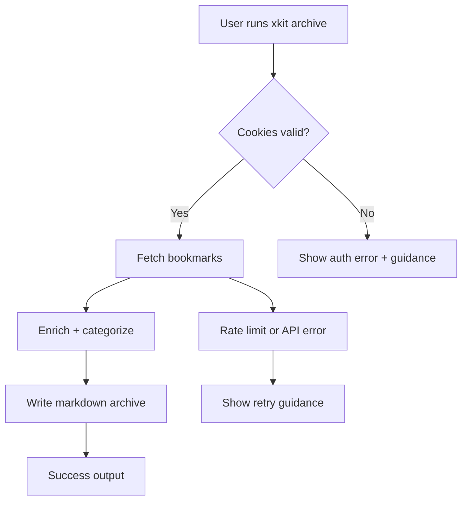
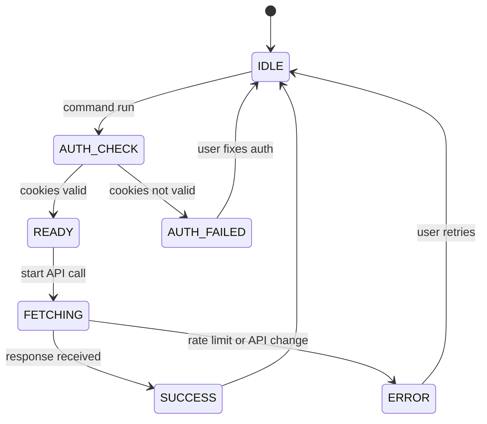

# PRD (Mini): xKit CLI + Bookmark Archiving

**Owner:** Jamie Craik  
**Status:** In Review  
**Last updated:** 2026-01-15  
**Stakeholders:** Solo dev (primary), future OSS contributors (secondary)  
**Links:** Repo: /Users/jamiecraik/dev/xKit | Docs: README.md | Testing: docs/testing.md

> Rule: If a section does not apply, write `N/A` and explain why in 1–2 lines.

---

## 0) One-screen summary

- **One-liner:** A fast, developer-first X/Twitter CLI with a best-in-class bookmark archiving workflow for knowledge-base creation.
- **Why now:** The project sits in WIP state and the fastest path to learning + profile growth uses a focused, reliable CLI wedge shared in Codex and Swift communities.
- **Expected outcome:** A usable CLI with a stable bookmark-archiving workflow and measurable early adoption.

---

## Executive Summary

xKit provides a solo-dev CLI that makes X workflows scriptable while building a durable bookmark archive. The primary wedge comes from a reliable archive pipeline with deterministic markdown output and stable JSON for scripting. The project avoids official API dependencies and focuses on a learn-by-shipping approach.

We measure success by early adoption signals from Codex and Swift communities (downloads, stars, and testimonials) and by operational reliability (low error rate, stable outputs). The plan includes explicit pause criteria to prevent long-term drift if volatility or lack of adoption persists
---

## 1) Problem / Opportunity (with evidence)

- **Problem:** Scriptable access to X workflows proves fragile or blocked behind official API friction; bookmark retention stays poor without automation.
- **Who feels it most:** Solo developers who want to learn, build credibility, and automate X workflows from the terminal.
- **Current workaround:** Manual web UI use, ad-hoc scripts, or manual bookmark export.
- **Evidence (required):**
  - None yet; evidence plan will collect usage signals via npm downloads + GitHub issues.
  - Collect 3–5 user testimonials via Codex and Swift-related feeds.
  - Track GitHub stars and release downloads to measure profile growth.
  - Post release notes in Codex and Swift feeds and log click-throughs manually.
  - Evidence plan (2-week sprint):

    | Action | Channel | Owner | Date | Success signal |
    |---|---|---|---|---|
    | Post release note + demo clip | Codex feed | Jamie | 2026-01-18 | >= 5 replies or 3 stars |
    | Post release note + demo clip | Swift feed | Jamie | 2026-01-20 | >= 5 replies or 3 stars |
    | Ask for 3 testers | GitHub Discussions | Jamie | 2026-01-22 | >= 3 testers |
    | Collect testimonials | GitHub issues/discussions | Jamie | 2026-01-25 | >= 3 quotes |

- **If we do nothing:** The project stays unfocused and adoption stays unclear.

---

## 2) Target Users / Personas

| Persona | Role | Context | Goals | Pain points |
|---|---|---|---|---|
| “Solo Dev” | Builder/Learner | Personal projects, terminal-first workflow | Learn by shipping, grow profile, automate X | Low visibility, brittle scripts, no API key |
| “Researcher/Writer” | Analyst/Writer | Collects and curates links | Durable bookmark archive | Bookmarks feel ephemeral, hard to organize |

**Primary:** Solo Dev  
**Secondary:** Researcher/Writer  

---

## 3) User Stories (MVP)
>
> Format: **As a [persona], I want [action] so that [benefit].**

1) **Story [STORY-001]:** As a Solo Dev, I want to read a tweet/thread by ID or URL so that I can quickly capture context for scripts.
   **Acceptance criteria:**
   - [ ] Given a tweet ID or URL, the CLI prints the text content in a single command.
   - [ ] The command supports `--json` output with a stable schema.
   **Priority:** Must

2) **Story [STORY-002]:** As a Researcher/Writer, I want to archive bookmarks to markdown so that I can build a personal knowledge base.
   **Acceptance criteria:**
   - [ ] Running `xkit archive` creates or updates a markdown archive file.
   - [ ] Each archived entry includes URL, author, and timestamp.
   **Priority:** Must

3) **Story [STORY-003]:** As a Solo Dev, I want to refresh query IDs so that I can recover from API changes without rebuilding the tool.
   **Acceptance criteria:**
   - [ ] `xkit query-ids --fresh` refreshes cached IDs and reports success or error.
   - [ ] Errors include actionable messaging.
   **Priority:** Should

4) **Story [STORY-004]:** As a Researcher/Writer, I want categorization of bookmark outputs so that I can keep my archive organized by content type.
   **Acceptance criteria:**
   - [ ] Write archives into category folders when categorization runs.
   - [ ] Apply a default category mapping without extra configuration.
   **Priority:** Should

5) **Story [STORY-005]:** As a CLI user, I want a plain output mode so that I can use the tool in scripts or accessibility tools without ANSI noise.
   **Acceptance criteria:**
   - [ ] `--plain` produces output with no emoji and no ANSI styling.
   - [ ] Plain output stays readable and stable across commands.
   **Priority:** Should

6) **Story [STORY-006]:** As a Solo Dev, I want a guided first-run setup so that I can configure cookies and outputs quickly.
   **Acceptance criteria:**
   - [ ] `xkit setup` completes with a success message and next-step command.
   - [ ] Setup errors include a specific fix (e.g., missing cookies, permissions).
   **Priority:** Should

---

## 4) Functional Requirements (testable)

- FR-1: CLI supports read/search/thread/mentions/news/bookmarks/lists with JSON output option (Must).
- FR-2: Archive command writes deterministic markdown with stable frontmatter fields (Must).
- FR-3: Query ID refresh command works without rebuild (Should).
- FR-4: Plain output mode supports all user-facing commands (Should).
- FR-5: Error messages always include a next-step command or checklist (Must).

### Edge cases & error UX (required)

- If cookies go missing or look not valid, then the user sees a clear auth error and next-step guidance.
- If query ID refresh fails, then the user sees an error message with a retry suggestion.
- If the archive output directory does not exist, then the CLI creates it or exits with a clear, actionable error.
- If rate limits or API changes trigger, then the CLI explains the likely cause and references recovery steps.

---

## 5) Non-Functional Requirements (high level only)

- **Performance:** Common read/search commands return within 2 seconds for typical requests.
- **Reliability:** CLI handles API volatility with clear errors and retry guidance for all error types.
- **Security & privacy:** Treat cookie values as secrets; avoid logging them.
- **Compliance:** N/A (no payment/PHI); assumes open-source best practices.
- **Accessibility:** CLI output stays readable in `--plain` mode (no reliance on ANSI styling or emoji).
- **Observability expectation:** Log command success/error counts only if the user opts in.

---

## 6) Success Metrics / KPIs

| Metric | Target | Measurement method | Source |
|---|---:|---|---|
| Weekly active users | 25 | npm downloads + manual feedback | npm stats + GitHub discussions |
| Archive completion rate | 70% | local log counters | opt-in telemetry or user reports |
| Command error rate | <3% | error counts per command | opt-in telemetry |
| Profile signal (stars) | +50 | GitHub stars change | GitHub repository |

**Measurement window:** 30 days post-release  

### Guardrails (required)

- CLI startup time must not exceed 2 seconds on a cold start.
- Bookmark archive output must remain backward compatible for existing users.

### Pause criteria (required)

- If after 30 days WAU < 10 and fewer than 3 user testimonials, pause and reassess.
- If query-ID breakage causes >30% command error for 7 consecutive days, pause until resolved.
- If cookie-based login gets blocked with no workaround for 14 consecutive days, pause the project.
  - Response plan: freeze new features, fix breakage or update runbook, and post status update in README.

---

## 7) Scope

### In scope

- CLI read/search/thread/mentions/news/bookmarks/lists
- Bookmark archiving + enrichment + categorization
- Query ID refresh tooling
- Cookie-based login (current approach)

### Out of scope (required)

- Official API support
- Advanced LLM integrations
- Parallel processing
- Token tracking

### Non-goals (recommended)

- Full analytics dashboards
- Web UI

---

## 8) Dependencies

- **Internal:** N/A (solo dev)
- **External:** X/Twitter GraphQL endpoints (undocumented)
- **Assumptions (required):**
  - Cookie-based login stays viable.
  - Query ID refresh stays possible without official API.
  - The core workflow does not require official API usage.
  - Distribution happens primarily through Codex and Swift-related feeds.

---

## 9) Risks and Mitigations

- Risk: X GraphQL changes break commands.  
  - Likelihood: High  
  - Impact: High  
  - Mitigation: query ID refresh command + runbook with fallback guidance.

- Risk: Cookie auth fails due to account challenges or OS changes.  
  - Likelihood: Medium  
  - Impact: High  
  - Mitigation: troubleshooting steps + alternative cookie sources.

- Risk: Lack of evidence for demand.  
  - Likelihood: High  
  - Impact: Medium  
  - Mitigation: lightweight evidence plan (downloads, user testimonials).

- Risk: Policy or enforcement changes restrict cookie-based access.  
  - Likelihood: Medium  
  - Impact: High  
  - Mitigation: document risks and provide a clear “project paused” threshold.

---

## 10) Timeline / Milestones (optional)

- Milestone: PRD + Tech Spec complete — 2026-01-22
- Milestone: Query ID refresh runbook — 2026-01-26
- Milestone: First release with archive workflow — 2026-02-01

---

## 11) Diagrams (recommended)

### User journey flow (Mermaid)

### User lifecycle state model (Mermaid)

---

## 12) Assumptions & Open Questions (required)

### Assumptions

- A-1: Cookie-based login stays the supported auth model.
- A-2: Measure early adoption via lightweight, manual signals.
- A-3: Codex and Swift feeds can reach the primary audience.

### Open questions

- Q-1: Do we want telemetry opt-in only, or fully turned off? (Owner: Jamie, Due: 2026-01-20)
- Q-2: Which pause criteria should trigger a pivot? (Owner: Jamie, Due: 2026-01-25)

---

## 13) PRD Integrity Rule (required)

- This PRD defines **WHAT / WHY / WHO**.
- No technical implementation details (databases, frameworks, service topology).
- Reference the Tech Spec for HOW.

---

## 14) PRD Quality Gate (required)

- [ ] Problem has evidence
- [ ] Personas feel specific
- [ ] Stories follow correct format + acceptance criteria exist
- [ ] Metrics have numeric targets + measurement method
- [ ] Scope includes explicit OUT
- [ ] Dependencies and risks exist
- [ ] No implementation details

## Tasks

- [ ] Enumerate CLI commands and default flags for read/search/thread/mentions/news/bookmarks/lists
  - Acceptance: Each command lists its default flags and required inputs.
  - Tests: N/A (spec-only).
- [ ] Define stable JSON output keys per command (minimum fields + `_schemaVersion`)
  - Acceptance: Each command’s JSON output lists required keys and example shapes.
  - Tests: N/A (spec-only).
- [ ] Specify deterministic archive file naming and storage layout
  - Acceptance: Archive paths and filenames are documented with examples.
  - Tests: N/A (spec-only).
- [ ] Define required archive frontmatter fields and their types
  - Acceptance: Required fields (URL, author, timestamp, category, source) are listed with types.
  - Tests: N/A (spec-only).
- [ ] Document archive degraded mode output when enrichment fails
  - Acceptance: Minimal output fields and `enrichment_status` behavior are specified.
  - Tests: N/A (spec-only).
- [ ] Define default category mapping and folder rules
  - Acceptance: Default categories, match rules, and destinations are listed.
  - Tests: N/A (spec-only).
- [ ] Document categorization overrides and opt-out behavior
  - Acceptance: How users override categories or disable categorization is documented.
  - Tests: N/A (spec-only).
- [ ] Specify query ID cache location and refresh lifecycle
  - Acceptance: Cache file location and refresh triggers are documented.
  - Tests: N/A (spec-only).
- [ ] Define `xkit query-ids --fresh` success and error UX
  - Acceptance: Output messages and retry guidance are documented.
  - Tests: N/A (spec-only).
- [ ] Define `--plain` output rules for all commands
  - Acceptance: Plain output rules cover ANSI removal, emoji removal, and stable phrasing.
  - Tests: N/A (spec-only).
- [ ] Define `xkit setup` required inputs and happy-path flow
  - Acceptance: Steps list required inputs and final success message.
  - Tests: N/A (spec-only).
- [ ] Define `xkit setup` error guidance for missing cookies and permissions
  - Acceptance: Each setup error shows a specific fix.
  - Tests: N/A (spec-only).
- [ ] Document error UX patterns for auth errors
  - Acceptance: Auth errors include next-step commands and help text.
  - Tests: N/A (spec-only).
- [ ] Document error UX patterns for rate limits and API changes
  - Acceptance: Rate-limit and API-change errors include cooldown/retry guidance.
  - Tests: N/A (spec-only).
- [ ] Document error UX patterns for missing output paths
  - Acceptance: Output-path errors include path creation guidance.
  - Tests: N/A (spec-only).
- [ ] Define observability metrics and local-only storage format
  - Acceptance: Metrics list and storage path/format are documented.
  - Tests: N/A (spec-only).
- [ ] Define opt-in telemetry decision and user controls
  - Acceptance: Opt-in toggle and privacy constraints are documented.
  - Tests: N/A (spec-only).
- [ ] Draft runbook outline for query ID breakage
  - Acceptance: Steps include detection, refresh, and rollback guidance.
  - Tests: N/A (spec-only).
- [ ] Draft runbook outline for cookie auth recovery
  - Acceptance: Steps include verification and alternative cookie sources.
  - Tests: N/A (spec-only).
- [ ] Specify unit test scope for CLI command parsing and output shaping
  - Acceptance: Unit test targets and minimum assertions are listed.
  - Tests: N/A (spec-only).
- [ ] Specify integration test scope for archive outputs and categorization
  - Acceptance: Integration test targets and required fixtures are listed.
  - Tests: N/A (spec-only).
- [ ] Specify live test scope and required environment variables
  - Acceptance: Live test scope and required env vars are documented.
  - Tests: N/A (spec-only).
- [ ] Define performance measurement approach for startup and command latency
  - Acceptance: Measurement method and thresholds are documented.
  - Tests: N/A (spec-only).
- [ ] Finalize evidence plan tracking fields (owner, date, success signal)
  - Acceptance: Evidence plan fields are defined and consistent across tasks.
  - Tests: N/A (spec-only).
