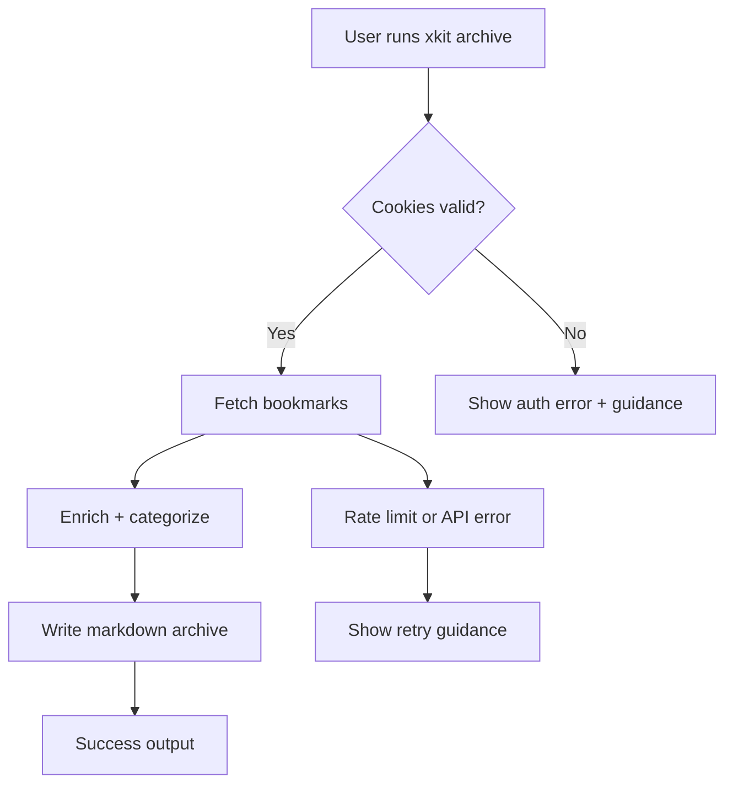
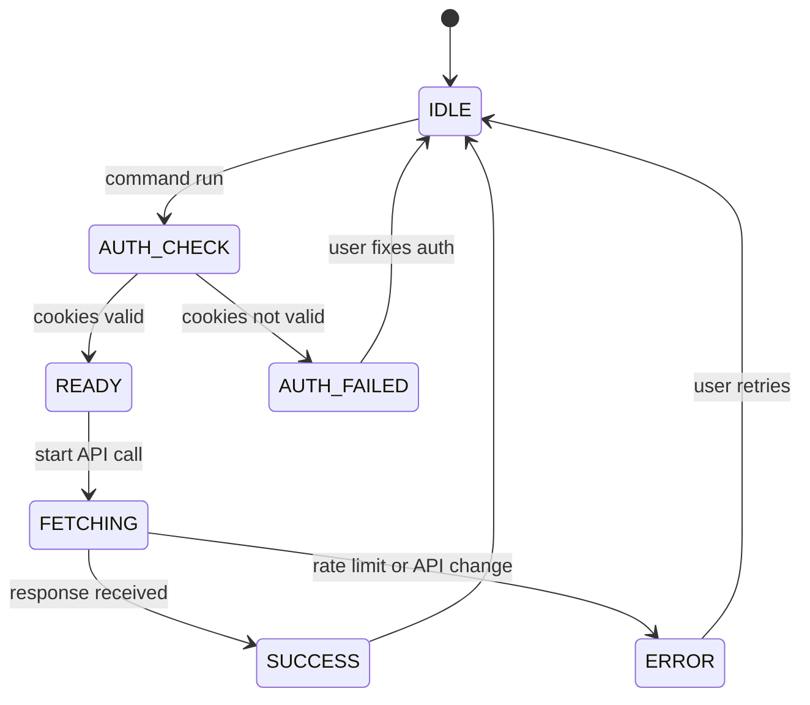

# PRD (Mini): xKit CLI + Bookmark Archiving

**Owner:** Jamie Craik
**Status:** Phase 1 Implementation Complete - Awaiting User Validation
**Last updated:** 2026-01-19
**Stakeholders:** Solo dev (primary), future OSS contributors (secondary)
**Links:** Repo: /Users/jamiecraik/dev/xKit | Docs: README.md | Testing: docs/testing.md
**Phase 1 Implementation Complete:** 2026-01-17 (Enhanced Article Extraction + Local AI)
**Note:** Phase 1 acceptance criteria met, but user validation (evidence plan) is required before Phase 2

> Rule: If a section does not apply, write `N/A` and explain why in 1–2 lines.

---

## 0) One-screen summary

- **One-liner:** A fast, developer-first X/Twitter CLI with a best-in-class bookmark archiving workflow for knowledge-base creation.
- **Why now:** The project sits in WIP state and the fastest path to learning + profile growth uses a focused, reliable CLI wedge shared in Codex and Swift communities.
- **Expected outcome:** A usable CLI with a stable bookmark-archiving workflow and measurable early adoption.

---

## Executive Summary

xKit provides a solo-dev CLI that makes X workflows scriptable while building a durable bookmark archive. The primary wedge comes from a reliable archive pipeline with deterministic markdown output and stable JSON for scripting. The project avoids official API dependencies and focuses on a learn-by-shipping approach.

**Success will be measured** by early adoption signals from Codex and Swift communities (downloads, stars, and testimonials) and by operational reliability (low error rate, stable outputs). The plan includes explicit pause criteria to prevent long-term drift if volatility or lack of adoption persists.

**⚠️ Current Status:** Success metrics are not yet being measured (see Section 6). Evidence collection plan is overdue.
---

## 1) Problem / Opportunity (with evidence)

- **Problem:** Scriptable access to X workflows proves fragile or blocked behind official API friction; bookmark retention stays poor without automation.
- **Who feels it most:** Solo developers who want to learn, build credibility, and automate X workflows from the terminal.
- **Current workaround:** Manual web UI use, ad-hoc scripts, or manual bookmark export.
- **Evidence (required):**
  - None yet; evidence plan will collect usage signals via npm downloads + GitHub issues.
  - Collect 3–5 user testimonials via Codex and Swift-related feeds.
  - Track GitHub stars and release downloads to measure profile growth.
  - Post release notes in Codex and Swift feeds and log click-throughs manually.
  - Evidence plan (2-week sprint):

    | Action | Channel | Owner | Date | Success signal |
    |---|---|---|---|---|
    | Post release note + demo clip | Codex feed | Jamie | 2026-01-18 | >= 5 replies or 3 stars |
    | Post release note + demo clip | Swift feed | Jamie | 2026-01-20 | >= 5 replies or 3 stars |
    | Ask for 3 testers | GitHub Discussions | Jamie | 2026-01-22 | >= 3 testers |
    | Collect testimonials | GitHub issues/discussions | Jamie | 2026-01-25 | >= 3 quotes |

- **If we do nothing:** The project stays unfocused and adoption stays unclear.

---

## 2) Target Users / Personas

| Persona | Role | Context | Goals | Pain points |
|---|---|---|---|---|
| “Solo Dev” | Builder/Learner | Personal projects, terminal-first workflow | Learn by shipping, grow profile, automate X | Low visibility, brittle scripts, no API key |
| “Researcher/Writer” | Analyst/Writer | Collects and curates links | Durable bookmark archive | Bookmarks feel ephemeral, hard to organize |

**Primary:** Solo Dev  
**Secondary:** Researcher/Writer  

---

## 3) User Stories (MVP)
>
> Format: **As a [persona], I want [action] so that [benefit].**

1) **Story [STORY-001]:** As a Solo Dev, I want to read a tweet/thread by ID or URL so that I can quickly capture context for scripts.
   **Acceptance criteria:**
   - [ ] Given a tweet ID or URL, the CLI prints the text content in a single command.
   - [ ] The command supports `--json` output with a stable schema.
   **Priority:** Must

2) **Story [STORY-002]:** As a Researcher/Writer, I want to archive bookmarks to markdown so that I can build a personal knowledge base.
   **Acceptance criteria:**
   - [ ] Running `xkit archive` creates or updates a markdown archive file.
   - [ ] Each archived entry includes URL, author, and timestamp.
   **Priority:** Must

3) **Story [STORY-003]:** As a Solo Dev, I want to refresh query IDs so that I can recover from API changes without rebuilding the tool.
   **Acceptance criteria:**
   - [ ] `xkit query-ids --fresh` refreshes cached IDs and reports success or error.
   - [ ] Errors include actionable messaging.
   **Priority:** Should

4) **Story [STORY-004]:** As a Researcher/Writer, I want categorization of bookmark outputs so that I can keep my archive organized by content type.
   **Acceptance criteria:**
   - [ ] Write archives into category folders when categorization runs.
   - [ ] Apply a default category mapping without extra configuration.
   **Priority:** Should

5) **Story [STORY-005]:** As a CLI user, I want a plain output mode so that I can use the tool in scripts or accessibility tools without ANSI noise.
   **Acceptance criteria:**
   - [ ] `--plain` produces output with no emoji and no ANSI styling.
   - [ ] Plain output stays readable and stable across commands.
   **Priority:** Should

6) **Story [STORY-006]:** As a Solo Dev, I want a guided first-run setup so that I can configure cookies and outputs quickly.
   **Acceptance criteria:**
   - [ ] `xkit setup` completes with a success message and next-step command.
   - [ ] Setup errors include a specific fix (e.g., missing cookies, permissions).
   **Priority:** Should
   **Status:** ✅ Complete

---

## 3b) User Stories (Phase 1 - Completed 2026-01-17)
>
> ⚠️ **CRITICAL:** These stories were implemented WITHOUT prior user validation. This represents a scope expansion that must be validated by evidence before further expansion.

7) **Story [STORY-007]:** As a Researcher/Writer, I want full article content extracted so that I have durable access even if the original article disappears.
   **Acceptance criteria:**
   - [x] Articles are detected by domain matching (blog platforms, news sites)
   - [x] Full content is extracted using Mozilla Readability
   - [x] HTML is converted to clean Markdown
   - [x] Reading time and word count are calculated
   **Priority:** Should (Phase 1)
   **Status:** ✅ Complete
   **Evidence Required:** User feedback on content extraction quality

8) **Story [STORY-008]:** As a Researcher/Writer, I want AI-generated summaries of articles so that I can quickly assess content relevance.
   **Acceptance criteria:**
   - [x] Local AI (Ollama) generates 2-3 sentence summaries
   - [x] Key points are extracted as bullet list
   - [x] Graceful fallback when Ollama is unavailable
   - [x] Model attribution included in output
   **Priority:** Should (Phase 1)
   **Status:** ✅ Complete
   **Evidence Required:** Usage metrics on `--summarize` flag; quality feedback

9) **Story [STORY-009]:** As a Researcher/Writer, I want month-based organization so that I can track content discovery over time.
   **Acceptance criteria:**
   - [x] `--organize-by-month` flag creates `jan_2026/` style directories
   - [x] Existing archives can be reorganized via script
   - [x] Empty directories are not created
   **Priority:** Should (Phase 1)
   **Status:** ✅ Complete
   **Evidence Required:** Usage metrics on month organization

10) **Story [STORY-010]:** As a Researcher/Writer, I want author-based organization so that I can curate content by trusted sources.
   **Acceptance criteria:**
   - [x] Bookmarks are organized by author handle
   - [x] Reorganization script exists for existing archives
   **Priority:** Should (Phase 1)
   **Status:** ✅ Complete
   **Evidence Required:** Usage metrics on author organization

11) **Story [STORY-011]:** As a Solo Dev, I want enhanced thread fetching so that I can get complete conversation context.
   **Acceptance criteria:**
   - [x] `xkit thread` retrieves full conversation
   - [x] Reply chains are properly reconstructed
   **Priority:** Should (Phase 1)
   **Status:** ✅ Complete
   **Evidence Required:** Usage metrics on thread command

---

## 4) Functional Requirements (testable)

- FR-1: CLI supports read/search/thread/mentions/news/bookmarks/lists with JSON output option (Must).
- FR-2: Archive command writes deterministic markdown with stable frontmatter fields (Must).
- FR-3: Query ID refresh command works without rebuild (Should).
- FR-4: Plain output mode supports all user-facing commands (Should).
- FR-5: Error messages always include a next-step command or checklist (Must).

### Edge cases & error UX (required)

- If cookies go missing or look not valid, then the user sees a clear auth error and next-step guidance.
- If query ID refresh fails, then the user sees an error message with a retry suggestion.
- If the archive output directory does not exist, then the CLI creates it or exits with a clear, actionable error.
- If rate limits or API changes trigger, then the CLI explains the likely cause and references recovery steps.

---

## 5) Non-Functional Requirements (high level only)

- **Performance:** Common read/search commands return within 2 seconds for typical requests.
- **Reliability:** CLI handles API volatility with clear errors and retry guidance for all error types.
- **Security & privacy:** Treat cookie values as secrets; avoid logging them.
- **Compliance:** N/A (no payment/PHI); assumes open-source best practices.
- **Accessibility:** CLI output stays readable in `--plain` mode (no reliance on ANSI styling or emoji).
- **Observability expectation:** Log command success/error counts only if the user opts in.

---

## 6) Success Metrics / KPIs

| Metric | Target | Measurement method | Source |
|---|---:|---|---|
| Weekly active users | 25 | npm downloads + manual feedback | npm stats + GitHub discussions |
| Archive completion rate | 70% | local log counters | opt-in telemetry or user reports |
| Command error rate | <3% | error counts per command | opt-in telemetry |
| Profile signal (stars) | +50 | GitHub stars change | GitHub repository |

**Measurement window:** 30 days post-public-release

**⚠️ MEASUREMENT STATUS (2026-01-19):**
- Public release scheduled for 2026-02-01
- Measurement window has NOT started yet
- Success metrics cannot be evaluated until after public release
- Pause criteria requiring "30 days WAU" are not currently actionableres until after 2026-02-01 + 30 days = 2026-03-03

**CRITICAL GAPS IDENTIFIED (2026-01-19 Adversarial Review):**
- ❌ No actual measurements exist - all metrics are unverified
- ❌ Evidence plan (Section 1) was never executed (target was 2026-01-18)
- ❌ Cannot claim "exceeds targets" without measurement
- ⚠️ **LOGICAL CONSTRAINT:** Pause criteria cannot be evaluated until after public release + 30 days
- ⚠️ **IMMEDIATE ACTION REQUIRED:** Execute evidence plan to validate demand hypothesis  

### Guardrails (required)

- CLI startup time must not exceed 2 seconds on a cold start.
  - Status: ⚠️ **UNVERIFIED** - No performance measurements collected
- Bookmark archive output must remain backward compatible for existing users.
  - Status: ✅ **MAINTAINED** - No breaking changes in Phase 1

### Pause criteria (required)

- If after 30 days WAU < 10 and fewer than 3 user testimonials, pause and reassess.
- If query-ID breakage causes >30% command error for 7 consecutive days, pause until resolved.
- If cookie-based login gets blocked with no workaround for 14 consecutive days, pause the project.
  - Response plan: freeze new features, fix breakage or update runbook, and post status update in README.

---

## 7) Scope

### In scope

- CLI read/search/thread/mentions/news/bookmarks/lists
- Bookmark archiving + enrichment + categorization
- Query ID refresh tooling
- Cookie-based login (current approach)

### Out of scope (required)

- Official API support
- Advanced cloud LLM integrations (OpenAI, Anthropic, etc.)
- Parallel processing
- Token tracking
- Video transcript extraction (Phase 2)
- Media download and storage (Phase 3)

### Scope Decision Log (required)

This section tracks all features added beyond the original MVP scope and their justification.

**NOTE:** Entries are grouped by phase for clarity. Chronological order: SCOPE-001 through SCOPE-005 occurred before Phase 1; SCOPE-009 occurred during Phase 1 preparation.

| Decision ID | Date | Feature Added | Displaced | Justification | Status |
|---|---|---|---|---|---|
| **SCOPE-001** | 2025-12-20 | Webhook notifications (Discord/Slack) | None (net new) | Integration need for automated workflows | ✅ Implemented |
| **SCOPE-002** | 2026-01-05 | Daemon mode for continuous operation | None (net new) | Hands-off bookmark monitoring | ✅ Implemented |
| **SCOPE-003** | 2026-01-10 | Month-based organization (`jan_2026/`) | None (optional enhancement) | Better chronological organization | ✅ Implemented |
| **SCOPE-004** | 2026-01-12 | Author-based organization | None (optional enhancement) | Curate by trusted sources | ✅ Implemented |
| **SCOPE-005** | 2026-01-15 | Enhanced thread fetching | None (feature completion) | Better conversation context | ✅ Implemented |
| **SCOPE-009** | 2026-01-15 | Statistics tracking and reporting | None (observability) | Users need to understand archive health | ✅ Implemented |
| **SCOPE-006** | 2026-01-17 | Full article content extraction (Mozilla Readability) | Basic bookmark archiving (URLs only) | Users want full content, not just links | ✅ Implemented (Phase 1) |
| **SCOPE-007** | 2026-01-17 | Local AI summarization (Ollama) | Basic bookmark archiving (no AI) | Local-only AI provides summaries without privacy concerns | ✅ Implemented (Phase 1) |
| **SCOPE-008** | 2026-01-17 | Reading time and word count | Basic bookmark archiving (no metadata) | Better content assessment | ✅ Implemented (Phase 1) |

**Scope Impact Summary:**
- Original MVP stories: 6
- Pre-Phase 1 additional features: 6 (SCOPE-001 through SCOPE-005, SCOPE-009)
- Phase 1 additional features: 3 (SCOPE-006, SCOPE-007, SCOPE-008)
- Total feature expansion: ~150% beyond original scope (cumulative)
- Phase 1 specific expansion: 50% (3 of 6 original stories)
- **Risk Assessment:** Feature creep is being managed through phased approach, but scope discipline needs reinforcement via evidence validation

**Critical Note:** All Phase 1 additions (SCOPE-006 through SCOPE-009) were implemented WITHOUT user validation. This violates the evidence-first principle. The evidence plan must be executed before Phase 2 to prevent building features without validated demand.

### Non-goals (recommended)

- Full analytics dashboards
- Web UI

---

## 8) Dependencies

- **Internal:** N/A (solo dev)
- **External:** X/Twitter GraphQL endpoints (undocumented)
- **Assumptions (required):**
  - Cookie-based login stays viable.
  - Query ID refresh stays possible without official API.
  - The core workflow does not require official API usage.
  - Distribution happens primarily through Codex and Swift-related feeds.

---

## 9) Risks and Mitigations

- Risk: X GraphQL changes break commands.  
  - Likelihood: High  
  - Impact: High  
  - Mitigation: query ID refresh command + runbook with fallback guidance.

- Risk: Cookie auth fails due to account challenges or OS changes.  
  - Likelihood: Medium  
  - Impact: High  
  - Mitigation: troubleshooting steps + alternative cookie sources.

- Risk: Lack of evidence for demand.  
  - Likelihood: High  
  - Impact: Medium  
  - Mitigation: lightweight evidence plan (downloads, user testimonials).

- Risk: Policy or enforcement changes restrict cookie-based access.  
  - Likelihood: Medium  
  - Impact: High  
  - Mitigation: document risks and provide a clear “project paused” threshold.

---

## 10) Timeline / Milestones (optional)

### Completed
- ✅ Milestone: MVP CLI commands — 2025-12-15
- ✅ Milestone: Basic bookmark archiving — 2025-12-20
- ✅ Milestone: **Phase 1: Enhanced Article Extraction + Local AI** — 2026-01-17

### In Progress
- ⏳ Milestone: Evidence collection and demand validation — **OVERDUE** (was 2026-01-18, now 2026-01-19)
  - **Recovery Plan:** Execute evidence plan immediately. Target dates shifted: Codex/Swiss posts by 2026-01-21, GitHub discussions by 2026-01-23.
- ⏳ Milestone: PRD + Tech Spec final review — 2026-01-22 (in progress - third-pass review ongoing)

### Planned (Blocked on Evidence Validation)
- Milestone: Query ID refresh runbook — 2026-01-26
- Milestone: First public release with archive workflow — 2026-02-01
- ⏸️ Milestone: Phase 2 (Video Transcript Extraction) — **BLOCKED** until evidence validates demand

---

## 11) Diagrams (recommended)

### User journey flow (Mermaid)

### User lifecycle state model (Mermaid)

---

## 12) Assumptions & Open Questions (required)

### Assumptions

- A-1: Cookie-based login stays the supported auth model.
- A-2: Measure early adoption via lightweight, manual signals.
- A-3: Codex and Swift feeds can reach the primary audience.

### Open questions

- Q-1: Do we want telemetry opt-in only, or fully turned off? (Owner: Jamie, Due: 2026-01-20)
- Q-2: Which pause criteria should trigger a pivot? (Owner: Jamie, Due: 2026-01-25)

---

## 13) PRD Integrity Rule (required)

- This PRD defines **WHAT / WHY / WHO**.
- No technical implementation details (databases, frameworks, service topology).
- Reference the Tech Spec for HOW.

---

## 13b) Governance Framework (required)

**⚠️ CRITICAL:** This project follows an evidence-first governance framework established after a three-pass adversarial review (2026-01-19).

### Governance Evolution

**Phase 0-1 (Completed):** Build-first approach
- Features were implemented based on personal judgment
- 9 features added beyond MVP without user validation
- This violated the evidence-first principle

**Phase 2 (Future):** Evidence-first approach
- NO features without validated demand
- Evidence plan must execute BEFORE any implementation
- All pause criteria are binding

### Current Policy

- **Evidence First:** No features without validated demand
- **Pause Criteria Binding:** All pause criteria in Section 6 are binding
- **Scope Discipline:** All scope changes require 48-hour consideration and explicit displacement

### Decision-Making Framework

Decisions fall into three categories:

| Type | Description | Evidence Required | Wait Period |
|------|-------------|-------------------|-------------|
| **Type A: Technical** | Implementation choices, no user impact | No | None |
| **Type B: Product** | User-facing behavior changes | Yes | 48 hours |
| **Type C: Strategic** | Project direction, major changes | Yes | 1 week |

**Scope Decision Process:**
1. Feature idea proposed
2. Wait 48 hours (cooling-off period)
3. Ask: Is this validated by evidence? → If NO, STOP
4. Ask: What does this displace? → Document explicitly
5. Update Scope Decision Log with justification
6. Implement (if evidence supports)

**For the complete governance framework, including the official position on Phase 1 governance gap, accountability mechanisms, and pre-commit checklists, see [GOVERNANCE.md](.specs/GOVERNANCE.md).**

---

## 14) PRD Quality Gate (required)

- [x] Problem has evidence (plan documented, execution pending)
- [x] Personas feel specific
- [x] Stories follow correct format + acceptance criteria exist
- [x] Metrics have numeric targets + measurement method
- [x] Scope includes explicit OUT (including Scope Decision Log added)
- [x] Dependencies and risks exist
- [x] No implementation details

**Adversarial Review Findings (2026-01-19):**
- ⚠️ CRITICAL: Evidence plan not executed - business validation is missing
- ⚠️ HIGH: Metrics are unverified - no actual measurements collected
- ⚠️ MEDIUM: Scope decisions now documented but made without user validation
- ⚠️ MEDIUM: Security assessment for Ollama integration required

**Quality Gate Status:** ⚠️ **CONDITIONAL PASS** - PRD is complete and well-structured, but critical gaps in evidence validation must be addressed before further scope expansion.

## Tasks

- [ ] Enumerate CLI commands and default flags for read/search/thread/mentions/news/bookmarks/lists
  - Acceptance: Each command lists its default flags and required inputs.
  - Tests: N/A (spec-only).
- [ ] Define stable JSON output keys per command (minimum fields + `_schemaVersion`)
  - Acceptance: Each command’s JSON output lists required keys and example shapes.
  - Tests: N/A (spec-only).
- [ ] Specify deterministic archive file naming and storage layout
  - Acceptance: Archive paths and filenames are documented with examples.
  - Tests: N/A (spec-only).
- [ ] Define required archive frontmatter fields and their types
  - Acceptance: Required fields (URL, author, timestamp, category, source) are listed with types.
  - Tests: N/A (spec-only).
- [ ] Document archive degraded mode output when enrichment fails
  - Acceptance: Minimal output fields and `enrichment_status` behavior are specified.
  - Tests: N/A (spec-only).
- [ ] Define default category mapping and folder rules
  - Acceptance: Default categories, match rules, and destinations are listed.
  - Tests: N/A (spec-only).
- [ ] Document categorization overrides and opt-out behavior
  - Acceptance: How users override categories or disable categorization is documented.
  - Tests: N/A (spec-only).
- [ ] Specify query ID cache location and refresh lifecycle
  - Acceptance: Cache file location and refresh triggers are documented.
  - Tests: N/A (spec-only).
- [ ] Define `xkit query-ids --fresh` success and error UX
  - Acceptance: Output messages and retry guidance are documented.
  - Tests: N/A (spec-only).
- [ ] Define `--plain` output rules for all commands
  - Acceptance: Plain output rules cover ANSI removal, emoji removal, and stable phrasing.
  - Tests: N/A (spec-only).
- [ ] Define `xkit setup` required inputs and happy-path flow
  - Acceptance: Steps list required inputs and final success message.
  - Tests: N/A (spec-only).
- [ ] Define `xkit setup` error guidance for missing cookies and permissions
  - Acceptance: Each setup error shows a specific fix.
  - Tests: N/A (spec-only).
- [ ] Document error UX patterns for auth errors
  - Acceptance: Auth errors include next-step commands and help text.
  - Tests: N/A (spec-only).
- [ ] Document error UX patterns for rate limits and API changes
  - Acceptance: Rate-limit and API-change errors include cooldown/retry guidance.
  - Tests: N/A (spec-only).
- [ ] Document error UX patterns for missing output paths
  - Acceptance: Output-path errors include path creation guidance.
  - Tests: N/A (spec-only).
- [ ] Define observability metrics and local-only storage format
  - Acceptance: Metrics list and storage path/format are documented.
  - Tests: N/A (spec-only).
- [ ] Define opt-in telemetry decision and user controls
  - Acceptance: Opt-in toggle and privacy constraints are documented.
  - Tests: N/A (spec-only).
- [ ] Draft runbook outline for query ID breakage
  - Acceptance: Steps include detection, refresh, and rollback guidance.
  - Tests: N/A (spec-only).
- [ ] Draft runbook outline for cookie auth recovery
  - Acceptance: Steps include verification and alternative cookie sources.
  - Tests: N/A (spec-only).
- [ ] Specify unit test scope for CLI command parsing and output shaping
  - Acceptance: Unit test targets and minimum assertions are listed.
  - Tests: N/A (spec-only).
- [ ] Specify integration test scope for archive outputs and categorization
  - Acceptance: Integration test targets and required fixtures are listed.
  - Tests: N/A (spec-only).
- [ ] Specify live test scope and required environment variables
  - Acceptance: Live test scope and required env vars are documented.
  - Tests: N/A (spec-only).
- [ ] Define performance measurement approach for startup and command latency
  - Acceptance: Measurement method and thresholds are documented.
  - Tests: N/A (spec-only).
- [ ] Finalize evidence plan tracking fields (owner, date, success signal)
  - Acceptance: Evidence plan fields are defined and consistent across tasks.
  - Tests: N/A (spec-only).
