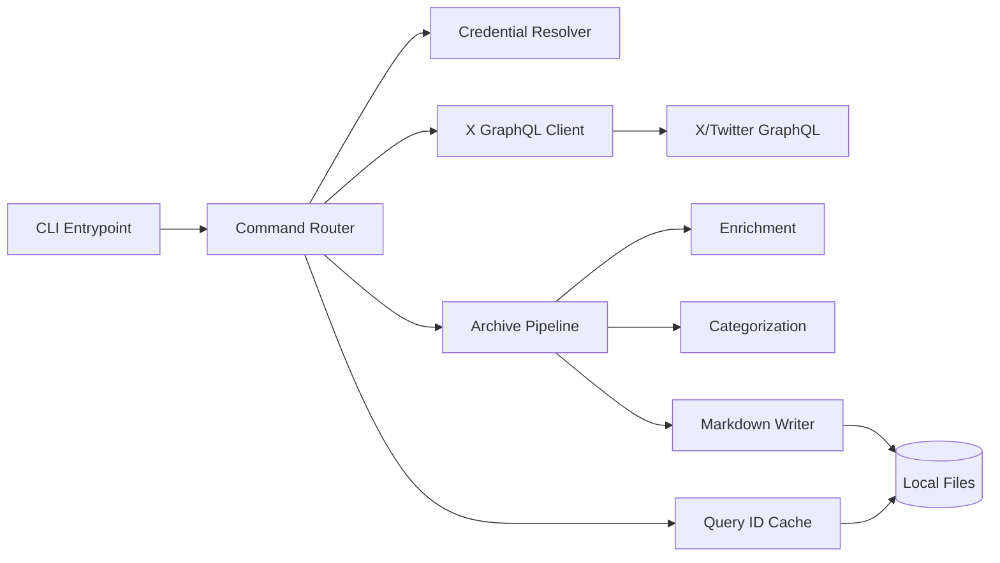
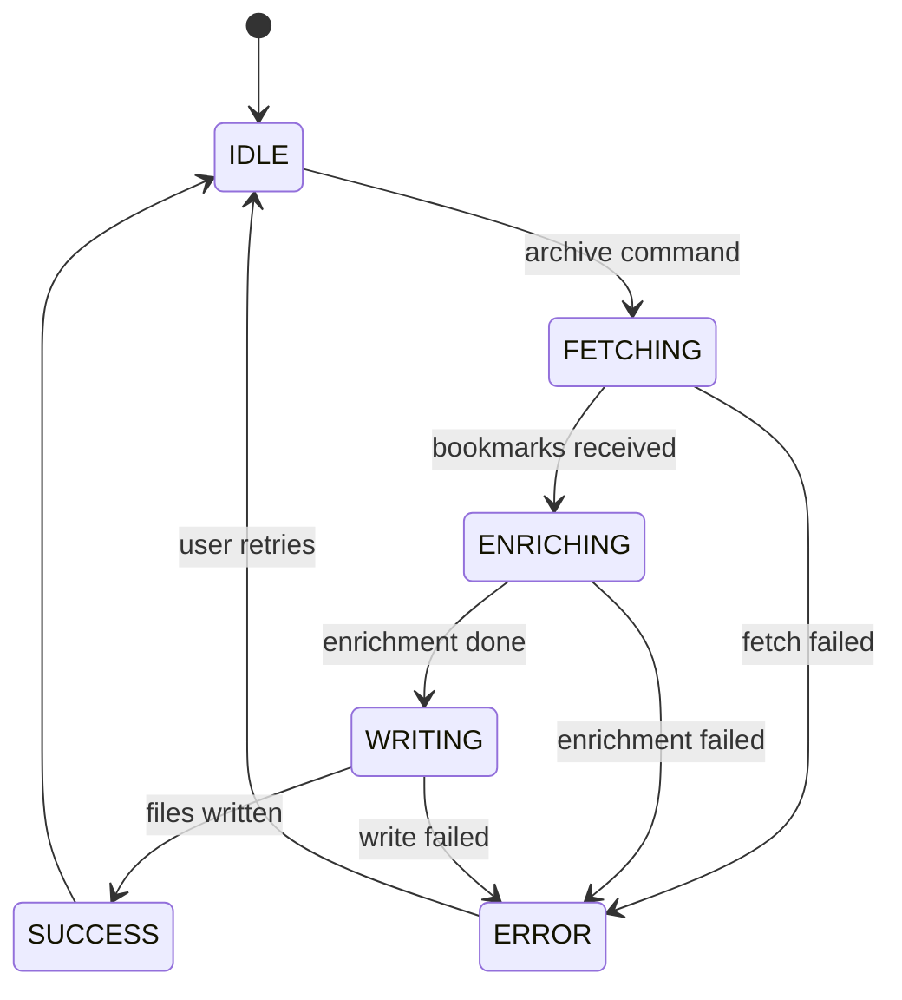
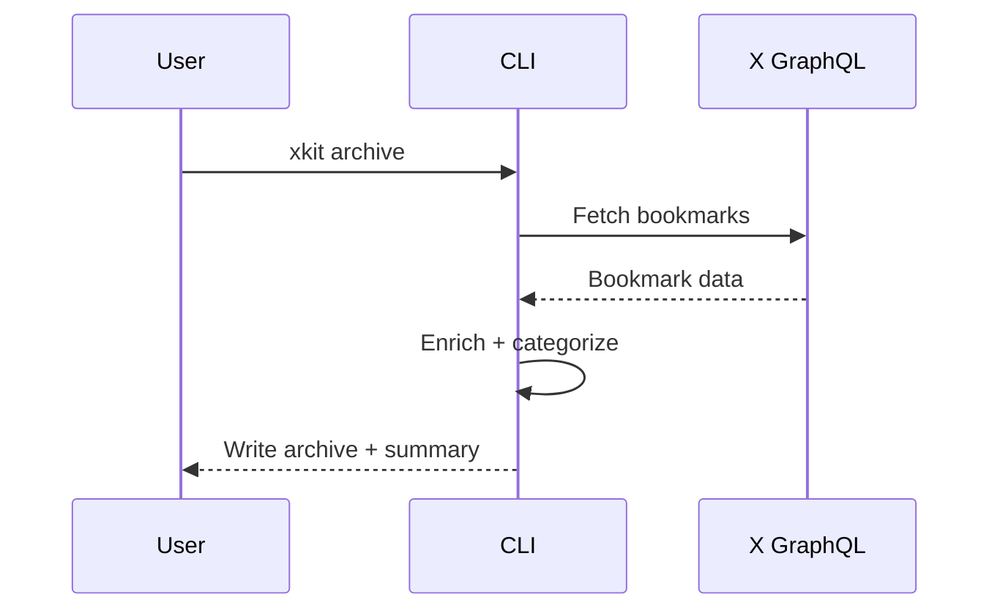
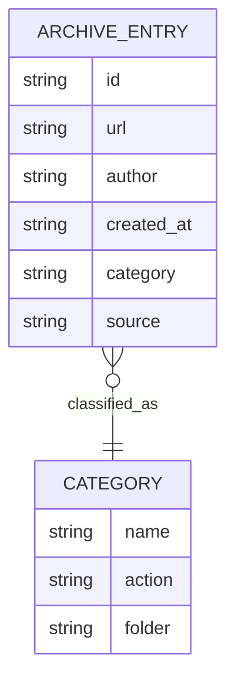

schema_version: 1
# Technical Specification: xKit CLI + Bookmark Archiving

**Owner:** Jamie Craik  
**Status:** Draft  
**Last updated:** 2026-01-15  
**Related PRD:** .specs/spec-2026-01-15-xkit-prd.md  
**Repo / Tracking:** /Users/jamiecraik/dev/xKit  
**Reviewers:** N/A (solo dev)  
**Release target:** 2026-02-01  

---

## 0) Summary
- **One-liner:** Build a reliable, scriptable X/Twitter CLI with a stable JSON surface and a bookmark archiving pipeline.
- **Primary goal:** Deliver a dependable CLI wedge for learning + profile growth, with a durable archive output format.
- **Key risks:** X GraphQL volatility, cookie auth changes, and low evidence of adoption.
- **Rollout shape:** Phased release via npm + Homebrew; no server-side rollout.

---

## 1) Overview / Context
### Context
xKit provides a Node/TypeScript CLI that accesses X/Twitter via cookie-based GraphQL requests. It exposes read/search/thread/mentions/news/bookmarks/lists plus an archive workflow that enriches bookmarks and writes Markdown output. This spec formalizes stable outputs, error handling, and operational safeguards.

### Constraints
- Platform constraints: Node.js (>=22), TypeScript, ESM, Commander CLI, Bun for optional binary build.
- Integration constraints: Undocumented X/Twitter GraphQL endpoints and query IDs.
- Compliance constraints: N/A (no payment/PHI); privacy focus on cookie handling.
- Operating constraints: No on-call; best-effort reliability; runbook-based response.

### Glossary
- Query IDs: Cached GraphQL query identifiers used by X endpoints.
- Archive pipeline: Fetch → Enrich → Categorize → Write Markdown.

---

## 2) Goals and Non-Goals
### Goals
- G1: Stable, documented JSON outputs for all supported commands.
- G2: Reliable bookmark archiving with deterministic Markdown structure.
- G3: Clear, actionable error guidance for auth, rate limit, and API changes.

### Non-Goals (required; RNIA — if N/A, say why)
- NG1: Official API support (out of scope for the project).
- NG2: Advanced LLM integration, parallel processing, or token tracking (explicitly skipped).

### Success criteria (engineering)
- p95 CLI command completion <= 2s for typical read/search operations.
- CLI error rate < 3% (30-day window, opt-in telemetry or manual tracking).
- JSON output schema stays backward compatible for one major version.

---

## User Stories
1) As a Solo Dev, I want to read a tweet/thread by ID or URL so that I can quickly capture context for scripts.
2) As a Researcher/Writer, I want to archive bookmarks to markdown so that I can build a personal knowledge base.
3) As a Solo Dev, I want to refresh query IDs so that I can recover from API changes without rebuilding the tool.
4) As a Researcher/Writer, I want categorized outputs so I can keep my archive organized by content type.
5) As a CLI user, I want a plain output mode so that I can use the tool in scripts or accessibility tools without ANSI noise.

---

## 3) System Architecture
### Architecture diagram (Mermaid)


### Architectural decisions (with rationale)
* **Decision:** Cookie-based auth only.  
  **Rationale:** No official API keys; aligns with current workflow.  
  **Alternatives:** Official API, OAuth.  
  **Tradeoffs:** Higher breakage risk; must include runbook.

* **Decision:** Stable JSON output schema with version marker.  
  **Rationale:** Enables scripts and long-term compatibility.  
  **Alternatives:** Best-effort outputs or raw passthrough.  
  **Tradeoffs:** Requires disciplined schema evolution.

* **Decision:** Schema change policy for JSON output.  
  **Rationale:** Prevents breaking downstream scripts.  
  **Alternatives:** Unversioned JSON or undocumented changes.  
  **Tradeoffs:** More release discipline required.  
  **Policy:** Breaking changes require a major version bump and a 30-day deprecation note in README; non-breaking changes update `_schemaVersion` minor.

---

## 4) Component Design

### Component inventory

| Component | Type | Status |
| --- | --- | --- |
| CLI Entrypoint | service | current |
| Command Router | service | current |
| Credential Resolver | service | current |
| X GraphQL Client | service | current |
| Archive Pipeline | job | current |
| Query ID Cache | job | current |
| Markdown Writer | lib | current |
| Enrichment | lib | current |
| Categorization | lib | current |

### Component: Archive Pipeline

**Status:** current

**Responsibilities**
* Fetch bookmarks
* Enrich and categorize
* Write deterministic Markdown

**Inputs**
* GraphQL bookmark responses
* Config (output paths, options)

**Outputs**
* Markdown archive file(s)
* Per-category files

**Owned data**
* Archive output files and state tracking

**Dependencies**
* X GraphQL Client
* Local filesystem

#### State machine


#### Error modes & recovery
* Error: Auth or rate limit issues
  * Detection: error response + status code
  * Handling: surface guidance, recommend `xkit check` or retry
  * User impact: archive not updated
  * Data impact: do not commit partial writes

* Error: Write issues (permissions/paths)
  * Detection: filesystem error
  * Handling: show path and recommended fix
  * User impact: archive not updated
  * Data impact: no partial output

#### Scaling notes
* Expected load now: single user, tens to thousands of bookmarks.
* Expected load in 12–24 months: single user, tens of thousands of bookmarks.
* Bottlenecks: API rate limits, enrichment network calls; mitigated with incremental processing.

### Component: X GraphQL Client

**Status:** current

**Responsibilities**
* Send GraphQL queries using cached query IDs
* Normalize outputs for CLI and JSON modes

**Inputs**
* Cookies + query ID cache
* Command parameters

**Outputs**
* Normalized response objects

**Owned data**
* N/A (stateless)

**Dependencies**
* X/Twitter GraphQL endpoints

#### State machine
State machine: N/A (stateless client requests per call).

#### Error modes & recovery
* Error: Query ID not valid
  * Detection: 400/404/GraphQL error
  * Handling: suggest `xkit query-ids --fresh`
  * User impact: command fails
  * Data impact: none

---

## 5) API Design

### API overview
* Auth model: Cookie-based (auth_token + ct0) from local browser or env.
* Versioning: Stable JSON output schema with `_schemaVersion` field in JSON output.
* Idempotency: CLI commands behave idempotently unless explicitly writing output files.
* Pagination: Bookmark/archive flows must handle pagination with user-provided limits.
* Rate limits: Best-effort handling; clear error guidance on 429s.

### Endpoint: CLI Command Interface
* **Method:** CLI invocation
* **Path:** `xkit <command> [args]`
* **Auth:** Cookie presence required for X GraphQL calls
* **Idempotent:** Yes, except archive write operations (writes deterministic output)

**Request schema**
```json
{
  "command": "archive",
  "options": {
    "all": true,
    "maxPages": 5,
    "outputDir": "./knowledge"
  }
}
```

**Response schema (JSON mode)**
```json
{
  "_schemaVersion": "1",
  "_meta": {
    "command": "archive",
    "status": "ok"
  },
  "data": {
    "archiveFile": "./knowledge/bookmarks.md",
    "count": 20
  }
}
```

**Errors**
* 400: not-valid arguments or malformed config
* 401/403: missing or not-valid cookies
* 404: query ID not valid or endpoint changed
* 429: rate limit
* 5xx: upstream dependency error

### Sequence diagram (Archive flow)


---

## 6) Data Models / Database Schema

### ER diagram (Mermaid)


### Tables / Collections

#### archive_entry (markdown record)
* Primary key: `id`
* Fields:
  * `id`: string (tweet/bookmark id)
  * `url`: string (canonical URL)
  * `author`: string
  * `created_at`: string (ISO-8601)
  * `category`: string
  * `source`: string (xkit)
* Indexes: N/A (file-based)
* Retention: indefinite unless user deletes
* PII classification: low (public data)
* Consistency: strong within a single run; no partial writes

### Archive format contract (required)
- Frontmatter fields required: `id`, `url`, `author`, `created_at`, `category`, `source`.
- Optional fields: `title`, `summary`, `tags`, `expanded_url`.
- Degraded mode: if enrichment fails, output required fields only and include `enrichment_status: "skipped"` in frontmatter.

---

## 7) Infrastructure Requirements

* Runtime: Node.js 22+ (Bun optional for binary builds)
* Deployment: local CLI only
* Environments: local dev (no staging/prod)
* Config management: JSON5 config + environment variables
* Secrets: OS keychain/browser cookies; env vars for auth
* Networking: outbound HTTPS to X endpoints
* Cost considerations: user bandwidth + local compute only

---

## 8) Security Considerations (Required)

* Authentication: cookie-based auth_token + ct0
* Authorization: N/A (user’s own account)
* Encryption: in transit (HTTPS); no at-rest encryption required for public bookmark data
* Input validation: schema validation for config and CLI args
* Secrets management: never log cookies; document safe handling
* Threats & mitigations:
  * T1: Cookie exfiltration → never log cookies; redaction in error messages
  * T2: Prompt injection via content → treat content as untrusted; no code run
  * T3: API misuse/rate limits → backoff + user guidance

---

## 9) Error Handling Strategy (Required)

* Error taxonomy: validation | auth | rate_limit | dependency | timeout | unknown
* Timeouts: 10s default per request; configurable via env
* Retry policy: no automatic retries for write operations; manual retry guidance
* Idempotency strategy: read/search/list behave idempotently; archive writes remain deterministic
* Degraded mode: if enrichment fails, write archive entries with required fields only and set `enrichment_status: "skipped"`
* User-facing error mapping: always include next-step guidance (e.g., `xkit check`, `xkit query-ids --fresh`)

### User-facing error mapping (required)
| Error type | Detection | Message includes | Next-step guidance |
|---|---|---|---|
| auth | 401/403 | missing/not-valid cookies | run `xkit check` and rerun command |
| rate_limit | 429 | rate limit detected | retry after cooldown; reduce `--max-pages` |
| query_id | 404 / GraphQL error | query ID not valid | run `xkit query-ids --fresh` |
| dependency | 5xx | upstream unavailable | retry later; check network |
| validation | CLI arg/config error | not-valid input | run `xkit <command> --help` |

---

## 10) Performance Requirements / SLAs or SLOs (Required)

| SLI | Target | Measurement |
| --- | ---: | --- |
| p95 latency (read/search) | <= 2000 ms | local timing logs |
| availability (CLI success) | >= 97% | opt-in telemetry or manual logs |
| throughput | 1 command/sec | local timing logs |

## 10b) SLOs and Error Budget (Required or N/A with reason)
- SLIs chosen: p95 latency, CLI success rate  
- SLO targets: 2s p95, 97% success rate  
- Error budget window: 30 days  
- Error budget policy: at 50% budget use pause non-critical changes; at 75% budget use focus on reliability; at 100% budget use pause releases  

---

## 11) Observability (Required)

* Logging:
  * Required fields: command, status, error_code, duration_ms
* Metrics:
  * Counters: commands_total, errors_total
  * Histograms: command_latency_ms
* Tracing: N/A (CLI)
* Dashboards: N/A (local)
* Alerts: N/A (no on-call; rely on manual review)

### Telemetry decision (required)
- Default: turned off.
- Optional: local-only counters stored on disk; no network transmission.
- Open decision: whether to support explicit opt-in network telemetry (see Open Questions).

---

## 12) Testing Strategy (Required)

* Unit tests: existing vitest suite
* Integration tests: CLI command tests in `tests/`
* E2E tests: `pnpm test:live` for live endpoint smoke tests
* Load tests: N/A (single-user CLI)
* Security tests: dependency audits via standard npm tooling
* Test data strategy: fixtures with redacted content

---

## 13) Deployment Strategy (Required)

* Build & release: changesets + `pnpm build` + npm publish
* Rollout: phased via npm versioning; Homebrew tap updates
* Feature flags: N/A
* Backward compatibility: JSON schema stays stable; breaking changes require a major version and migration notes
* Rollback: revert release and publish patch; add warning in README
* Post-deploy verification: run `pnpm test` and manual `xkit check`

---

## 14) Migration Plan (if applicable)
N/A (no persistent service migration).

---

## 15) Operational Notes (Recommended)

* Runbook: document query ID refresh and cookie troubleshooting in docs.
* Manual operations: rerun archive, delete corrupted outputs, reinitialize config.
* Support playbook: common errors point to `xkit check` and `xkit query-ids --fresh`.
* On-call readiness: N/A.

---

## Risks and Mitigations
- Risk: X GraphQL changes break commands.
  - Mitigation: query ID refresh + runbook + clear error guidance.
- Risk: Cookie auth gets blocked.
  - Mitigation: document “pause” threshold and alternative cookie sources if available.
- Risk: JSON schema changes break scripts.
  - Mitigation: stable schema versioning and major release process.

---

## 16) Open Questions / Future Considerations (Required)

### Open questions
* Q1: Should telemetry stay local-only, or support explicit opt-in network telemetry? (Owner: Jamie, Due: 2026-01-20)
* Q2: Where should runbook live (README vs docs/)? (Owner: Jamie, Due: 2026-01-20)

### Future considerations
* Optional archive exports (JSON) for integration with other tools.

---

## 17) Tech Spec Quality Gate (Required)

* [ ] Architecture reads clear and diagrammed
* [ ] Every stateful component has a state machine (or N/A + reason)
* [ ] APIs have complete schemas + errors
* [ ] Data model includes constraints and indexes
* [ ] List security threats and mitigations
* [ ] Error handling covers timeouts, retries, idempotency, degraded modes
* [ ] Performance targets use numeric values and measurable targets
* [ ] Observability includes logs, metrics, dashboards, alerts
* [ ] Deployment stays repeatable and rollbackable
* [ ] No ambiguity left for implementers
